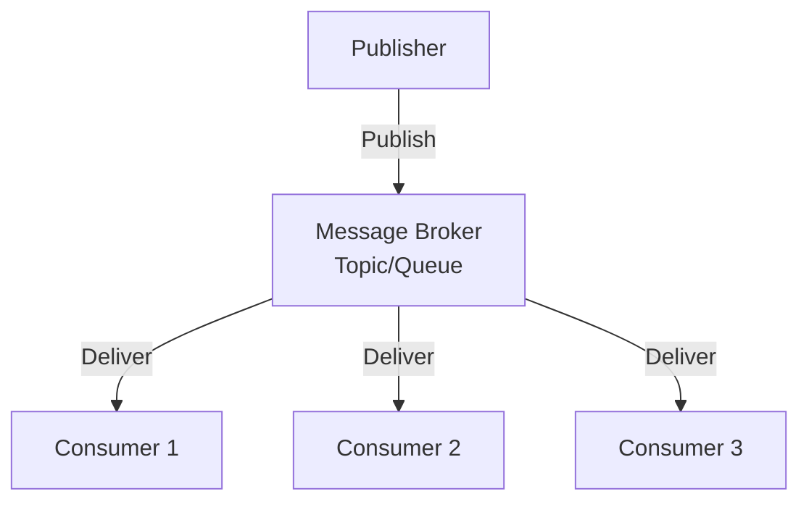
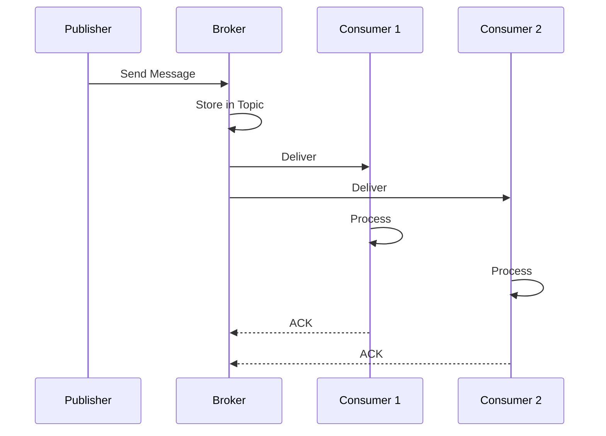

# Pub-Sub System

## Problem Statement

Implement a publish-subscribe messaging system where publishers send messages to topics and subscribers receive them asynchronously.

**Requirements:**
- Topics (channels for messages)
- Publish messages to topics
- Subscribe to topics
- Async message delivery
- Multiple subscribers per topic

## Design

### Architecture

```
Publisher ---→ Topic ---→ Subscriber1
                  │    ---→ Subscriber2
                  └-------→ Subscriber3
```

### Key Components

```
Topic: Channel holding subscribers and message queue
Publisher: Publishes messages to topics
Subscriber: Receives messages from subscribed topics
Message: Data being published
```

### Data Structure

```
topics: {topic_name -> [subscribers, message_queue]}
subscribers: {subscriber_id -> subscribed_topics[]}
```

### Operations

```
subscribe(subscriber, topic):
  topics[topic].subscribers.add(subscriber)

publish(topic, message):
  for each subscriber in topics[topic].subscribers:
    subscriber.receive(message)

receive(subscriber, message):
  subscriber.onMessage(message)
```


## Architecture Diagram

```
┌──────────────────────────────────────────┐
│      Pub-Sub Broker (Central Hub)        │
│  ┌──────────────────────────────────────┐│
│  │  Topics: {topic → [sub1, sub2, ...]}  ││
│  │  Message Queue: [msg1, msg2, ...]    ││
│  │  Subscriptions: {subscriber → topics} ││
│  └──────────────────────────────────────┘│
└──────────────────────────────────────────┘
        ↑ publish       ↓ subscribe/notify
┌───────┴──────┐      ┌──────┴────────┐
│              │      │               │
▼              ▼      ▼               ▼
Pub1    Pub2   Sub1   Sub2   Sub3   Sub4
(writes)       (reads)
```

## Common Questions & Answers

**Q: Push vs Pull model?**
A: Push: broker sends to subscribers (server initiative). Pull: subscribers ask broker for messages (client initiative). Push: lower latency, broker load. Pull: less bandwidth, subscriber backpressure control. HTTP polling is pull; WebSocket is push.

**Q: Topic-based vs Content-based routing?**
A: Topic-based: subscribe to "news.sports" (coarse). Content-based: subscribe to "topic=news AND category=sports" (fine). Topic simpler, fast; content requires filtering overhead. Most systems use topic + optional content filtering.

**Q: Guaranteed delivery vs Fire-and-forget?**
A: Guaranteed: broker confirms, retries on failure (TCP-like). Fire-and-forget: send once, no retry (UDP-like). Guaranteed adds latency, complexity; needed for critical messages. Fire-and-forget for events, telemetry.

**Q: How to handle slow subscribers?**
A: Async queue: broker queues messages for slow subs (memory grows). Timeout: drop subscriber after delay. Backpressure: slow down publisher. Fair approach: queue with bounded size, drop if full.

## Back-of-Envelope Calculations

For typical pub-sub (10 topics, 100 publishers, 1000 subscribers, 100K msg/sec):
- Storage: 1000 topics × 100 subscribers = 100K subscriptions × 16 bytes = 1.6MB registry
- Message queue: 100K msg/sec × 100 bytes = 10MB/sec, need 10-100GB buffer for 10s-100s latency
- Throughput: 100K msg/sec per broker, scale via sharding by topic
- Latency: Push ~1-10ms, Pull ~100ms (polling interval)

Network: ~10Gbps for 100K msg/sec × 100 bytes. Need clustering/sharding.

## Design Choice Comparison

| Approach | Pros | Cons |
|----------|------|------|
| In-Memory Hash | Simple, fast O(1) | All data in RAM, no persistence |
| Message Queue (Redis) | Persistent, scalable | Adds external dependency, latency |
| Kafka/Event Bus | Massively scalable, replay | Complex, high operational overhead |

## Follow-up Interview Questions

1. How would you persist messages for replay? Use Kafka-like append-only log.
2. What if a subscriber crashes? Track offset, resume from checkpoint.
3. How to monitor topic lag (subscriber behind publisher)?
4. What's the bottleneck at 10x scale (1M msg/sec)? Broker I/O; need Kafka cluster.
5. How to implement ordering guarantees (messages in order per topic)?

## Example Scenario Walkthrough

Scenario: Real-time stock price updates

Initial state:
- Topics: {"stocks.AAPL", "stocks.GOOG"}
- Publishers: StockDataProvider
- Subscribers: PortfolioManager, Trader, Logger

Step 1: Portfolio Manager subscribes
- pubsub.subscribe("stocks.AAPL", portfolioMgr)
- topic = "stocks.AAPL"
- subscribers = [portfolioMgr]

Step 2: Trader subscribes to same topic
- pubsub.subscribe("stocks.AAPL", trader)
- topic = "stocks.AAPL"
- subscribers = [portfolioMgr, trader]

Step 3: Logger subscribes to all stocks
- pubsub.subscribe("stocks.*", logger)
- subscribers for "stocks.*" = [logger]

Step 4: Stock price publisher publishes
- pubsub.publish("stocks.AAPL", {price: 150.0})
- Message added to queue

Step 5: Broker notifies all subscribers
- for sub in subscribers["stocks.AAPL"]:
-     sub.onMessage({price: 150.0})
- Calls: portfolioMgr.onMessage(), trader.onMessage()

Step 6: Subscribers process independently
- PortfolioManager: recalculate portfolio value
- Trader: check if price triggers trade rule
- Logger: log price to analytics DB

Step 7: Subscriber unsubscribes (cleanup)
- pubsub.unsubscribe("stocks.AAPL", portfolioMgr)
- subscribers = [trader]
- Future prices only notify trader

## Trade-offs

| Async | Sync |
|-------|------|
| Non-blocking, scalable | Simpler, immediate |
| Ordering challenges | Blocking calls |
| Decoupled publishers/subs | Tight coupling |

### Architecture Diagram



### Flow Diagram



## Complexity

| Operation | Time |
|-----------|------|
| subscribe | O(1) |
| unsubscribe | O(1) |
| publish | O(n) where n=subscribers |
| Space | O(t+s+m) where t=topics, s=subscribers, m=messages |
