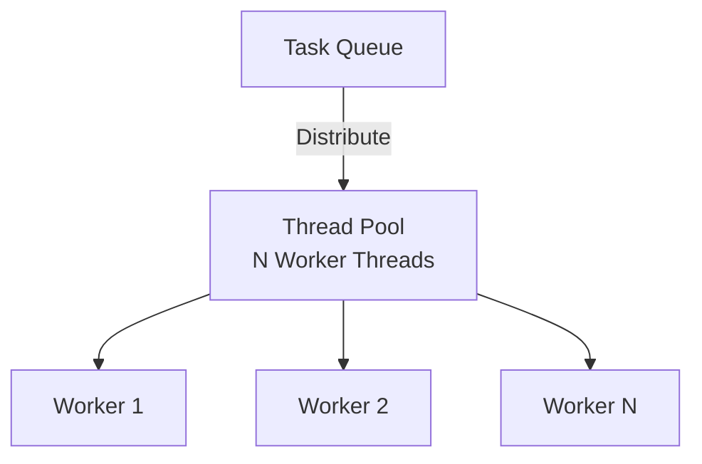
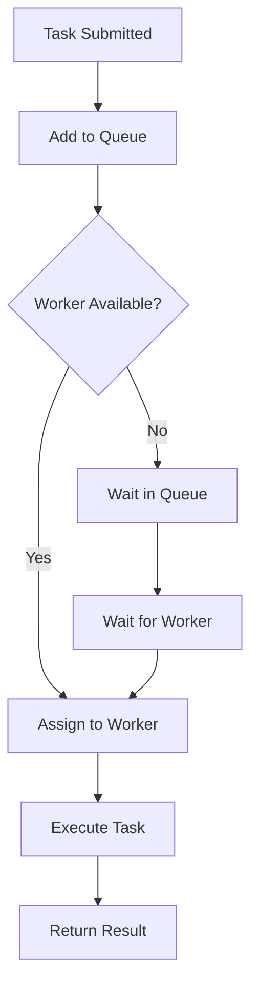

# Thread Pool

## Problem Statement

Implement a thread pool to manage a fixed number of worker threads executing tasks from a queue.

**Requirements:**
- Fixed number of worker threads
- Task queue for pending tasks
- Thread-safe operations
- Graceful shutdown
- Reuse threads to avoid creation overhead

## Design

### Architecture

```
Task Queue (FIFO)
    │
    ├→ Worker1 (busy)
    ├→ Worker2 (idle, waiting)
    ├→ Worker3 (busy)
    └→ Worker4 (idle, waiting)
```

### Key Components

```
Worker: Thread that executes tasks
Task: Runnable/callable work unit
ThreadPool: Manages workers and task queue
TaskQueue: Holds pending tasks (BlockingQueue)
```

### Operations

```
execute(task):
  taskQueue.add(task)
  // Worker picks it up

Worker loop:
  while not shutdown:
    task = taskQueue.take()  // blocking, waits if empty
    task.run()

shutdown():
  Wait for all workers to finish
  Terminate threads
```


## Architecture Diagram

```
┌──────────────────────────────────────────┐
│      Thread Pool Manager                 │
│  ┌──────────────────────────────────────┐│
│  │  Task Queue (FIFO, BlockingQueue)     ││
│  │  ├─ [Task1] [Task2] [Task3] ...      ││
│  │  └─ Max queue size: 1000             ││
│  └──────────────────────────────────────┘│
│           ↑ submit tasks                  │
└──────────────────────────────────────────┘
        │
     threads (4 workers)
     │
  ┌──┴──┬──────┬──────┬──────┐
  ▼     ▼      ▼      ▼      ▼
Worker1 W2    W3     W4    (idle/busy)
├─ busy: Task5
├─ idle (waiting)
├─ busy: Task7
└─ idle (waiting)
```

## Common Questions & Answers

**Q: Fixed vs Dynamic pool size?**
A: Fixed: create N workers upfront, reuse. Simple, predictable latency. Dynamic: grow/shrink based on load. Scales better but adds complexity. Use fixed for consistent load, dynamic for unpredictable.

**Q: Queue capacity—what if it fills up?**
A: Options: (1) Reject task (throw exception), (2) Block caller, (3) Use unbounded queue (risky, OOM). Bounded queue with rejection policy balances fairness and memory safety.

**Q: How to gracefully shutdown thread pool?**
A: (1) Stop accepting new tasks, (2) Wait for queue to drain, (3) Send interrupt signal to workers, (4) Terminate threads. Timeout after N seconds to force shutdown if workers hang.

**Q: Worker thread contention—how to scale?**
A: Multiple workers reduce lock contention (BlockingQueue is synchronized). Sweet spot: workers = CPU cores for CPU-bound, workers = cores × 2-4 for I/O-bound. Monitor utilization, tune if needed.

## Back-of-Envelope Calculations

For typical server (4 CPU cores, I/O-bound workload):
- Pool size: 4 cores × 3 = 12 workers (heuristic for I/O-bound)
- Task queue: 1000 tasks × 200 bytes = 200KB
- Context switch: 12 threads = ~12μs overhead per switch, < 1% if tasks > 100μs
- Throughput: 12 workers × 10 tasks/sec = 120 tasks/sec, scales linearly with workers

Memory: 12 threads × 1MB stack = 12MB minimal overhead. Bottleneck is task processing time, not threading.

## Design Choice Comparison

| Approach | Pros | Cons |
|----------|------|------|
| Fixed Pool | Predictable, simple | Fixed capacity, may underutilize |
| Dynamic Pool | Scales with load | Complex, overhead, GC pressure |
| Single-threaded | Simplest | No parallelism, throughput limited |

## Follow-up Interview Questions

1. How would you monitor thread pool health (utilization, queue depth, task latency)?
2. What if a task blocks forever (deadlock)? Timeout + thread restart (expensive).
3. How to prioritize tasks (high-priority tasks execute first)?
4. What's the bottleneck at 10x scale (1000 req/sec)? Task processing time and queue depth.
5. How to implement graceful degradation when queue fills up?

## Example Scenario Walkthrough

Scenario: Web server with thread pool handling requests

Initial state:
- ThreadPool: 4 worker threads, queue capacity = 1000
- Incoming requests: 10 req/sec

Step 1: Server starts, creates thread pool
- Create 4 Worker threads
- Each enters loop: task = queue.take() (blocks waiting)

Step 2: First 4 requests arrive
- Request1 → submit to queue → Worker1 picks up
- Request2 → submit to queue → Worker2 picks up
- Request3 → submit to queue → Worker3 picks up
- Request4 → submit to queue → Worker4 picks up
- All workers busy

Step 3: Requests 5-10 arrive while workers busy
- Queue state: [Request5, Request6, Request7, Request8, Request9, Request10]
- Requests wait in queue (FIFO order)

Step 4: Worker1 finishes Request1 (took 500ms)
- Worker1 completes Task1
- Worker1.run() loops: task = queue.take()
- Picks Request5 from queue
- Begins executing Request5

Step 5: Worker2 finishes Request2
- Worker2 picks Request6 from queue
- Continues processing

Step 6: Queue drains
- All requests eventually processed
- When queue empty, workers block waiting for next task

Step 7: Peak load arrives (50 requests in burst)
- Requests 1-4 assigned to workers immediately
- Requests 5-50 queued: queue depth = 46
- If more arrive before queue drains, may reject (queue full)

Step 8: Shutdown sequence
- Server.shutdown()
- Stop accepting new tasks
- Wait for queue to drain (blocking join on workers)
- Send interrupt to workers
- Threads terminate gracefully

## Trade-offs

| Approach | Pro | Con |
|----------|-----|-----|
| Fixed pool | Predictable, fast | Fixed capacity |
| Dynamic pool | Scales with load | Overhead, complexity |
| Blocking queue | Thread-safe | Blocking calls |

### Architecture Diagram



### Flow Diagram



## Complexity

| Operation | Time |
|-----------|------|
| execute | O(1) |
| worker.run | O(task time) |
| shutdown | O(n) where n=workers |
