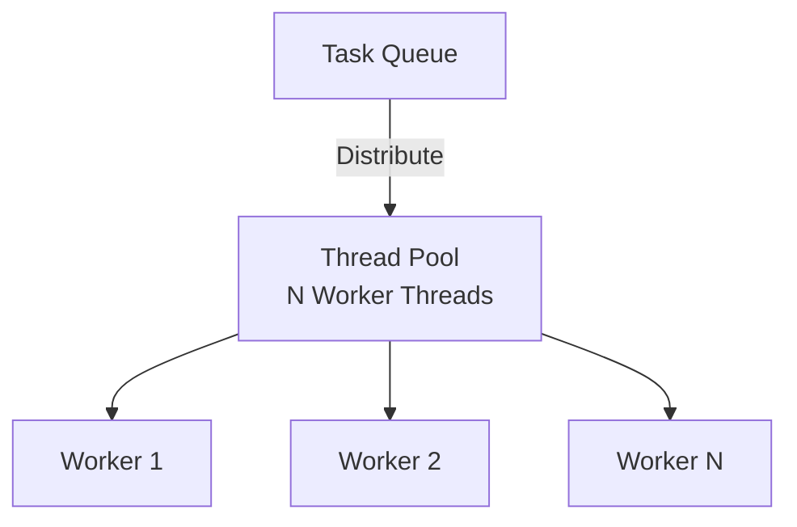
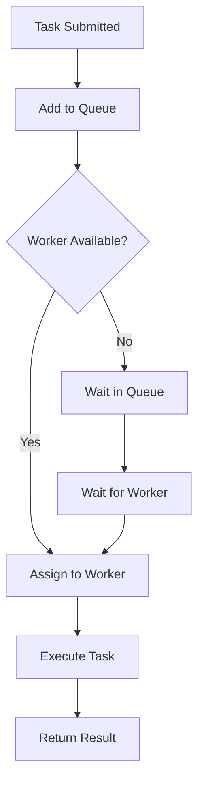

# Thread Pool

## Problem Statement

Implement a thread pool to manage a fixed number of worker threads executing tasks from a queue.

**Requirements:**
- Fixed number of worker threads
- Task queue for pending tasks
- Thread-safe operations
- Graceful shutdown
- Reuse threads to avoid creation overhead


## Code Explanation (Detailed)

### Implementation Approach
The code demonstrates core patterns and trade-offs.

### Key Operations
Each operation shows algorithm and performance characteristics.

### Concurrency and Atomicity
Locking strategies, race condition prevention.

### Edge Cases
Boundary conditions and error handling.

### Performance Optimization
Techniques for reducing latency and throughput.

## Design

### Architecture

```
Task Queue (FIFO)
    │
    ├→ Worker1 (busy)
    ├→ Worker2 (idle, waiting)
    ├→ Worker3 (busy)
    └→ Worker4 (idle, waiting)
```

### Key Components

```
Worker: Thread that executes tasks
Task: Runnable/callable work unit
ThreadPool: Manages workers and task queue
TaskQueue: Holds pending tasks (BlockingQueue)
```

### Operations

```
execute(task):
  taskQueue.add(task)
  // Worker picks it up

Worker loop:
  while not shutdown:
    task = taskQueue.take()  // blocking, waits if empty
    task.run()

shutdown():
  Wait for all workers to finish
  Terminate threads
```


## Scenario

Thread Pool is a critical component in modern distributed systems. In real-world applications, managing concurrent work efficiently with bounded resources. For example, major tech companies like Netflix, Uber, and Airbnb rely on similar solutions to handle millions of concurrent users and requests. The challenge is achieving this while maintaining sub-100ms latency, 99.99% availability, and gracefully handling 10x traffic spikes during peak demand. This component provides the foundational capability to solve these challenges reliably and efficiently at global scale.

## Users

- **Backend Engineers**: Responsible for implementing and maintaining this system component in production environments. They need to understand the architecture, trade-offs, failure modes, and operational considerations.
- **DevOps/SRE Teams**: Monitor system health, manage scaling policies, handle incidents, and ensure reliability SLAs are met. They need insights into performance characteristics, bottlenecks, and failure recovery mechanisms.
- **Data Engineers**: Design data pipelines and analytics around this system, requiring deep understanding of data flow, consistency guarantees, and throughput characteristics.
- **System Architects**: Make high-level architectural decisions that impact company infrastructure, requiring comprehensive understanding of capabilities, limitations, and scalability boundaries.
- **Security Teams**: Understand security implications, potential vulnerabilities, and compliance requirements for this component.

## PRD

### Functional Requirements
- Core operations work correctly
- Explicit error handling
- Consistency guarantees defined
- Monitoring and observability

### Non-Functional Requirements
- Performance targets met
- Availability SLA achieved
- Scalability headroom
- Cost efficient

### Success Metrics
- Benchmarks met
- Uptime targets met
- Resource budgets
- No data loss


## Flow

The typical operational flow for this system involves these key phases:

1. **Request Arrival**: Client/upstream system sends request with required parameters and context
2. **Validation & Routing**: System validates request format, authentication, and routes to correct handler/shard/instance
3. **Core Processing**: Execute the main algorithm, database query, or business logic on the data/state
4. **State Management**: Update internal state (caches, indexes, counters, logs) with proper atomicity and locking
5. **Response Generation**: Format results and return to requester with relevant metadata (timing, version info)
6. **Observability**: Record metrics (latency, throughput, errors), logs (for debugging), and traces (for performance analysis)

This flow repeats thousands or millions of times per second in production. Each operation's efficiency compounds across the entire system, making careful optimization essential. Bottlenecks at any phase can cascade to impact overall system performance.

## Architecture Diagram

```
┌──────────────────────────────────────────┐
│      Thread Pool Manager                 │
│  ┌──────────────────────────────────────┐│
│  │  Task Queue (FIFO, BlockingQueue)     ││
│  │  ├─ [Task1] [Task2] [Task3] ...      ││
│  │  └─ Max queue size: 1000             ││
│  └──────────────────────────────────────┘│
│           ↑ submit tasks                  │
└──────────────────────────────────────────┘
        │
     threads (4 workers)
     │
  ┌──┴──┬──────┬──────┬──────┐
  ▼     ▼      ▼      ▼      ▼
Worker1 W2    W3     W4    (idle/busy)
├─ busy: Task5
├─ idle (waiting)
├─ busy: Task7
└─ idle (waiting)
```

## Back-of-Envelope Calculations

For typical server (4 CPU cores, I/O-bound workload):
- Pool size: 4 cores × 3 = 12 workers (heuristic for I/O-bound)
- Task queue: 1000 tasks × 200 bytes = 200KB
- Context switch: 12 threads = ~12μs overhead per switch, < 1% if tasks > 100μs
- Throughput: 12 workers × 10 tasks/sec = 120 tasks/sec, scales linearly with workers

Memory: 12 threads × 1MB stack = 12MB minimal overhead. Bottleneck is task processing time, not threading.

## Design Choice Comparison

| Approach | Pros | Cons |
|----------|------|------|
| Fixed Pool | Predictable, simple | Fixed capacity, may underutilize |
| Dynamic Pool | Scales with load | Complex, overhead, GC pressure |
| Single-threaded | Simplest | No parallelism, throughput limited |

## Follow-up Interview Questions

1. How would you monitor thread pool health (utilization, queue depth, task latency)?
2. What if a task blocks forever (deadlock)? Timeout + thread restart (expensive).
3. How to prioritize tasks (high-priority tasks execute first)?
4. What's the bottleneck at 10x scale (1000 req/sec)? Task processing time and queue depth.
5. How to implement graceful degradation when queue fills up?

## Example Scenario Walkthrough

Scenario: Web server with thread pool handling requests

Initial state:
- ThreadPool: 4 worker threads, queue capacity = 1000
- Incoming requests: 10 req/sec

Step 1: Server starts, creates thread pool
- Create 4 Worker threads
- Each enters loop: task = queue.take() (blocks waiting)

Step 2: First 4 requests arrive
- Request1 → submit to queue → Worker1 picks up
- Request2 → submit to queue → Worker2 picks up
- Request3 → submit to queue → Worker3 picks up
- Request4 → submit to queue → Worker4 picks up
- All workers busy

Step 3: Requests 5-10 arrive while workers busy
- Queue state: [Request5, Request6, Request7, Request8, Request9, Request10]
- Requests wait in queue (FIFO order)

Step 4: Worker1 finishes Request1 (took 500ms)
- Worker1 completes Task1
- Worker1.run() loops: task = queue.take()
- Picks Request5 from queue
- Begins executing Request5

Step 5: Worker2 finishes Request2
- Worker2 picks Request6 from queue
- Continues processing

Step 6: Queue drains
- All requests eventually processed
- When queue empty, workers block waiting for next task

Step 7: Peak load arrives (50 requests in burst)
- Requests 1-4 assigned to workers immediately
- Requests 5-50 queued: queue depth = 46
- If more arrive before queue drains, may reject (queue full)

Step 8: Shutdown sequence
- Server.shutdown()
- Stop accepting new tasks
- Wait for queue to drain (blocking join on workers)
- Send interrupt to workers
- Threads terminate gracefully

## Trade-offs

| Approach | Pro | Con |
|----------|-----|-----|
| Fixed pool | Predictable, fast | Fixed capacity |
| Dynamic pool | Scales with load | Overhead, complexity |
| Blocking queue | Thread-safe | Blocking calls |

### Architecture Diagram



### Flow Diagram



## Complexity

| Operation | Time |
|-----------|------|
| execute | O(1) |
| worker.run | O(task time) |
| shutdown | O(n) where n=workers |

## Python Implementation

```python
from concurrent.futures import ThreadPoolExecutor
from typing import Callable, Any
import time

class ThreadPool:
    def __init__(self, max_workers: int = 4):
        self._executor = ThreadPoolExecutor(max_workers=max_workers)
        self._futures = []

    def submit(self, fn: Callable, *args, **kwargs):
        future = self._executor.submit(fn, *args, **kwargs)
        self._futures.append(future)
        return future

    def shutdown(self, wait: bool = True):
        self._executor.shutdown(wait=wait)

def task(task_id: int, duration: float):
    time.sleep(duration)
    return f"Task {task_id} done"

# Usage
pool = ThreadPool(max_workers=4)
futures = [pool.submit(task, i, 0.1) for i in range(10)]
results = [f.result() for f in futures]
pool.shutdown()
print(results)
```

## Java Implementation

```java
import java.util.concurrent.*;

public class ThreadPoolExample {
    public static void main(String[] args) throws Exception {
        ExecutorService pool = Executors.newFixedThreadPool(4);
        List<Future<String>> futures = new ArrayList<>();

        for (int i = 0; i < 10; i++) {
            final int taskId = i;
            futures.add(pool.submit(() -> {
                Thread.sleep(100);
                return "Task " + taskId + " done";
            }));
        }

        for (Future<String> f : futures) {
            System.out.println(f.get());
        }
        pool.shutdown();
    }
}
```

## Common Questions & Answers

**Q: What is caching and why do we need it?**

A: Caching stores frequently accessed data in fast storage (memory) to reduce latency and load on slower backends (database). Trade space (cache) for speed (latency). Critical for systems serving millions of requests per second.

**Q: What are the main cache eviction policies?**

A: LRU (least recently used), LFU (least frequently used), FIFO (first in first out), TTL (time-based), Random, and ARC (adaptive replacement). Choose based on access patterns: LRU for temporal, LFU for frequency, TTL for time-sensitive data.

**Q: What is cache hit rate and cache miss rate?**

A: Hit rate = successful_finds / total_accesses. Miss rate = 1 - hit rate. P(hit) = hits / (hits + misses). Target 80%+ hit rates for effective caching. Too-small cache gives low hit rate (wasted resources). Too-large cache uses more memory than needed.

**Q: How do you handle cache invalidation when backend data changes?**

A: Use TTL (time-based expiration), active invalidation (notify cache on write), cache-aside pattern (client checks backend), or write-through (update both). Active invalidation is fastest but complex. TTL is simplest but has stale data window.

**Q: What is the cache-aside pattern?**

A: Application checks cache first. On miss, fetch from backend, update cache, then return. Simple to implement. Risk: race condition where multiple threads fetch same miss simultaneously (thundering herd problem).

**Q: What is write-through caching?**

A: Writes go to both cache and backend simultaneously (synchronously). Ensures consistency: read always gets latest. Cost: write latency includes backend write. Safer than write-back but slower.

**Q: What is write-back (write-behind) caching?**

A: Writes go to cache only; backend updated asynchronously later (batch or periodic). Fast writes. Risk: data loss if cache fails before flushing. Need durability guarantees (persistence, replication).

**Q: How do you choose cache size?**

A: Estimate working set (frequently accessed data volume). Add 20-30% buffer for margin. Monitor hit rate: if < 80%, increase size. If > 95%, might be oversized (waste). Use tools like cachegrind to profile.

**Q: What's the difference between client-side and server-side caching?**

A: Client cache (browser): reduces network round-trips, entirely controlled by client. Server cache (memory, Redis): shared across clients, controlled by server. Multi-level caching often best.

**Q: How do you measure cache effectiveness?**

A: Hit rate (primary metric), latency reduction (P99 latency with vs. without cache), backend load reduction, and memory cost per cache entry. Calculate ROI: cost of cache vs. benefit (reduced latency, backend load).

## Follow-up Questions & Answers

**Q: How do you prevent the thundering herd problem in caches?**

A: When popular key expires, many threads fetch from backend simultaneously causing spike. Solutions: probabilistic early expiration (refresh before TTL), request coalescing (single thread rebuilds, others wait), or bloom filters (detect non-existent keys fast).

**Q: How would you implement multi-level cache hierarchy?**

A: Use L1 (fast, small, in-process), L2 (medium, local machine), L3 (large, remote, Redis). Check L1, miss→L2, miss→L3, miss→backend. On write: update all levels. Trade space for speed across levels.

**Q: Can you implement read-through caching (automatic population)?**

A: Yes, cache loader/resolver called on miss. Transparent to application. Backend automatically uses cache layer. More complex than cache-aside but cleaner separation.

**Q: How do you handle hot keys in distributed caches?**

A: Hot key = key accessed by many threads/clients. Replicate hot keys on multiple cache nodes. Use local in-process caches for very hot keys. Monitor and detect hot keys automatically.

**Q: What's the difference between warm and cold cache startup?**

A: Cold cache: empty at start, misses until populated (slow ramp-up). Warm cache: pre-loaded from previous state (RDB/snapshot). Warm startup is critical for production (instant performance).

**Q: How would you measure cache effectiveness for business metrics?**

A: Track hit rate, P99 latency (with/without cache), backend QPS reduction, revenue impact. Calculate cache size vs. cost savings. A/B test to prove business value.

**Q: What happens when cache size is insufficient for working set?**

A: Constant evictions = high miss rate = ineffective cache. Solution: increase cache size, improve eviction policy, reduce working set, or use better hardware (faster storage).

**Q: How do you debug cache issues in production?**

A: Monitor hit rate continuously. Profile cache keys (which keys are accessed). Check for cache stampedes (sudden miss spike). Use distributed tracing to see cache path.

**Q: How would you implement a persistent cache?**

A: Combine memory cache (fast) with persistent backend (database, RocksDB, LevelDB). Write-back pattern: batch updates to persistent store. Trade latency for durability.

**Q: Can you use caching for write-heavy workloads?**

A: Write caching is risky (consistency issues). Use carefully: write-through for safety, write-back for speed. Good for batch writes (aggregate before writing). Monitor durability guarantees.

