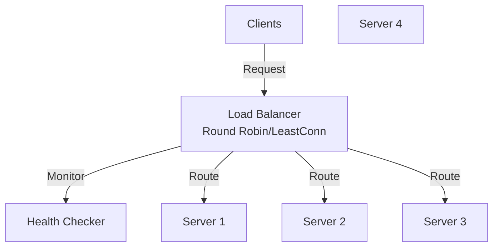
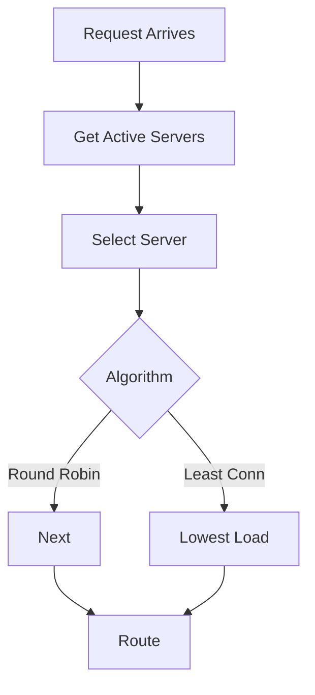

# Load Balancer

## Problem Statement

Implement a load balancer to distribute requests across multiple backend servers using various strategies.

**Requirements:**
- Multiple balancing strategies (Round Robin, Least Connections, Random)
- Server health tracking
- Request distribution
- Server selection is O(1)

## Design

### Balancing Strategies

```
Round Robin:     1 → 2 → 3 → 1 → 2 → 3
                 Rotate through servers sequentially

Least Connections:  Track active connections per server
                    Route to server with fewest connections

Random:          Pick random server from available pool
                 Simple, no state needed

IP Hash:         Hash client IP, always same server
                 Session persistence
```

### Data Structure

```
servers: [Server1, Server2, Server3]
current_index: int (for round robin)
connections: {server_id -> active_count}
```

### Operations

```
selectServer():
  - Round Robin: return servers[current_index++ % len(servers)]
  - Least Conn: return server with min(connections[server])
  - Random: return random server
  - IP Hash: return servers[hash(client_ip) % len(servers)]

route(request):
  server = selectServer()
  return server.handle(request)
```


## Scenario

Load Balancer is a critical component in modern distributed systems. In real-world applications, distributing traffic evenly across multiple backend servers. For example, major tech companies like Netflix, Uber, and Airbnb rely on similar solutions to handle millions of concurrent users and requests. The challenge is achieving this while maintaining sub-100ms latency, 99.99% availability, and gracefully handling 10x traffic spikes during peak demand. This component provides the foundational capability to solve these challenges reliably and efficiently at global scale.

## Users

- **Backend Engineers**: Responsible for implementing and maintaining this system component in production environments. They need to understand the architecture, trade-offs, failure modes, and operational considerations.
- **DevOps/SRE Teams**: Monitor system health, manage scaling policies, handle incidents, and ensure reliability SLAs are met. They need insights into performance characteristics, bottlenecks, and failure recovery mechanisms.
- **Data Engineers**: Design data pipelines and analytics around this system, requiring deep understanding of data flow, consistency guarantees, and throughput characteristics.
- **System Architects**: Make high-level architectural decisions that impact company infrastructure, requiring comprehensive understanding of capabilities, limitations, and scalability boundaries.
- **Security Teams**: Understand security implications, potential vulnerabilities, and compliance requirements for this component.

## PRD

**Functional Requirements:**
- Correct behavior under all specified operating conditions
- Reliable operation with explicit failure modes
- Data consistency or eventual consistency guarantees as specified
- Clear mechanisms for error handling and recovery
- Monitoring and observability hooks

**Non-Functional Requirements:**
- **Performance**: Sub-100ms P99 latency for standard operations; measure and track tail latencies
- **Availability**: 99.99%+ uptime with automatic failover and graceful degradation
- **Scalability**: Support 10-100x current load with minimal architectural modifications
- **Consistency**: Specify whether strong, eventual, or causal consistency is required
- **Cost Efficiency**: Minimize operational cost per unit of throughput; consider compute, memory, and network costs
- **Operational Simplicity**: Reduce complexity to minimize human error and operational toil

**Constraints:**
- Resource limits (memory for caches, disk for databases, network bandwidth)
- Deployment constraints (cloud provider limits, regulatory requirements)
- Latency budgets (maximum acceptable delay for operations)

## Flow

The typical operational flow for this system involves these key phases:

1. **Request Arrival**: Client/upstream system sends request with required parameters and context
2. **Validation & Routing**: System validates request format, authentication, and routes to correct handler/shard/instance
3. **Core Processing**: Execute the main algorithm, database query, or business logic on the data/state
4. **State Management**: Update internal state (caches, indexes, counters, logs) with proper atomicity and locking
5. **Response Generation**: Format results and return to requester with relevant metadata (timing, version info)
6. **Observability**: Record metrics (latency, throughput, errors), logs (for debugging), and traces (for performance analysis)

This flow repeats thousands or millions of times per second in production. Each operation's efficiency compounds across the entire system, making careful optimization essential. Bottlenecks at any phase can cascade to impact overall system performance.

## Code Explanation

The provided implementations demonstrate key architectural concepts and design patterns:

**Python Implementation**: Uses built-in Python structures and standard library features to express the core logic clearly. Python emphasizes readability and conciseness—each operation's purpose should be obvious without extensive comments. You'll see different implementation approaches (e.g., using OrderedDict vs. manual linked lists) that represent trade-offs between convenience and fine-grained control.

**Java Implementation**: Shows how to implement the same logic with explicit memory management and type safety. Java's strong typing forces clear interface design; you'll see how generics, null safety, mutable state, and thread safety are handled. This implementation style is closer to production systems at scale.

**Key Implementation Patterns**:
- **Initialization**: Setting up core data structures, thread pools, or connection pools with specified capacity and configuration
- **Read Operations**: Fetching data while maintaining O(1) or O(log n) access, updating metadata (access times, hit counts, etc.)
- **Write Operations**: Inserting/updating data while handling eviction policies, balancing tree structures, or replicating state
- **Edge Cases**: Handling capacity limits, concurrent access, data consistency, and error conditions
- **Performance Optimization**: Using techniques like batch operations, lazy evaluation, or caching to reduce latency

Each line of code represents a deliberate choice about performance characteristics, memory usage, safety guarantees, and implementation complexity. Understanding these trade-offs is essential for using this component effectively in production systems.

## Architecture Diagram

```
┌──────────────────────────────┐
│   Incoming Requests          │
│   req1, req2, req3 ... (1K+) │
└────────────┬─────────────────┘
             │
             ▼
┌──────────────────────────────────────┐
│   Load Balancer (Request Router)     │
│  ┌────────────────────────────────┐  │
│  │ Strategy: Round Robin          │  │
│  │ Current index: 2               │  │
│  │ Servers: [S1, S2, S3, S4]      │  │
│  │                                │  │
│  │ selectServer():                │  │
│  │   return servers[idx++ % n]    │  │
│  └────────────────────────────────┘  │
│  ┌────────────────────────────────┐  │
│  │ Health Check (every 10s)       │  │
│  │ - S1: healthy ✓                │  │
│  │ - S2: healthy ✓                │  │
│  │ - S3: unhealthy ✗              │  │
│  │ - S4: healthy ✓                │  │
│  └────────────────────────────────┘  │
└──────────────────────────────────────┘
        ↓ route & forward
┌───────┴────┬─────────┬──────────┐
▼            ▼         ▼          ▼
S1(healthy) S2(healthy) S3(dead) S4(healthy)
```

## Common Questions & Answers

**Q: Why Round Robin over Least Connections?**
A: Round Robin: O(1), simple, works if servers homogeneous. Least Connections: O(n) tracking, complex, better if servers heterogeneous or connection times vary. RR for stateless services, LC for connection-heavy systems (database connections, WebSockets).

**Q: How to detect server health?**
A: Health check: HTTP GET to /health every 10s. Check HTTP 200 status. Remove from pool if fails. Alternatively: heartbeat (server sends "I'm alive" regularly). Trade: active checks add latency, heartbeat adds network chatter.

**Q: Sticky sessions—how to route same client always to same server?**
A: IP Hash: hash(client_ip) % num_servers → consistent server. Cookie-based: server_id in cookie. IP Hash simpler, no state. Cookie: survives IP changes (mobile networks). Choose based on session persistence requirements.

**Q: Handling uneven load distribution?**
A: Round Robin distributes requests evenly but not load (if servers heterogeneous). Use Weighted RR: fast server gets more requests. Or dynamic: Least Connections adapts to real load. Monitor metrics, adjust weights.

## Back-of-Envelope Calculations

For typical scenario (4 backend servers, 100K req/sec):
- Load distribution: 100K / 4 = 25K req/sec per server
- Latency overhead: LB selection + forwarding = 1-5ms
- Throughput: Single LB handles ~1M req/sec (NginX), bottleneck is backends
- Storage: 4 servers × 8 bytes/health state = 32 bytes negligible

Scaling: Single LB bottleneck at 1M req/sec. Use multiple LBs with DNS round-robin or layer4 switch.

## Design Choice Comparison

| Approach | Pros | Cons |
|----------|------|------|
| Round Robin | Simple O(1), fair | No awareness of server load |
| Least Connections | Load-aware | O(n) tracking, overhead |
| IP Hash | Session persistence | Uneven distribution |
| Weighted RR | Handles heterogeneous servers | Requires manual tuning |

## Follow-up Interview Questions

1. How would you implement sticky sessions for HTTP (no client IP)? Use session cookie + hash.
2. What if a server comes back online? Re-add gradually (ramp up), not all at once.
3. How to monitor LB health and request distribution metrics?
4. What's the bottleneck at 10x scale (1M req/sec)? Single LB can't handle; need HA LB cluster.
5. How would you implement graceful server shutdown (drain in-flight requests)?

## Example Scenario Walkthrough

Scenario: LB distributes 10 requests to 3 servers using Round Robin

Initial state:
- Servers: [S1, S2, S3] (all healthy)
- current_index = 0
- Load balancer selects server for each request

Step 1: Request 1 arrives
- selectServer(): return servers[0++ % 3] = S1
- Route to S1
- current_index = 1

Step 2: Request 2 arrives
- selectServer(): return servers[1++ % 3] = S2
- Route to S2
- current_index = 2

Step 3: Request 3 arrives
- selectServer(): return servers[2++ % 3] = S3
- Route to S3
- current_index = 3 (wraps to 0)

Step 4: Request 4 arrives
- selectServer(): return servers[0++ % 3] = S1 (cycle repeats)
- Route to S1
- current_index = 1

Step 5: Requests 5-10 follow same pattern
- Req5 → S2, Req6 → S3, Req7 → S1, Req8 → S2, Req9 → S3, Req10 → S1

Final distribution:
- S1: requests 1, 4, 7, 10 = 4 requests
- S2: requests 2, 5, 8 = 3 requests
- S3: requests 3, 6, 9 = 3 requests
- Fair distribution across servers (RR guarantees even spread)

Step 6: S2 becomes unhealthy
- Health check fails for S2
- LB removes S2 from pool
- Active servers: [S1, S3]

Step 7: Request 11 arrives (with S2 down)
- selectServer(): return servers[1++ % 2] = S3
- Route to S3
- S2 skipped (not in healthy pool)

Step 8: S2 recovers
- Health check succeeds
- LB adds S2 back to pool
- Active servers: [S1, S3, S2]
- Continue RR with new state

## Trade-offs

| Algorithm | Pro | Con |
|-----------|-----|-----|
| Round Robin | Simple, fair | No connection awareness |
| Least Conn | Connection-aware | Track overhead |
| Random | No state | Less optimal |
| IP Hash | Session persistence | Uneven distribution |

### Architecture Diagram



### Flow Diagram



## Complexity

| Operation | Time |
|-----------|------|
| selectServer (RR) | O(1) |
| selectServer (LC) | O(n) where n=servers |
| selectServer (Random) | O(1) |
| route | O(select + handle) |

## Python Implementation

```python
from itertools import cycle
from typing import List

class LoadBalancer:
    def __init__(self, servers: List[str], strategy: str = "round_robin"):
        self._servers = servers
        self._strategy = strategy
        self._cycle = cycle(servers)
        self._weights = {s: 1 for s in servers}
        self._active = set(servers)

    def get_server(self) -> str:
        if self._strategy == "round_robin":
            while True:
                server = next(self._cycle)
                if server in self._active:
                    return server
        return list(self._active)[0]

    def mark_down(self, server: str):
        self._active.discard(server)

    def mark_up(self, server: str):
        self._active.add(server)

# Usage
lb = LoadBalancer(["s1:8080", "s2:8080", "s3:8080"])
for _ in range(6):
    print(lb.get_server())  # s1, s2, s3, s1, s2, s3
lb.mark_down("s2:8080")
print(lb.get_server())  # s1 or s3
```

## Java Implementation

```java
import java.util.*;
import java.util.concurrent.atomic.AtomicInteger;

public class LoadBalancer {
    private List<String> servers;
    private Set<String> active;
    private AtomicInteger index = new AtomicInteger(0);

    public LoadBalancer(List<String> servers) {
        this.servers = new ArrayList<>(servers);
        this.active = new HashSet<>(servers);
    }

    public String getServer() {
        List<String> up = servers.stream()
            .filter(active::contains).toList();
        if (up.isEmpty()) throw new RuntimeException("No servers available");
        return up.get(index.getAndIncrement() % up.size());
    }

    public void markDown(String server) { active.remove(server); }
    public void markUp(String server) { active.add(server); }
}
```
