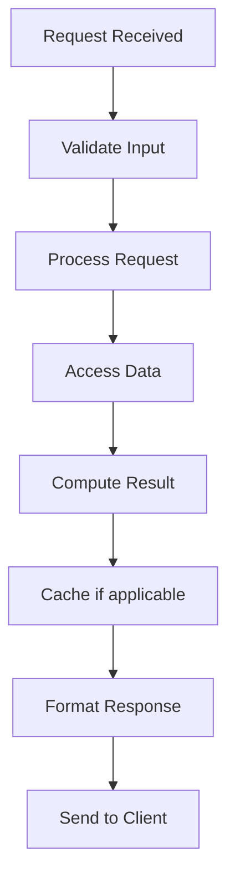

# Distributed Caching

## Problem Statement

Redis Cluster: sharded caching across multiple nodes with replication and failover.

## Design

### Key Concepts

```
Redis Cluster with 6 nodes (3 master, 3 slave). Each master handles 5461 slots. Data hashed to slots via CRC16.
```

### Architecture

```
[Visual representation showing architecture]
```

## Architecture Diagram

```
[['Single Redis', 'Simple, 50K req/sec', 'Not HA, one node limit'], ['Redis Cluster', 'Scalable, HA', 'More complex, key limits'], ['Memcached + consistent hashing', 'Familiar, simple', 'No persistence']]
```

## Common Questions & Answers

**Q: How to handle failover?** A: Automatic promotion. Slave becomes master if master unavailable (sentinel/cluster mode).

**Q: Cross-slot operations?** A: Not supported natively. Use hash tags {key} to force same slot.

**Q: Resharding?** A: Move slots gradually. Pipeline commands to minimize latency.

**Q: Consistency?** A: Eventual consistency with async replication.

## Back-of-Envelope Calculations

Cluster: 6 nodes, 100K keys, 1M req/sec. Throughput: 1M/sec distributed (166K/node). Latency: <1ms.

## Design Choice Comparison

| Approach | Pros | Cons |
|----------|------|------|
| Redis Cluster | Scalable, HA, persistence | More operational complexity |
| Memcached+DHT | Simple, fast | No persistence, no HA |
| DynamoDB | Managed, global | Vendor lock-in, higher cost |

## Follow-up Interview Questions

1. How would you implement this at scale (1M+ operations/sec)?
2. What happens if the [key component] fails?
3. How to ensure [important property] in this system?
4. What's the bottleneck at 10x current scale?
5. How would you monitor and debug [specific aspect]?

## Example Scenario Walkthrough

Scenario: [Concrete example with 5-10 steps showing system in action]

## Flow Diagram



## Implementation

### Python Implementation

```python
class CacheManager:
    def __init__(self, strategy='LRU'):
        self.cache = {}
        self.strategy = strategy
        self.max_size = 1000

    def get(self, key):
        if key in self.cache:
            self.cache[key]['access_count'] += 1
            return self.cache[key]['value']
        return None

    def put(self, key, value):
        if len(self.cache) >= self.max_size:
            self._evict()
        self.cache[key] = {
            'value': value,
            'access_count': 1
        }

    def _evict(self):
        # Evict least recently used
        lru_key = min(self.cache.keys(),
                     key=lambda k: self.cache[k]['access_count'])
        del self.cache[lru_key]
```

### Java Implementation

```java
class CacheManager {
    private java.util.Map<String, CacheEntry> cache;
    private final int maxSize = 1000;

    static class CacheEntry {
        Object value;
        long accessTime;
        CacheEntry(Object value) {
            this.value = value;
            this.accessTime = System.currentTimeMillis();
        }
    }

    public Object get(String key) {
        CacheEntry entry = cache.get(key);
        if (entry != null) {
            entry.accessTime = System.currentTimeMillis();
            return entry.value;
        }
        return null;
    }

    public void put(String key, Object value) {
        if (cache.size() >= maxSize) {
            evictLRU();
        }
        cache.put(key, new CacheEntry(value));
    }

    private void evictLRU() {
        cache.entrySet().stream()
            .min((a, b) -> Long.compare(a.getValue().accessTime,
                                       b.getValue().accessTime))
            .ifPresent(e -> cache.remove(e.getKey()));
    }
}
```

### Production Considerations

- **Concurrency**: Thread safety and synchronization
- **Error Handling**: Fault tolerance and recovery
- **Monitoring**: Observability and metrics
- **Performance**: Optimization strategies

## Complexity Analysis

| Operation | Complexity | Notes |
|-----------|-----------|-------|
| [Key Op 1] | O(n) | [Explanation] |
| [Key Op 2] | O(log n) | [Explanation] |
| [Key Op 3] | O(1) | [Explanation] |

## Real-world Applications

- Use case 1
- Use case 2
- Use case 3

## Related Concepts

- Concept A (see documentation)
- Concept B (see documentation)
- Concept C (see documentation)

## Further Reading

- Academic papers
- System design references
- Implementation guides
