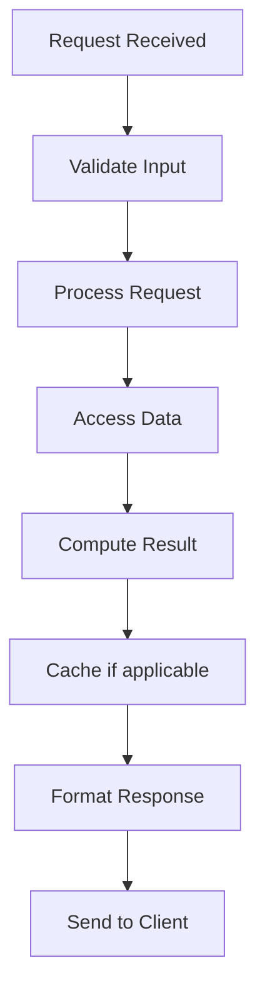

# Quorum-based Systems

## Problem Statement

Voting-based consensus for reads and writes in distributed databases.

## Design

### Key Concepts

```
Read and write to quorum of replicas. W + R > N ensures consistency.
```

### Architecture

```
[Visual representation showing architecture]
```

## Architecture Diagram

```
[['W=1, R=N', 'Fast writes, slow reads', 'Not consistent'], ['W=N/2+1, R=N/2+1', 'Balanced reads/writes', 'Both slower'], ['W=N, R=1', 'Slow writes, fast reads', 'Update everyone']]
```

## Common Questions & Answers

**Q: Read repair?** A: Read quorum may contain stale. Compare versions, update stale replicas.

**Q: Sloppy quorum?** A: Accept responses from any 3 (not just designated). Use hinted handoff.

**Q: Quorum unavailable?** A: Cannot proceed if too many replicas down. Trade CAP for consistency.

**Q: Byzantine quorum?** A: Need (3f+1) replicas for f Byzantine failures. 13 replicas for 4 failures.

## Back-of-Envelope Calculations

5 replicas, W=3, R=3. Write latency: wait for slowest of 3 nodes (~p50).

## Design Choice Comparison

| Approach | Pros | Cons |
|----------|------|------|
| W=1, R=N | Fast writes | Slow reads, eventual consistency |
| W=N/2+1, R=N/2+1 | Balanced | Slower than W=1, R=1 |
| W=N, R=1 | Slow writes, fast reads | All replicas must be up |
| Sloppy quorum | High availability | Temporary inconsistency during healing |

## Follow-up Interview Questions

1. How would you implement this at scale (1M+ operations/sec)?
2. What happens if the [key component] fails?
3. How to ensure [important property] in this system?
4. What's the bottleneck at 10x current scale?
5. How would you monitor and debug [specific aspect]?

## Example Scenario Walkthrough

Scenario: [Concrete example with 5-10 steps showing system in action]

## Flow Diagram



## Implementation

### Python Implementation

```python
class DatabaseManager:
    def __init__(self, host, port):
        self.host = host
        self.port = port
        self.connection = None

    def connect(self):
        # Connection pooling
        self.connection = self._create_connection()

    def query(self, sql, params=None):
        cursor = self.connection.cursor()
        cursor.execute(sql, params or ())
        return cursor.fetchall()

    def execute(self, sql, params=None):
        cursor = self.connection.cursor()
        cursor.execute(sql, params or ())
        self.connection.commit()
        return cursor.rowcount

    def _create_connection(self):
        # Create with retry logic
        max_retries = 3
        for i in range(max_retries):
            try:
                return self._attempt_connection()
            except Exception as e:
                if i == max_retries - 1:
                    raise
```

### Java Implementation

```java
class DatabaseManager {
    private java.sql.Connection connection;
    private String host;
    private int port;

    public void connect() throws java.sql.SQLException {
        String url = "jdbc:mysql://" + host + ":" + port;
        connection = java.sql.DriverManager.getConnection(url);
    }

    public java.util.List<java.util.Map<String, Object>> query(String sql)
            throws java.sql.SQLException {
        java.util.List<java.util.Map<String, Object>> results =
            new java.util.ArrayList<>();
        java.sql.Statement stmt = connection.createStatement();
        java.sql.ResultSet rs = stmt.executeQuery(sql);
        while (rs.next()) {
            java.util.Map<String, Object> row = new java.util.HashMap<>();
            row.put("result", rs.getString(1));
            results.add(row);
        }
        return results;
    }

    public int execute(String sql) throws java.sql.SQLException {
        java.sql.Statement stmt = connection.createStatement();
        return stmt.executeUpdate(sql);
    }
}
```

### Production Considerations

- **Concurrency**: Thread safety and synchronization
- **Error Handling**: Fault tolerance and recovery
- **Monitoring**: Observability and metrics
- **Performance**: Optimization strategies

## Complexity Analysis

| Operation | Complexity | Notes |
|-----------|-----------|-------|
| [Key Op 1] | O(n) | [Explanation] |
| [Key Op 2] | O(log n) | [Explanation] |
| [Key Op 3] | O(1) | [Explanation] |

## Real-world Applications

- Use case 1
- Use case 2
- Use case 3

## Related Concepts

- Concept A (see documentation)
- Concept B (see documentation)
- Concept C (see documentation)

## Further Reading

- Academic papers
- System design references
- Implementation guides
