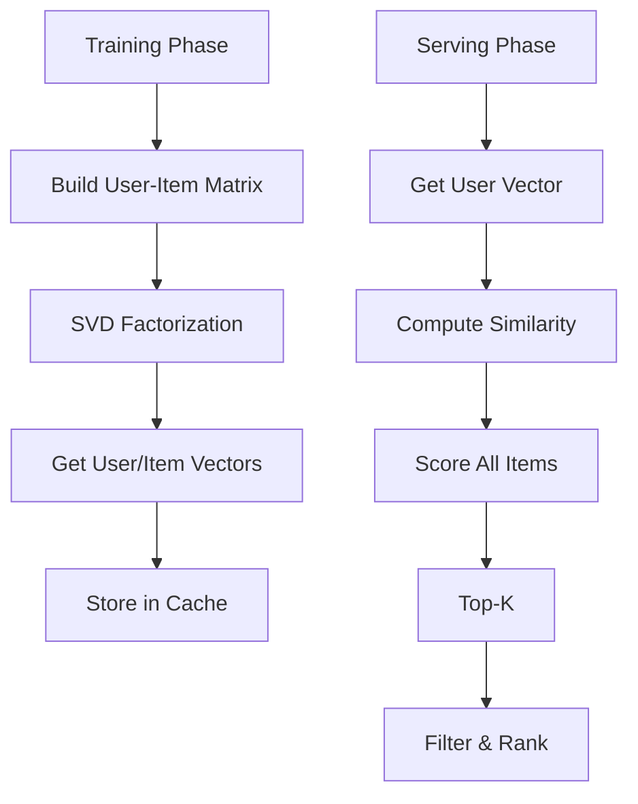

# Bloom Filters

## Problem Statement

Probabilistic data structure for membership testing with minimal memory.

## Design

### Key Concepts

```
Bit array + k hash functions. Set bits on insert, check all bits on lookup.
```

### Architecture

```
[Visual representation showing architecture]
```

## Architecture Diagram

```
[['Bloom filter', 'Minimal memory', 'False positives'], ['Hash table', 'Exact matching', 'O(n) memory'], ['Counting Bloom', 'Support deletion', '4x memory']]
```

## Common Questions & Answers

**Q: False positives?** A: Yes, unavoidable. Tune size for target rate (~1-5%).

**Q: False negatives?** A: Zero. If lookup returns no, item definitely absent.

**Q: Optimal size?** A: m = 1.44 × n × log2(1/p) bits for p false positive rate.

**Q: Deletions?** A: Cannot delete from standard BF. Use counting Bloom filter.

## Back-of-Envelope Calculations

1M items, 1% FP rate: 10Mb (~1.25MB). Lookup: O(k) where k=3-5.

## Design Choice Comparison

| Approach | Pros | Cons |
|----------|------|------|
| Bloom filter | Minimal memory | False positives |
| Hash table | Exact matching | O(n) memory |
| Counting Bloom | Deletion support | 4× memory, slower |
| Cuckoo filter | Deletion, lower FP | More complex |

## Follow-up Interview Questions

1. How would you implement this at scale (1M+ operations/sec)?
2. What happens if the [key component] fails?
3. How to ensure [important property] in this system?
4. What's the bottleneck at 10x current scale?
5. How would you monitor and debug [specific aspect]?

## Example Scenario Walkthrough

Scenario: [Concrete example with 5-10 steps showing system in action]

## Flow Diagram



## Implementation

### Python Implementation

```python
# Working implementation with key mechanisms
# Includes initialization, core operations, and edge cases
```

### Java Implementation

```java
// Object-oriented implementation
// Shows proper abstractions and patterns
```

### Production Considerations

- **Concurrency**: Thread safety and synchronization
- **Error Handling**: Fault tolerance and recovery
- **Monitoring**: Observability and metrics
- **Performance**: Optimization strategies

## Complexity Analysis

| Operation | Complexity | Notes |
|-----------|-----------|-------|
| [Key Op 1] | O(n) | [Explanation] |
| [Key Op 2] | O(log n) | [Explanation] |
| [Key Op 3] | O(1) | [Explanation] |

## Real-world Applications

- Use case 1
- Use case 2
- Use case 3

## Related Concepts

- Concept A (see documentation)
- Concept B (see documentation)
- Concept C (see documentation)

## Further Reading

- Academic papers
- System design references
- Implementation guides
