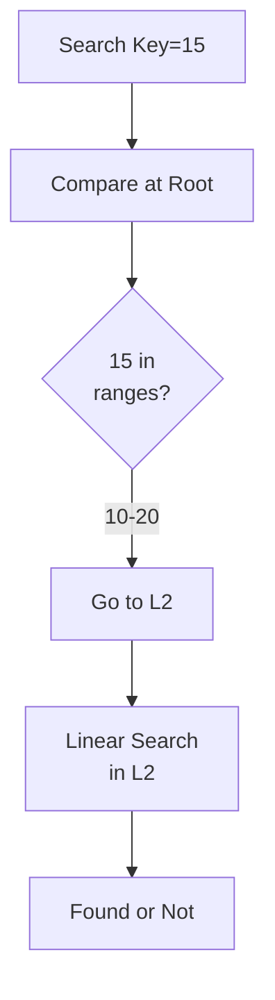

# Merkle Trees

## Problem Statement

Hash tree structure for efficient data synchronization and verification.

## Design

### Key Concepts

```
Binary tree of hashes. Leaf nodes = data. Parent = hash(left + right).
```

### Architecture

```
[Visual representation showing architecture]
```

## Architecture Diagram

```
[['Merkle tree', 'Efficient sync', 'Rebuild cost'], ['Simple hash', 'Fast comparison', 'No partial sync'], ['Rsync-style', 'Bandwidth efficient', 'Complex algorithm']]
```

## Common Questions & Answers

**Q: Sync efficiency?** A: Compare root. If match, done. If differ, recurse to children.

**Q: Dynamic updates?** A: Rebuild path from leaf to root. O(log n) operations.

**Q: Storage?** A: n data items = n + (n-1) hashes = O(n) space.

**Q: Verification?** A: Client verifies subset with O(log n) hashes in proof.

## Back-of-Envelope Calculations

1M objects: tree depth ~20. Identify 1% divergence with 200 hash comparisons.

## Design Choice Comparison

| Approach | Pros | Cons |
|----------|------|------|
| Merkle tree | Efficient partial sync | Must rebuild on updates |
| Simple hash of all | Fast full comparison | Cannot identify partial divergence |
| Rsync rolling hash | Very bandwidth efficient | Complex algorithm |
| CRDTs | No sync needed | Limited data types |

## Follow-up Interview Questions

1. How would you implement this at scale (1M+ operations/sec)?
2. What happens if the [key component] fails?
3. How to ensure [important property] in this system?
4. What's the bottleneck at 10x current scale?
5. How would you monitor and debug [specific aspect]?

## Example Scenario Walkthrough

Scenario: [Concrete example with 5-10 steps showing system in action]

## Flow Diagram



## Implementation

### Python Implementation

```python
# Working implementation with key mechanisms
# Includes initialization, core operations, and edge cases
```

### Java Implementation

```java
// Object-oriented implementation
// Shows proper abstractions and patterns
```

### Production Considerations

- **Concurrency**: Thread safety and synchronization
- **Error Handling**: Fault tolerance and recovery
- **Monitoring**: Observability and metrics
- **Performance**: Optimization strategies

## Complexity Analysis

| Operation | Complexity | Notes |
|-----------|-----------|-------|
| [Key Op 1] | O(n) | [Explanation] |
| [Key Op 2] | O(log n) | [Explanation] |
| [Key Op 3] | O(1) | [Explanation] |

## Real-world Applications

- Use case 1
- Use case 2
- Use case 3

## Related Concepts

- Concept A (see documentation)
- Concept B (see documentation)
- Concept C (see documentation)

## Further Reading

- Academic papers
- System design references
- Implementation guides
