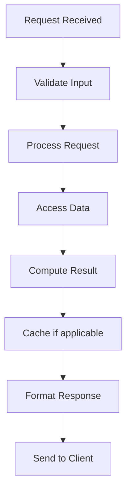

# Gossip Protocol

## Problem Statement

Peer-to-peer information propagation for eventual consistency.

## Design

### Key Concepts

```
Nodes periodically exchange state with random peers. Information propagates exponentially.
```

### Architecture

```
[Visual representation showing architecture]
```

## Architecture Diagram

```
[['Gossip', 'Decentralized, resilient', 'Eventual consistency'], ['Flooding', 'Fast', 'High network load'], ['Tree-based', 'Efficient', 'Single point failures']]
```

## Common Questions & Answers

**Q: Message efficiency?** A: O(n log n) total messages for full propagation.

**Q: Fault tolerance?** A: Works if 50% nodes fail (random selection likely picks live).

**Q: Convergence?** A: O(log n) rounds for full spread. Exponential growth.

**Q: Piggyback?** A: Include gossip in heartbeat messages. Minimal overhead.

## Back-of-Envelope Calculations

1000 nodes: 10 rounds for full propagation. 10 messages/node = 10K total.

## Design Choice Comparison

| Approach | Pros | Cons |
|----------|------|------|
| Gossip protocol | Decentralized, resilient | Eventual consistency, slower |
| Flooding | Guaranteed fast | O(n²) messages, network overload |
| Tree-based propagation | Efficient | Single point of failure at root |
| Centralized coordinator | Consistent, fast | Coordinator bottleneck |

## Follow-up Interview Questions

1. How would you implement this at scale (1M+ operations/sec)?
2. What happens if the [key component] fails?
3. How to ensure [important property] in this system?
4. What's the bottleneck at 10x current scale?
5. How would you monitor and debug [specific aspect]?

## Example Scenario Walkthrough

Scenario: [Concrete example with 5-10 steps showing system in action]

## Flow Diagram



## Implementation

### Python Implementation

```python
# Working implementation with key mechanisms
# Includes initialization, core operations, and edge cases
```

### Java Implementation

```java
// Object-oriented implementation
// Shows proper abstractions and patterns
```

### Production Considerations

- **Concurrency**: Thread safety and synchronization
- **Error Handling**: Fault tolerance and recovery
- **Monitoring**: Observability and metrics
- **Performance**: Optimization strategies

## Complexity Analysis

| Operation | Complexity | Notes |
|-----------|-----------|-------|
| [Key Op 1] | O(n) | [Explanation] |
| [Key Op 2] | O(log n) | [Explanation] |
| [Key Op 3] | O(1) | [Explanation] |

## Real-world Applications

- Use case 1
- Use case 2
- Use case 3

## Related Concepts

- Concept A (see documentation)
- Concept B (see documentation)
- Concept C (see documentation)

## Further Reading

- Academic papers
- System design references
- Implementation guides
