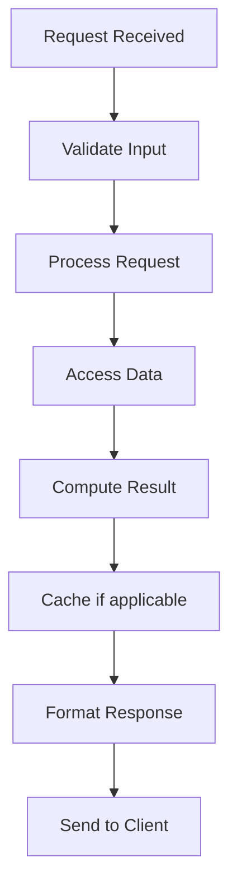

# CRDT (Conflict-free Replicated Data Type)

## Problem Statement

Data structures that converge without coordination in distributed systems.

## Design

### Key Concepts

```
CRDTs use commutative operations. All nodes merge same operations → converge to same state.
```

### Architecture

```
[Visual representation showing architecture]
```

## Architecture Diagram

```
[['CRDT', 'Auto-convergent', 'Memory overhead'], ['OT (Operational Transform)', 'Complex, powerful', 'Central server needed'], ['Consensus', 'Strong consistency', 'Unavailable when partitioned']]
```

## Common Questions & Answers

**Q: Convergence guaranteed?** A: Yes, mathematically. Commutative + associative operations.

**Q: Data types supported?** A: Counters, sets (LWW, OR, UR), registers, maps, sequences (RGA, Yata).

**Q: Causality?** A: Depends on implementation. Vector clocks optional.

**Q: Memory?** A: Metadata overhead 10-20× for concurrent edits.

## Back-of-Envelope Calculations

100K users, 1M edits: CRDT metadata 10-20x base data.

## Design Choice Comparison

| Approach | Pros | Cons |
|----------|------|------|
| CRDT (OT-free) | Auto-converge, no central server | Memory overhead, limited types |
| Operational Transform | More data types | Central server required |
| Consensus (PAXOS/Raft) | Strong consistency | Unavailable on partition |
| Last-write-wins | Simple | Data loss possible |

## Follow-up Interview Questions

1. How would you implement this at scale (1M+ operations/sec)?
2. What happens if the [key component] fails?
3. How to ensure [important property] in this system?
4. What's the bottleneck at 10x current scale?
5. How would you monitor and debug [specific aspect]?

## Example Scenario Walkthrough

Scenario: [Concrete example with 5-10 steps showing system in action]

## Flow Diagram



## Implementation

### Python Implementation

```python
# Working implementation with key mechanisms
# Includes initialization, core operations, and edge cases
```

### Java Implementation

```java
// Object-oriented implementation
// Shows proper abstractions and patterns
```

### Production Considerations

- **Concurrency**: Thread safety and synchronization
- **Error Handling**: Fault tolerance and recovery
- **Monitoring**: Observability and metrics
- **Performance**: Optimization strategies

## Complexity Analysis

| Operation | Complexity | Notes |
|-----------|-----------|-------|
| [Key Op 1] | O(n) | [Explanation] |
| [Key Op 2] | O(log n) | [Explanation] |
| [Key Op 3] | O(1) | [Explanation] |

## Real-world Applications

- Use case 1
- Use case 2
- Use case 3

## Related Concepts

- Concept A (see documentation)
- Concept B (see documentation)
- Concept C (see documentation)

## Further Reading

- Academic papers
- System design references
- Implementation guides
