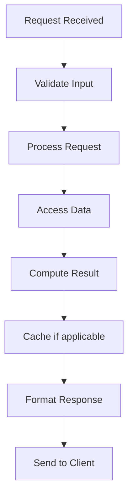

# Leader Election

## Problem Statement

Algorithms for selecting a coordinator in distributed systems.

## Design

### Key Concepts

```
Candidates compete via quorum voting. Highest priority/ID becomes leader. Heartbeat confirms.
```

### Architecture

```
[Visual representation showing architecture]
```

## Architecture Diagram

```
[['Bully algorithm', 'Simple', 'Many messages'], ['Raft', 'Practical, safe', 'More complex'], ['Ring algorithm', 'Elegant math', 'Slow convergence']]
```

## Common Questions & Answers

**Q: Split brain prevention?** A: Require quorum majority for leadership. Partition loses minority.

**Q: Failover latency?** A: Election timeout (500ms-2s) + message propagation.

**Q: Candidate ranking?** A: By node ID, capabilities, uptime, or custom logic.

**Q: Stale leader?** A: Heartbeat from new leader forces old to step down.

## Back-of-Envelope Calculations

5 nodes, 500ms election timeout: 1-2 leader changes per failure.

## Design Choice Comparison

| Approach | Pros | Cons |
|----------|------|------|
| Bully algorithm | Simple, fast | Many messages |
| Raft | Practical, safe | More complex |
| Ring algorithm | Elegant | Slower convergence |
| Zookeeper/etcd | Proven, reliable | External service required |

## Follow-up Interview Questions

1. How would you implement this at scale (1M+ operations/sec)?
2. What happens if the [key component] fails?
3. How to ensure [important property] in this system?
4. What's the bottleneck at 10x current scale?
5. How would you monitor and debug [specific aspect]?

## Example Scenario Walkthrough

Scenario: [Concrete example with 5-10 steps showing system in action]

## Flow Diagram



## Implementation

### Python Implementation

```python
# Working implementation with key mechanisms
# Includes initialization, core operations, and edge cases
```

### Java Implementation

```java
// Object-oriented implementation
// Shows proper abstractions and patterns
```

### Production Considerations

- **Concurrency**: Thread safety and synchronization
- **Error Handling**: Fault tolerance and recovery
- **Monitoring**: Observability and metrics
- **Performance**: Optimization strategies

## Complexity Analysis

| Operation | Complexity | Notes |
|-----------|-----------|-------|
| [Key Op 1] | O(n) | [Explanation] |
| [Key Op 2] | O(log n) | [Explanation] |
| [Key Op 3] | O(1) | [Explanation] |

## Real-world Applications

- Use case 1
- Use case 2
- Use case 3

## Related Concepts

- Concept A (see documentation)
- Concept B (see documentation)
- Concept C (see documentation)

## Further Reading

- Academic papers
- System design references
- Implementation guides
