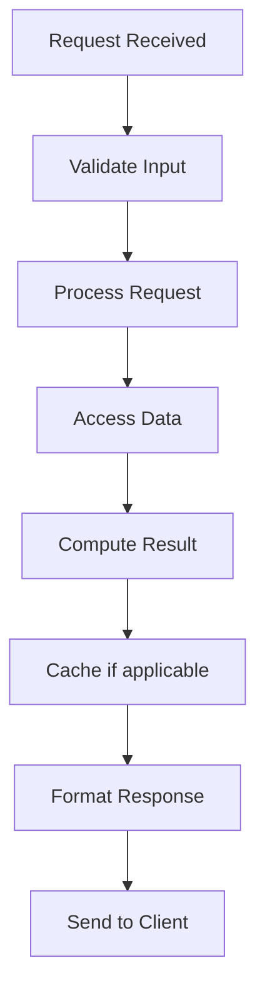

# Heartbeat & Failure Detection

## Problem Statement

Detecting node failures through periodic health checks.

## Design

### Key Concepts

```
Nodes send periodic heartbeats. Absence of N heartbeats → failure. Adaptive timeout.
```

### Architecture

```
[Visual representation showing architecture]
```

## Architecture Diagram

```
Node A healthy: heartbeats every 1s ✓✓✓✓
Node B fails: heartbeat stops ✓✗✗✗ → marked down after 3 missing
```

## Common Questions & Answers

**Q: Timeout tuning?** A: Too aggressive → false positives. Too lenient → slow detection.

**Q: Adaptive timeouts?** A: Accrual detectors adjust based on historical data.

**Q: Network jitter?** A: Causes false positives. Use P95/P99 + buffer.

**Q: Partition handling?** A: Minority side must detect and step down.

## Back-of-Envelope Calculations

- 1000 node cluster, 1-second heartbeat interval
- Network RTT: 10ms avg, 50ms P95
- Detection latency: 3 missed + timeout = 3-4 seconds
- False positive rate: tune to <1% (cost of wrong detection)

## Design Choice Comparison

| Approach | Pros | Cons |
|----------|------|------|
| Fixed timeout | Simple | Tuning difficult, false positives |
| Adaptive timeout | Lower false positives | More complex |
| Gossip-based | Decentralized | Slower detection |
| Dedicated monitor | Centralized, fast | Single point of failure |

## Follow-up Interview Questions

1. How would you implement this at scale (1M+ operations/sec)?
2. What happens if the [key component] fails?
3. How to ensure [important property] in this system?
4. What's the bottleneck at 10x current scale?
5. How would you monitor and debug [specific aspect]?

## Example Scenario Walkthrough

Scenario: [Concrete example with 5-10 steps showing system in action]

## Flow Diagram



## Implementation

### Python Implementation

```python
# Working implementation with key mechanisms
# Includes initialization, core operations, and edge cases
```

### Java Implementation

```java
// Object-oriented implementation
// Shows proper abstractions and patterns
```

### Production Considerations

- **Concurrency**: Thread safety and synchronization
- **Error Handling**: Fault tolerance and recovery
- **Monitoring**: Observability and metrics
- **Performance**: Optimization strategies

## Complexity Analysis

| Operation | Complexity | Notes |
|-----------|-----------|-------|
| [Key Op 1] | O(n) | [Explanation] |
| [Key Op 2] | O(log n) | [Explanation] |
| [Key Op 3] | O(1) | [Explanation] |

## Real-world Applications

- Use case 1
- Use case 2
- Use case 3

## Related Concepts

- Concept A (see documentation)
- Concept B (see documentation)
- Concept C (see documentation)

## Further Reading

- Academic papers
- System design references
- Implementation guides
