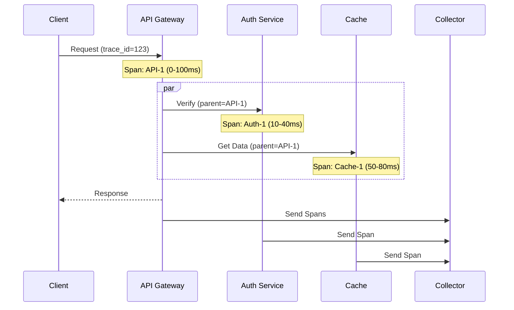

# Distributed Tracing

## Problem Statement

Request tracing across services (OpenTelemetry, Jaeger, Zipkin).

## Design

### Key Concepts

```
Trace ID flows through all services. Each span records timing, tags, events.
```

### Architecture

```
[Visual representation showing architecture]
```

## Architecture Diagram

```
Request span (100ms):
  Service A (20ms)
  → Service B (50ms, includes)
    → Service C (30ms)
  → Service D (10ms)
```

## Common Questions & Answers

**Q: Sampling?** A: 1-10% in prod. Full tracing in staging/test.

**Q: Overhead?** A: ~5-10% latency impact. Worth it for debugging.

**Q: Storage?** A: 1K trace spans/sec = ~1MB/sec uncompressed.

**Q: Privacy?** A: Sanitize PII from spans. Encrypt in transit/rest.

## Back-of-Envelope Calculations

- 10K req/sec, sampling 1% = 100 traces/sec
- ~100 spans per trace = 10K spans/sec
- 1KB per span = 10MB/sec raw
- With compression (4:1): 2.5MB/sec
- Monthly: 2.5MB/s × 2.6M seconds = 6.5TB (with retention policies)

## Design Choice Comparison

| Approach | Pros | Cons |
|----------|------|------|
| Distributed tracing (Jaeger/Zipkin) | Production debugging | Storage overhead |
| Structured logging | Simpler | Harder to correlate |
| APM (DataDog/NewRelic) | Managed, more features | Expensive |
| Custom sampling | Flexible | DIY maintenance |

## Follow-up Interview Questions

1. How would you implement this at scale (1M+ operations/sec)?
2. What happens if the [key component] fails?
3. How to ensure [important property] in this system?
4. What's the bottleneck at 10x current scale?
5. How would you monitor and debug [specific aspect]?

## Example Scenario Walkthrough

Scenario: [Concrete example with 5-10 steps showing system in action]

## Flow Diagram



## Implementation

### Python Implementation

```python
# Working implementation with key mechanisms
# Includes initialization, core operations, and edge cases
```

### Java Implementation

```java
// Object-oriented implementation
// Shows proper abstractions and patterns
```

### Production Considerations

- **Concurrency**: Thread safety and synchronization
- **Error Handling**: Fault tolerance and recovery
- **Monitoring**: Observability and metrics
- **Performance**: Optimization strategies

## Complexity Analysis

| Operation | Complexity | Notes |
|-----------|-----------|-------|
| [Key Op 1] | O(n) | [Explanation] |
| [Key Op 2] | O(log n) | [Explanation] |
| [Key Op 3] | O(1) | [Explanation] |

## Real-world Applications

- Use case 1
- Use case 2
- Use case 3

## Related Concepts

- Concept A (see documentation)
- Concept B (see documentation)
- Concept C (see documentation)

## Further Reading

- Academic papers
- System design references
- Implementation guides
