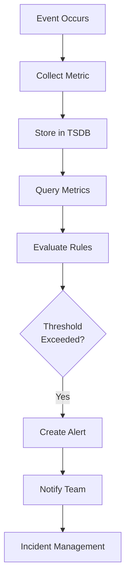

# Monitoring & Alerting Systems

## Problem Statement

Observability stack for distributed systems (Prometheus, Grafana).

## Design

### Key Concepts

```
Metrics collected → time-series DB → alert rules → incidents → escalation.
```

### Architecture

```
[Visual representation showing architecture]
```

## Architecture Diagram

```
Prometheus scrapes → TSDB storage
         ↓
  Grafana dashboards
         ↓
Alert rules (if metric > threshold)
         ↓
Alertmanager → Slack/PagerDuty
```

## Common Questions & Answers

**Q: Metrics to collect?** A: RED (Rate, Errors, Duration). USE (Utilization, Saturation, Errors).

**Q: Cardinality explosion?** A: Limit tags. No user IDs in metrics.

**Q: Alert fatigue?** A: Tune thresholds. Use baselines, anomaly detection.

**Q: SLA/SLO?** A: Define meaningful SLOs. Map to alerts.

## Back-of-Envelope Calculations

- 10K metrics, 15-second resolution = 40K points/minute
- Each point: 64-bit timestamp + value = 16 bytes
- 40K points/min × 16 bytes × 43200 min/month = 27.6GB/month
- 1 year retention: 331GB (before compression)

## Design Choice Comparison

| Approach | Pros | Cons |
|----------|------|------|
| Prometheus + Grafana | Open source, flexible | DIY scaling/retention |
| Datadog/NewRelic | Managed, powerful | Expensive at scale |
| CloudWatch/Stackdriver | Cloud-native | Vendor lock-in |
| Custom TSDB | Tailored | High maintenance |

## Follow-up Interview Questions

1. How would you implement this at scale (1M+ operations/sec)?
2. What happens if the [key component] fails?
3. How to ensure [important property] in this system?
4. What's the bottleneck at 10x current scale?
5. How would you monitor and debug [specific aspect]?

## Example Scenario Walkthrough

Scenario: [Concrete example with 5-10 steps showing system in action]

## Flow Diagram



## Implementation

### Python Implementation

```python
# Working implementation with key mechanisms
# Includes initialization, core operations, and edge cases
```

### Java Implementation

```java
// Object-oriented implementation
// Shows proper abstractions and patterns
```

### Production Considerations

- **Concurrency**: Thread safety and synchronization
- **Error Handling**: Fault tolerance and recovery
- **Monitoring**: Observability and metrics
- **Performance**: Optimization strategies

## Complexity Analysis

| Operation | Complexity | Notes |
|-----------|-----------|-------|
| [Key Op 1] | O(n) | [Explanation] |
| [Key Op 2] | O(log n) | [Explanation] |
| [Key Op 3] | O(1) | [Explanation] |

## Real-world Applications

- Use case 1
- Use case 2
- Use case 3

## Related Concepts

- Concept A (see documentation)
- Concept B (see documentation)
- Concept C (see documentation)

## Further Reading

- Academic papers
- System design references
- Implementation guides
