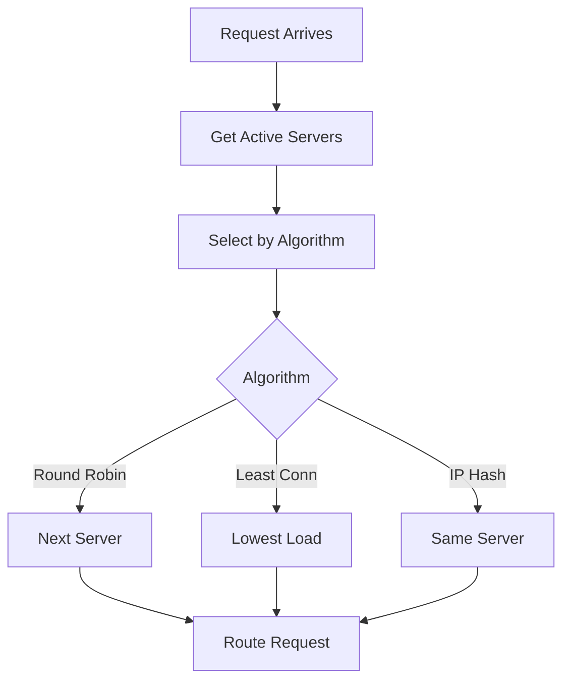

# Load Shedding & Backpressure

## Problem Statement

Graceful degradation and flow control under overload.

## Design

### Key Concepts

```
Detect overload → reject low-priority requests → reduce processing → return to normal.
```

### Architecture

```
[Visual representation showing architecture]
```

## Architecture Diagram

```
Request rate: 1000 req/sec
  Processing capacity: 800 req/sec
  Accepted: 800 (high priority)
  Dropped: 200 (low priority)
```

## Common Questions & Answers

**Q: Detection mechanism?** A: Queue depth, response latency, CPU usage.

**Q: Priority levels?** A: Gold/Silver/Bronze customers. Authenticated > anonymous.

**Q: Graceful degradation?** A: Return cached data or 503 Service Unavailable.

**Q: Recovery?** A: Gradual acceptance increase as load drops.

## Back-of-Envelope Calculations

- Service can handle 1000 req/sec
- Traffic spike: 2000 req/sec arrives
- Without shedding: 1000 accepted (overloaded), rest timeout
- With shedding: 1000 accepted (normal), 1000 rejected fast (2ms)
- Better: user gets immediate rejection vs 10s timeout

## Design Choice Comparison

| Approach | Pros | Cons |
|----------|------|------|
| Token bucket (rate limiting) | Smooth load | Not true shedding |
| Queue + drop | Simple | Delayed rejection |
| Adaptive shedding | Dynamic thresholds | Complex tuning |
| Request prioritization | Fair allocation | Requires priority info |

## Follow-up Interview Questions

1. How would you implement this at scale (1M+ operations/sec)?
2. What happens if the [key component] fails?
3. How to ensure [important property] in this system?
4. What's the bottleneck at 10x current scale?
5. How would you monitor and debug [specific aspect]?

## Example Scenario Walkthrough

Scenario: [Concrete example with 5-10 steps showing system in action]

## Flow Diagram



## Implementation

### Python Implementation

```python
class LoadBalancer:
    def __init__(self, servers):
        self.servers = servers
        self.current = 0

    def route_request(self, request):
        # Round-robin
        server = self.servers[self.current]
        self.current = (self.current + 1) % len(self.servers)
        return server.handle(request)

    def add_server(self, server):
        self.servers.append(server)

    def remove_server(self, server):
        if server in self.servers:
            self.servers.remove(server)
```

### Java Implementation

```java
class LoadBalancer {
    private java.util.List<Server> servers;
    private int current = 0;

    public LoadBalancer(java.util.List<Server> servers) {
        this.servers = servers;
    }

    public Response routeRequest(Request request) {
        Server server = servers.get(current);
        current = (current + 1) % servers.size();
        return server.handle(request);
    }

    public synchronized void addServer(Server server) {
        servers.add(server);
    }

    public synchronized void removeServer(Server server) {
        servers.remove(server);
    }
}
```

### Production Considerations

- **Concurrency**: Thread safety and synchronization
- **Error Handling**: Fault tolerance and recovery
- **Monitoring**: Observability and metrics
- **Performance**: Optimization strategies

## Complexity Analysis

| Operation | Complexity | Notes |
|-----------|-----------|-------|
| [Key Op 1] | O(n) | [Explanation] |
| [Key Op 2] | O(log n) | [Explanation] |
| [Key Op 3] | O(1) | [Explanation] |

## Real-world Applications

- Use case 1
- Use case 2
- Use case 3

## Related Concepts

- Concept A (see documentation)
- Concept B (see documentation)
- Concept C (see documentation)

## Further Reading

- Academic papers
- System design references
- Implementation guides
