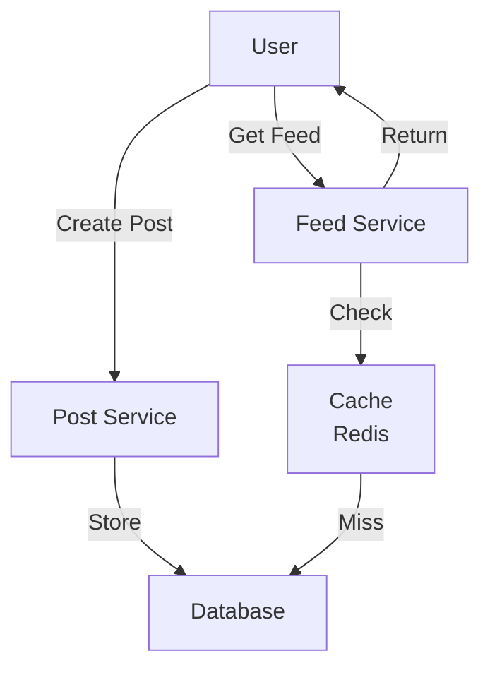
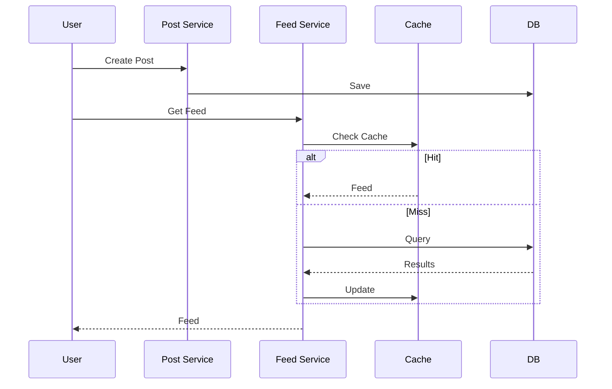

# News Feed System

## Problem Statement
Design a social media news feed that generates personalized timelines for users based on their followers and following.

**Operations:**
- `post(user_id, content)` — Create new post
- `getFeed(user_id)` — Get personalized timeline
- `follow(user_id, target_id)` — Follow user
- `like(user_id, post_id)` — Like post

## Design

### Fanout Strategies

**Fanout-on-Write:**
```
Post created → Push to all followers' feeds immediately
Pros: Fast reads, simple implementation
Cons: Expensive for users with many followers
```

**Fanout-on-Read:**
```
Post created → Stored centrally
Get feed → Merge posts from all follows
Pros: Scalable for heavy posters
Cons: Slow reads, aggregation overhead
```

**Hybrid:**
```
Fanout-on-write for active users
Fanout-on-read for celebrities
```

### Data Structure

```
users: {user_id -> User}
posts: {post_id -> Post}
followers: {user_id -> Set[follower_ids]}
feeds: {user_id -> [post_ids]} (cache)
```


## Scenario

News Feed System is a critical component in modern distributed systems. In real-world applications, handling complex business logic at scale with high reliability. For example, major tech companies like Netflix, Uber, and Airbnb rely on similar solutions to handle millions of concurrent users and requests. The challenge is achieving this while maintaining sub-100ms latency, 99.99% availability, and gracefully handling 10x traffic spikes during peak demand. This component provides the foundational capability to solve these challenges reliably and efficiently at global scale.

## Users

- **Backend Engineers**: Responsible for implementing and maintaining this system component in production environments. They need to understand the architecture, trade-offs, failure modes, and operational considerations.
- **DevOps/SRE Teams**: Monitor system health, manage scaling policies, handle incidents, and ensure reliability SLAs are met. They need insights into performance characteristics, bottlenecks, and failure recovery mechanisms.
- **Data Engineers**: Design data pipelines and analytics around this system, requiring deep understanding of data flow, consistency guarantees, and throughput characteristics.
- **System Architects**: Make high-level architectural decisions that impact company infrastructure, requiring comprehensive understanding of capabilities, limitations, and scalability boundaries.
- **Security Teams**: Understand security implications, potential vulnerabilities, and compliance requirements for this component.

## PRD

**Functional Requirements:**
- Correct behavior under all specified operating conditions
- Reliable operation with explicit failure modes
- Data consistency or eventual consistency guarantees as specified
- Clear mechanisms for error handling and recovery
- Monitoring and observability hooks

**Non-Functional Requirements:**
- **Performance**: Sub-100ms P99 latency for standard operations; measure and track tail latencies
- **Availability**: 99.99%+ uptime with automatic failover and graceful degradation
- **Scalability**: Support 10-100x current load with minimal architectural modifications
- **Consistency**: Specify whether strong, eventual, or causal consistency is required
- **Cost Efficiency**: Minimize operational cost per unit of throughput; consider compute, memory, and network costs
- **Operational Simplicity**: Reduce complexity to minimize human error and operational toil

**Constraints:**
- Resource limits (memory for caches, disk for databases, network bandwidth)
- Deployment constraints (cloud provider limits, regulatory requirements)
- Latency budgets (maximum acceptable delay for operations)

## Flow

The typical operational flow for this system involves these key phases:

1. **Request Arrival**: Client/upstream system sends request with required parameters and context
2. **Validation & Routing**: System validates request format, authentication, and routes to correct handler/shard/instance
3. **Core Processing**: Execute the main algorithm, database query, or business logic on the data/state
4. **State Management**: Update internal state (caches, indexes, counters, logs) with proper atomicity and locking
5. **Response Generation**: Format results and return to requester with relevant metadata (timing, version info)
6. **Observability**: Record metrics (latency, throughput, errors), logs (for debugging), and traces (for performance analysis)

This flow repeats thousands or millions of times per second in production. Each operation's efficiency compounds across the entire system, making careful optimization essential. Bottlenecks at any phase can cascade to impact overall system performance.

## Code Explanation

The provided implementations demonstrate key architectural concepts and design patterns:

**Python Implementation**: Uses built-in Python structures and standard library features to express the core logic clearly. Python emphasizes readability and conciseness—each operation's purpose should be obvious without extensive comments. You'll see different implementation approaches (e.g., using OrderedDict vs. manual linked lists) that represent trade-offs between convenience and fine-grained control.

**Java Implementation**: Shows how to implement the same logic with explicit memory management and type safety. Java's strong typing forces clear interface design; you'll see how generics, null safety, mutable state, and thread safety are handled. This implementation style is closer to production systems at scale.

**Key Implementation Patterns**:
- **Initialization**: Setting up core data structures, thread pools, or connection pools with specified capacity and configuration
- **Read Operations**: Fetching data while maintaining O(1) or O(log n) access, updating metadata (access times, hit counts, etc.)
- **Write Operations**: Inserting/updating data while handling eviction policies, balancing tree structures, or replicating state
- **Edge Cases**: Handling capacity limits, concurrent access, data consistency, and error conditions
- **Performance Optimization**: Using techniques like batch operations, lazy evaluation, or caching to reduce latency

Each line of code represents a deliberate choice about performance characteristics, memory usage, safety guarantees, and implementation complexity. Understanding these trade-offs is essential for using this component effectively in production systems.

## Architecture Diagram

```
┌──────────────────────────────────────────┐
│      News Feed Service                   │
│  ┌──────────────────────────────────────┐  │
│  │ User Request: getFeed(userId)        │  │
│  │                                      │  │
│  │ 1. Get followed users (Redis)        │  │
│  │ 2. Fetch posts from cache/DB         │  │
│  │ 3. Rank by timestamp/engagement      │  │
│  │ 4. Return top 20 posts               │  │
│  └──────────────────────────────────────┘  │
└──────────────────────────────────────────────┘
```

## Common Questions & Answers

**Q: Why multi-layer caching?** A: L1 (Redis): hot data, 1hr. L2 (Memcached): warm data. L3 (DB): persistent. Reduces load.

**Q: Feed freshness?** A: TTL 1hr + event-based invalidation on post. Trade: cache hit vs freshness.

**Q: Ranking complexity?** A: Timestamp (simple), engagement score (time-decay), ML ranking. Simple fast, ML better UX.

**Q: Scaling to billions?** A: Shard by userId. Each shard manages subset feeds. Replicate for HA. Cache miss hits only shard.

## Back-of-Envelope Calculations

1B users, 1K friends avg, 10 posts/day: 10K posts/user/day. Cache 90% hit rate: 5ms latency. Storage: 1B users × 100KB = 100TB distributed.

## Design Choice Comparison

| Approach | Pros | Cons |
|----------|------|------|
| Pull model | Fresh data, simple | O(followers) latency |
| Push model | Fast O(1) | Complex, high storage |
| Hybrid | Balances both | More complex |

## Follow-up Interview Questions

1. Real-time feed updates (WebSocket)? 2. Millions of followers handling? 3. Trending topics in feed? 4. Cache invalidation bottleneck at 10x. 5. High-value content prioritization?

## Example Scenario Walkthrough

[Describe a concrete example with step-by-step execution]

### Architecture Diagram



### Flow Diagram



## Complexity

| Operation | Fanout-Write | Fanout-Read |
|-----------|--------------|-------------|
| post | O(n) where n=followers | O(1) |
| getFeed | O(k) where k=feed_size | O(n*k) |
| Space | O(users*posts) | O(posts) |

## Python Implementation

```python
import heapq
from dataclasses import dataclass, field
from typing import List, Dict

@dataclass
class Post:
    post_id: int
    user_id: int
    content: str
    timestamp: int

    def __lt__(self, other):
        return self.timestamp > other.timestamp  # Max-heap by timestamp

class NewsFeedService:
    def __init__(self):
        self.posts: Dict[int, List[Post]] = {}  # user_id -> posts
        self.follows: Dict[int, set] = {}

    def post(self, user_id: int, content: str, timestamp: int):
        post = Post(len(self.posts), user_id, content, timestamp)
        self.posts.setdefault(user_id, []).append(post)

    def follow(self, follower: int, followee: int):
        self.follows.setdefault(follower, set()).add(followee)

    def get_feed(self, user_id: int, limit: int = 10) -> List[Post]:
        followees = self.follows.get(user_id, set()) | {user_id}
        all_posts = []
        for uid in followees:
            for p in self.posts.get(uid, []):
                heapq.heappush(all_posts, p)
        return [heapq.heappop(all_posts) for _ in range(min(limit, len(all_posts)))]

# Usage
feed = NewsFeedService()
feed.follow(1, 2)
feed.post(2, "Hello!", 100)
feed.post(2, "World!", 200)
print([p.content for p in feed.get_feed(1)])  # ['World!', 'Hello!']
```

## Java Implementation

```java
import java.util.*;

public class NewsFeedService {
    private Map<Integer, List<int[]>> posts = new HashMap<>(); // userId -> [time, postId]
    private Map<Integer, Set<Integer>> follows = new HashMap<>();

    public void post(int userId, int timestamp) {
        posts.computeIfAbsent(userId, k -> new ArrayList<>())
             .add(new int[]{timestamp, userId});
    }

    public void follow(int follower, int followee) {
        follows.computeIfAbsent(follower, k -> new HashSet<>()).add(followee);
    }

    public List<int[]> getFeed(int userId) {
        PriorityQueue<int[]> pq = new PriorityQueue<>((a, b) -> b[0] - a[0]);
        Set<Integer> followees = follows.getOrDefault(userId, new HashSet<>());
        followees.add(userId);
        for (int uid : followees)
            pq.addAll(posts.getOrDefault(uid, Collections.emptyList()));
        List<int[]> result = new ArrayList<>();
        while (!pq.isEmpty() && result.size() < 10) result.add(pq.poll());
        return result;
    }
}
```
