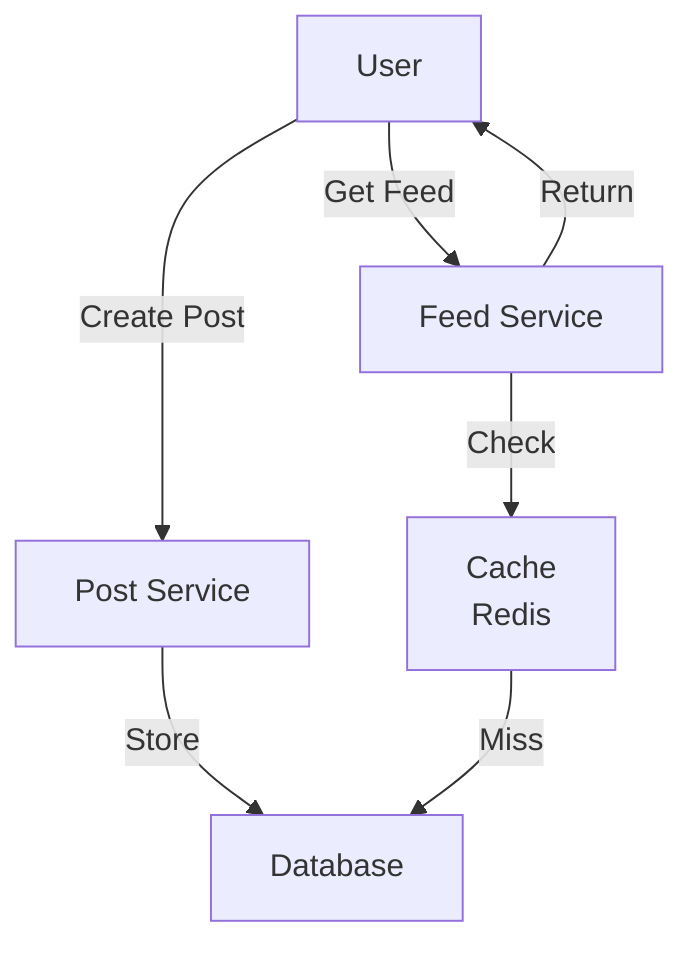
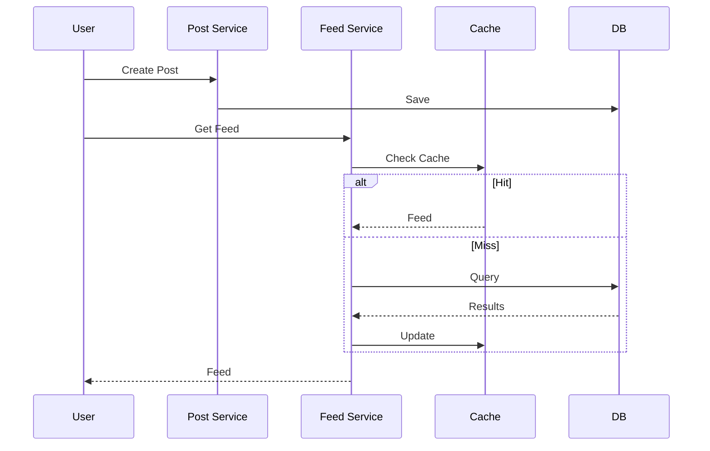

# News Feed System

## Problem Statement
Design a social media news feed that generates personalized timelines for users based on their followers and following.

**Operations:**
- `post(user_id, content)` — Create new post
- `getFeed(user_id)` — Get personalized timeline
- `follow(user_id, target_id)` — Follow user
- `like(user_id, post_id)` — Like post

## Design

### Fanout Strategies

**Fanout-on-Write:**
```
Post created → Push to all followers' feeds immediately
Pros: Fast reads, simple implementation
Cons: Expensive for users with many followers
```

**Fanout-on-Read:**
```
Post created → Stored centrally
Get feed → Merge posts from all follows
Pros: Scalable for heavy posters
Cons: Slow reads, aggregation overhead
```

**Hybrid:**
```
Fanout-on-write for active users
Fanout-on-read for celebrities
```

### Data Structure

```
users: {user_id -> User}
posts: {post_id -> Post}
followers: {user_id -> Set[follower_ids]}
feeds: {user_id -> [post_ids]} (cache)
```


## Architecture Diagram

```
┌──────────────────────────────────────────┐
│      News Feed Service                   │
│  ┌──────────────────────────────────────┐  │
│  │ User Request: getFeed(userId)        │  │
│  │                                      │  │
│  │ 1. Get followed users (Redis)        │  │
│  │ 2. Fetch posts from cache/DB         │  │
│  │ 3. Rank by timestamp/engagement      │  │
│  │ 4. Return top 20 posts               │  │
│  └──────────────────────────────────────┘  │
└──────────────────────────────────────────────┘
```

## Common Questions & Answers

**Q: Why multi-layer caching?** A: L1 (Redis): hot data, 1hr. L2 (Memcached): warm data. L3 (DB): persistent. Reduces load.

**Q: Feed freshness?** A: TTL 1hr + event-based invalidation on post. Trade: cache hit vs freshness.

**Q: Ranking complexity?** A: Timestamp (simple), engagement score (time-decay), ML ranking. Simple fast, ML better UX.

**Q: Scaling to billions?** A: Shard by userId. Each shard manages subset feeds. Replicate for HA. Cache miss hits only shard.

## Back-of-Envelope Calculations

1B users, 1K friends avg, 10 posts/day: 10K posts/user/day. Cache 90% hit rate: 5ms latency. Storage: 1B users × 100KB = 100TB distributed.

## Design Choice Comparison

| Approach | Pros | Cons |
|----------|------|------|
| Pull model | Fresh data, simple | O(followers) latency |
| Push model | Fast O(1) | Complex, high storage |
| Hybrid | Balances both | More complex |

## Follow-up Interview Questions

1. Real-time feed updates (WebSocket)? 2. Millions of followers handling? 3. Trending topics in feed? 4. Cache invalidation bottleneck at 10x. 5. High-value content prioritization?

## Example Scenario Walkthrough

[Describe a concrete example with step-by-step execution]

### Architecture Diagram



### Flow Diagram



## Complexity

| Operation | Fanout-Write | Fanout-Read |
|-----------|--------------|-------------|
| post | O(n) where n=followers | O(1) |
| getFeed | O(k) where k=feed_size | O(n*k) |
| Space | O(users*posts) | O(posts) |

## Python Implementation

```python
import heapq
from dataclasses import dataclass, field
from typing import List, Dict

@dataclass
class Post:
    post_id: int
    user_id: int
    content: str
    timestamp: int

    def __lt__(self, other):
        return self.timestamp > other.timestamp  # Max-heap by timestamp

class NewsFeedService:
    def __init__(self):
        self.posts: Dict[int, List[Post]] = {}  # user_id -> posts
        self.follows: Dict[int, set] = {}

    def post(self, user_id: int, content: str, timestamp: int):
        post = Post(len(self.posts), user_id, content, timestamp)
        self.posts.setdefault(user_id, []).append(post)

    def follow(self, follower: int, followee: int):
        self.follows.setdefault(follower, set()).add(followee)

    def get_feed(self, user_id: int, limit: int = 10) -> List[Post]:
        followees = self.follows.get(user_id, set()) | {user_id}
        all_posts = []
        for uid in followees:
            for p in self.posts.get(uid, []):
                heapq.heappush(all_posts, p)
        return [heapq.heappop(all_posts) for _ in range(min(limit, len(all_posts)))]

# Usage
feed = NewsFeedService()
feed.follow(1, 2)
feed.post(2, "Hello!", 100)
feed.post(2, "World!", 200)
print([p.content for p in feed.get_feed(1)])  # ['World!', 'Hello!']
```

## Java Implementation

```java
import java.util.*;

public class NewsFeedService {
    private Map<Integer, List<int[]>> posts = new HashMap<>(); // userId -> [time, postId]
    private Map<Integer, Set<Integer>> follows = new HashMap<>();

    public void post(int userId, int timestamp) {
        posts.computeIfAbsent(userId, k -> new ArrayList<>())
             .add(new int[]{timestamp, userId});
    }

    public void follow(int follower, int followee) {
        follows.computeIfAbsent(follower, k -> new HashSet<>()).add(followee);
    }

    public List<int[]> getFeed(int userId) {
        PriorityQueue<int[]> pq = new PriorityQueue<>((a, b) -> b[0] - a[0]);
        Set<Integer> followees = follows.getOrDefault(userId, new HashSet<>());
        followees.add(userId);
        for (int uid : followees)
            pq.addAll(posts.getOrDefault(uid, Collections.emptyList()));
        List<int[]> result = new ArrayList<>();
        while (!pq.isEmpty() && result.size() < 10) result.add(pq.poll());
        return result;
    }
}
```
