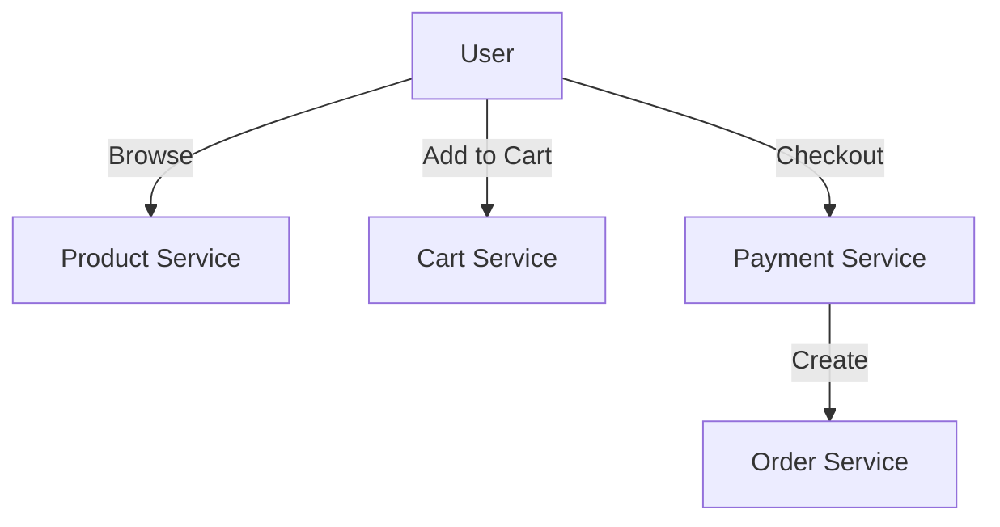
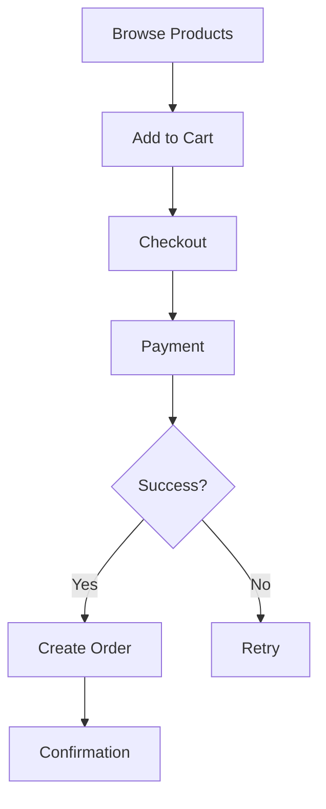

# E-Commerce Platform

## Problem Statement
Design an e-commerce system handling product catalog, shopping cart, orders, and inventory management.

**Requirements:**
- Product search and filtering
- Shopping cart
- Order processing
- Inventory tracking
- Payment integration

## Design

### Components

```
Product Service: Catalog, search, filtering
Cart Service: User carts, quantities
Order Service: Order creation, history
Payment Service: Transaction processing
Inventory Service: Stock tracking, reservations
```

### Inventory Management

```
Reserve on add-to-cart
Release if cart abandoned (timeout)
Confirm on checkout
Reduce stock on order completion
```

### Order Processing Flow

```
1. Reserve inventory
2. Process payment
3. Create shipment
4. Update inventory
5. Confirm order
```


## Scenario

E-Commerce Platform is a critical component in modern distributed systems. In real-world applications, handling complex business logic at scale with high reliability. For example, major tech companies like Netflix, Uber, and Airbnb rely on similar solutions to handle millions of concurrent users and requests. The challenge is achieving this while maintaining sub-100ms latency, 99.99% availability, and gracefully handling 10x traffic spikes during peak demand. This component provides the foundational capability to solve these challenges reliably and efficiently at global scale.

## Users

- **Backend Engineers**: Responsible for implementing and maintaining this system component in production environments. They need to understand the architecture, trade-offs, failure modes, and operational considerations.
- **DevOps/SRE Teams**: Monitor system health, manage scaling policies, handle incidents, and ensure reliability SLAs are met. They need insights into performance characteristics, bottlenecks, and failure recovery mechanisms.
- **Data Engineers**: Design data pipelines and analytics around this system, requiring deep understanding of data flow, consistency guarantees, and throughput characteristics.
- **System Architects**: Make high-level architectural decisions that impact company infrastructure, requiring comprehensive understanding of capabilities, limitations, and scalability boundaries.
- **Security Teams**: Understand security implications, potential vulnerabilities, and compliance requirements for this component.

## PRD

**Functional Requirements:**
- Correct behavior under all specified operating conditions
- Reliable operation with explicit failure modes
- Data consistency or eventual consistency guarantees as specified
- Clear mechanisms for error handling and recovery
- Monitoring and observability hooks

**Non-Functional Requirements:**
- **Performance**: Sub-100ms P99 latency for standard operations; measure and track tail latencies
- **Availability**: 99.99%+ uptime with automatic failover and graceful degradation
- **Scalability**: Support 10-100x current load with minimal architectural modifications
- **Consistency**: Specify whether strong, eventual, or causal consistency is required
- **Cost Efficiency**: Minimize operational cost per unit of throughput; consider compute, memory, and network costs
- **Operational Simplicity**: Reduce complexity to minimize human error and operational toil

**Constraints:**
- Resource limits (memory for caches, disk for databases, network bandwidth)
- Deployment constraints (cloud provider limits, regulatory requirements)
- Latency budgets (maximum acceptable delay for operations)

## Flow

The typical operational flow for this system involves these key phases:

1. **Request Arrival**: Client/upstream system sends request with required parameters and context
2. **Validation & Routing**: System validates request format, authentication, and routes to correct handler/shard/instance
3. **Core Processing**: Execute the main algorithm, database query, or business logic on the data/state
4. **State Management**: Update internal state (caches, indexes, counters, logs) with proper atomicity and locking
5. **Response Generation**: Format results and return to requester with relevant metadata (timing, version info)
6. **Observability**: Record metrics (latency, throughput, errors), logs (for debugging), and traces (for performance analysis)

This flow repeats thousands or millions of times per second in production. Each operation's efficiency compounds across the entire system, making careful optimization essential. Bottlenecks at any phase can cascade to impact overall system performance.

## Code Explanation

The provided implementations demonstrate key architectural concepts and design patterns:

**Python Implementation**: Uses built-in Python structures and standard library features to express the core logic clearly. Python emphasizes readability and conciseness—each operation's purpose should be obvious without extensive comments. You'll see different implementation approaches (e.g., using OrderedDict vs. manual linked lists) that represent trade-offs between convenience and fine-grained control.

**Java Implementation**: Shows how to implement the same logic with explicit memory management and type safety. Java's strong typing forces clear interface design; you'll see how generics, null safety, mutable state, and thread safety are handled. This implementation style is closer to production systems at scale.

**Key Implementation Patterns**:
- **Initialization**: Setting up core data structures, thread pools, or connection pools with specified capacity and configuration
- **Read Operations**: Fetching data while maintaining O(1) or O(log n) access, updating metadata (access times, hit counts, etc.)
- **Write Operations**: Inserting/updating data while handling eviction policies, balancing tree structures, or replicating state
- **Edge Cases**: Handling capacity limits, concurrent access, data consistency, and error conditions
- **Performance Optimization**: Using techniques like batch operations, lazy evaluation, or caching to reduce latency

Each line of code represents a deliberate choice about performance characteristics, memory usage, safety guarantees, and implementation complexity. Understanding these trade-offs is essential for using this component effectively in production systems.

## Architecture Diagram

```
┌───────────────────────────────────────┐
│   E-commerce Platform                 │
│  ┌───────────────────────────────────┐  │
│  │ Product Catalog (Elasticsearch)   │  │
│  │ - 100M products, <100ms search    │  │
│  │ Shopping Cart (Redis, 24hr TTL)   │  │
│  │ - <10ms read/write                │  │
│  │ Order Processing                  │  │
│  │ - Inventory, Payment, Fulfill     │  │
│  └───────────────────────────────────┘  │
└───────────────────────────────────────────┘
```

## Common Questions & Answers

**Q: Inventory consistency?** A: Pessimistic lock or optimistic versioning. Use saga pattern for order flow.

**Q: Cart timeout?** A: TTL 24hr, notify before expiry. Recover from backup.

**Q: Product search scaling?** A: Elasticsearch cluster, shard by product_id, cache popular.

**Q: Payment failure recovery?** A: Retry + exponential backoff, webhook from gateway, saga rollback.

## Back-of-Envelope Calculations

10M SKUs, 1M concurrent users, 1K orders/sec. Cart: 1M × 500B = 500GB Redis. Search: 100K QPS ES cluster. Payment: 1K req/sec (3-4 gateways).

## Design Choice Comparison

| Approach | Pros | Cons |
|----------|------|------|
| Monolithic | Simple, consistent | Poor scaling |
| Microservices | Scalable, independent | Complex coordination |
| Event-driven | Decoupled, responsive | Harder to debug |

## Follow-up Interview Questions

1. Flash sales (millions orders/sec)? 2. Real-time inventory across regions? 3. Fraud detection in payments? 4. Payment gateway bottleneck. 5. Return/refund workflow?

## Example Scenario Walkthrough

[Describe a concrete example with step-by-step execution]

### Architecture Diagram



### Flow Diagram



## Complexity

| Operation | Time | Space |
|-----------|------|-------|
| Search products | O(log n) | O(1) |
| Add to cart | O(1) | O(1) |
| Checkout | O(1) | O(1) |
| Check inventory | O(1) | O(1) |

## Python Implementation

```python
from dataclasses import dataclass, field
from typing import List, Dict, Optional
from enum import Enum

class OrderStatus(Enum):
    PENDING = "pending"
    CONFIRMED = "confirmed"
    SHIPPED = "shipped"
    DELIVERED = "delivered"

@dataclass
class Product:
    product_id: str
    name: str
    price: float
    stock: int

@dataclass
class CartItem:
    product: Product
    quantity: int

@dataclass
class Order:
    order_id: str
    user_id: str
    items: List[CartItem]
    status: OrderStatus = OrderStatus.PENDING

    def total(self) -> float:
        return sum(item.product.price * item.quantity for item in self.items)

class EcommerceService:
    def __init__(self):
        self._products: Dict[str, Product] = {}
        self._orders: Dict[str, Order] = {}

    def add_product(self, product: Product):
        self._products[product.product_id] = product

    def place_order(self, user_id: str, cart: List[CartItem]) -> Optional[Order]:
        for item in cart:
            if item.product.stock < item.quantity:
                return None
        for item in cart:
            item.product.stock -= item.quantity
        order_id = f"ORD-{len(self._orders)+1}"
        order = Order(order_id, user_id, cart)
        self._orders[order_id] = order
        return order

# Usage
svc = EcommerceService()
p = Product("P1", "Widget", 9.99, 100)
svc.add_product(p)
order = svc.place_order("user1", [CartItem(p, 2)])
print(order.total(), order.status)  # 19.98 OrderStatus.PENDING
```

## Java Implementation

```java
import java.util.*;

public class EcommerceService {
    record Product(String id, String name, double price, int stock) {}
    record CartItem(Product product, int quantity) {}
    record Order(String orderId, String userId, List<CartItem> items) {
        double total() { return items.stream().mapToDouble(i -> i.product().price() * i.quantity()).sum(); }
    }

    private Map<String, Product> products = new HashMap<>();
    private Map<String, Order> orders = new HashMap<>();

    public void addProduct(Product p) { products.put(p.id(), p); }

    public Optional<Order> placeOrder(String userId, List<CartItem> cart) {
        for (CartItem item : cart)
            if (item.product().stock() < item.quantity()) return Optional.empty();
        String id = "ORD-" + (orders.size() + 1);
        Order order = new Order(id, userId, cart);
        orders.put(id, order);
        return Optional.of(order);
    }
}
```
