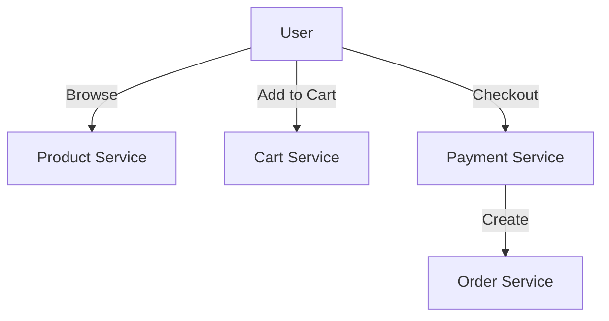
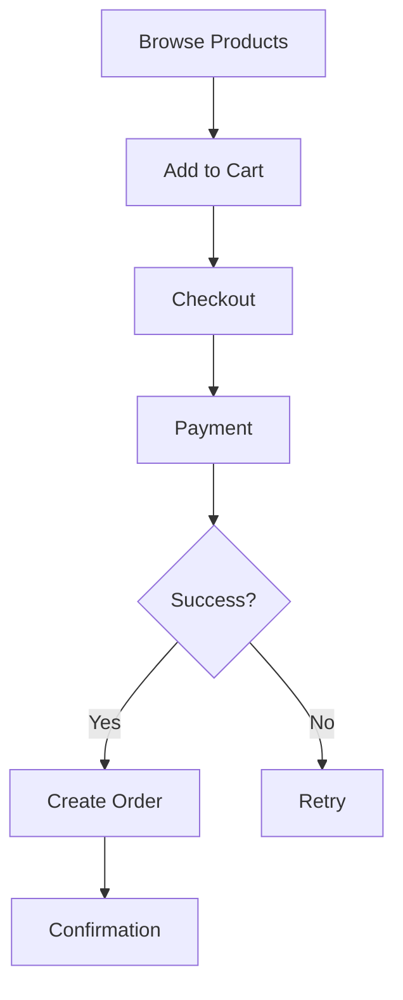

# E-Commerce Platform

## Problem Statement
Design an e-commerce system handling product catalog, shopping cart, orders, and inventory management.

**Requirements:**
- Product search and filtering
- Shopping cart
- Order processing
- Inventory tracking
- Payment integration

## Design

### Components

```
Product Service: Catalog, search, filtering
Cart Service: User carts, quantities
Order Service: Order creation, history
Payment Service: Transaction processing
Inventory Service: Stock tracking, reservations
```

### Inventory Management

```
Reserve on add-to-cart
Release if cart abandoned (timeout)
Confirm on checkout
Reduce stock on order completion
```

### Order Processing Flow

```
1. Reserve inventory
2. Process payment
3. Create shipment
4. Update inventory
5. Confirm order
```


## Architecture Diagram

```
┌───────────────────────────────────────┐
│   E-commerce Platform                 │
│  ┌───────────────────────────────────┐  │
│  │ Product Catalog (Elasticsearch)   │  │
│  │ - 100M products, <100ms search    │  │
│  │ Shopping Cart (Redis, 24hr TTL)   │  │
│  │ - <10ms read/write                │  │
│  │ Order Processing                  │  │
│  │ - Inventory, Payment, Fulfill     │  │
│  └───────────────────────────────────┘  │
└───────────────────────────────────────────┘
```

## Common Questions & Answers

**Q: Inventory consistency?** A: Pessimistic lock or optimistic versioning. Use saga pattern for order flow.

**Q: Cart timeout?** A: TTL 24hr, notify before expiry. Recover from backup.

**Q: Product search scaling?** A: Elasticsearch cluster, shard by product_id, cache popular.

**Q: Payment failure recovery?** A: Retry + exponential backoff, webhook from gateway, saga rollback.

## Back-of-Envelope Calculations

10M SKUs, 1M concurrent users, 1K orders/sec. Cart: 1M × 500B = 500GB Redis. Search: 100K QPS ES cluster. Payment: 1K req/sec (3-4 gateways).

## Design Choice Comparison

| Approach | Pros | Cons |
|----------|------|------|
| Monolithic | Simple, consistent | Poor scaling |
| Microservices | Scalable, independent | Complex coordination |
| Event-driven | Decoupled, responsive | Harder to debug |

## Follow-up Interview Questions

1. Flash sales (millions orders/sec)? 2. Real-time inventory across regions? 3. Fraud detection in payments? 4. Payment gateway bottleneck. 5. Return/refund workflow?

## Example Scenario Walkthrough

[Describe a concrete example with step-by-step execution]

### Architecture Diagram



### Flow Diagram



## Complexity

| Operation | Time | Space |
|-----------|------|-------|
| Search products | O(log n) | O(1) |
| Add to cart | O(1) | O(1) |
| Checkout | O(1) | O(1) |
| Check inventory | O(1) | O(1) |

## Python Implementation

```python
from dataclasses import dataclass, field
from typing import List, Dict, Optional
from enum import Enum

class OrderStatus(Enum):
    PENDING = "pending"
    CONFIRMED = "confirmed"
    SHIPPED = "shipped"
    DELIVERED = "delivered"

@dataclass
class Product:
    product_id: str
    name: str
    price: float
    stock: int

@dataclass
class CartItem:
    product: Product
    quantity: int

@dataclass
class Order:
    order_id: str
    user_id: str
    items: List[CartItem]
    status: OrderStatus = OrderStatus.PENDING

    def total(self) -> float:
        return sum(item.product.price * item.quantity for item in self.items)

class EcommerceService:
    def __init__(self):
        self._products: Dict[str, Product] = {}
        self._orders: Dict[str, Order] = {}

    def add_product(self, product: Product):
        self._products[product.product_id] = product

    def place_order(self, user_id: str, cart: List[CartItem]) -> Optional[Order]:
        for item in cart:
            if item.product.stock < item.quantity:
                return None
        for item in cart:
            item.product.stock -= item.quantity
        order_id = f"ORD-{len(self._orders)+1}"
        order = Order(order_id, user_id, cart)
        self._orders[order_id] = order
        return order

# Usage
svc = EcommerceService()
p = Product("P1", "Widget", 9.99, 100)
svc.add_product(p)
order = svc.place_order("user1", [CartItem(p, 2)])
print(order.total(), order.status)  # 19.98 OrderStatus.PENDING
```

## Java Implementation

```java
import java.util.*;

public class EcommerceService {
    record Product(String id, String name, double price, int stock) {}
    record CartItem(Product product, int quantity) {}
    record Order(String orderId, String userId, List<CartItem> items) {
        double total() { return items.stream().mapToDouble(i -> i.product().price() * i.quantity()).sum(); }
    }

    private Map<String, Product> products = new HashMap<>();
    private Map<String, Order> orders = new HashMap<>();

    public void addProduct(Product p) { products.put(p.id(), p); }

    public Optional<Order> placeOrder(String userId, List<CartItem> cart) {
        for (CartItem item : cart)
            if (item.product().stock() < item.quantity()) return Optional.empty();
        String id = "ORD-" + (orders.size() + 1);
        Order order = new Order(id, userId, cart);
        orders.put(id, order);
        return Optional.of(order);
    }
}
```
