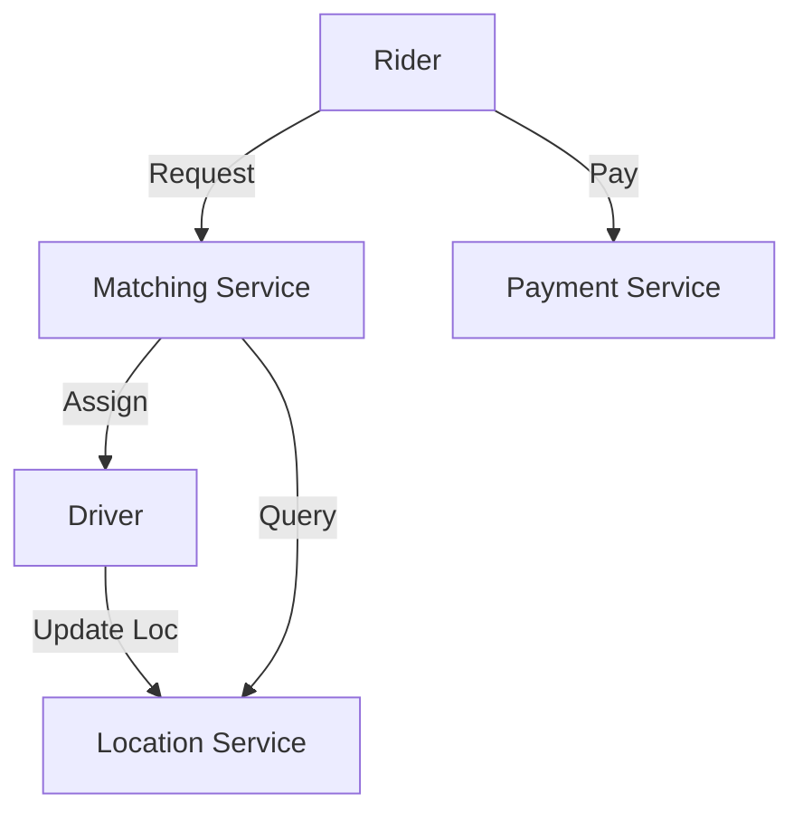
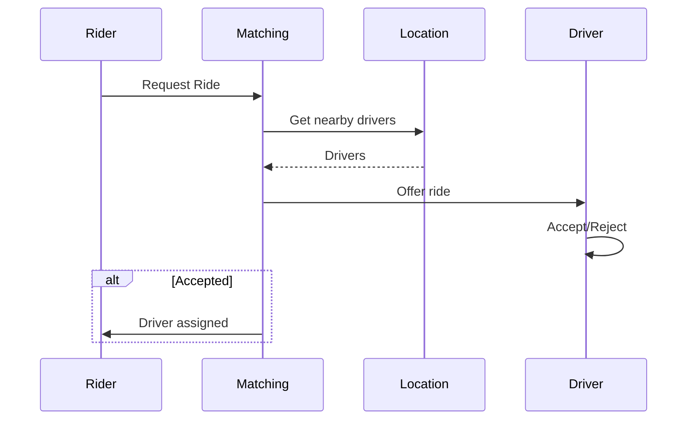

# Ride-Sharing System

## Problem Statement
Design an Uber-like system matching riders with drivers in real-time.

**Operations:**
- `requestRide(rider_location)` — Request ride
- `acceptRide(driver_id, ride_id)` — Driver accepts
- `updateLocation(user_id, location)` — Live location
- `completeRide(ride_id)` — Complete trip

## Design

### Matching Algorithm

```
Spatial indexing: Grid or quadtree
For rider request:
  1. Find nearby drivers (radius search)
  2. Calculate ETA
  3. Send offers
  4. Accept first responder
```

### Real-time Tracking

```
Pub-sub for location updates
WebSocket for live position
Redis for driver availability cache
```

### Payment

```
Calculate distance + time
Apply surge pricing
Process payment
Generate receipt
```


## Architecture Diagram

```
┌───────────────────────────────┐
│   Ride-sharing Service        │
│  Driver Location (GeoHash)    │
│  - Update: every 2-5 sec      │
│  Matching: distance < 5km     │
│  Payment & Trip               │
│  - Real-time tracking         │
│  - Surge pricing              │
└───────────────────────────────┘
```

## Common Questions & Answers

**Q: Finding drivers within 5km?** A: GeoHash cells or Quadtree. Redis GeoHash O(log n) for radius queries.

**Q: Surge pricing?** A: Real-time demand/supply ratio. Update every 5 min. Detect surge from queued requests.

**Q: Match consistency?** A: Server decides (fair), client suggests (fast). Hybrid: server proposes top-3.

**Q: Disputes?** A: Trip log (immutable). Manual review if disputed.

## Back-of-Envelope Calculations

1M drivers, 10M requests/day, 5K concurrent matches. Driver updates: 3M/sec (Redis). Match latency: ~10ms.
## Design Choice Comparison

| Approach | Pros | Cons |
|----------|------|------|
| Client matching | Fast | Unfair |
| Server matching | Fair | Bottleneck |
| Hybrid | Balanced | Complex |

## Follow-up Interview Questions

1. Ghost rides (fake location)? 2. Incentives for low-pay rides? 3. Real-time ETA? 4. Matching bottleneck at 10x? 5. Fairness testing?

## Example Scenario Walkthrough

[Describe a concrete example with step-by-step execution]

### Architecture Diagram



### Flow Diagram



## Complexity

| Operation | Time |
|-----------|------|
| Find drivers | O(log n) |
| Calculate ETA | O(1) |
| Update location | O(1) |
| Complete ride | O(1) |
