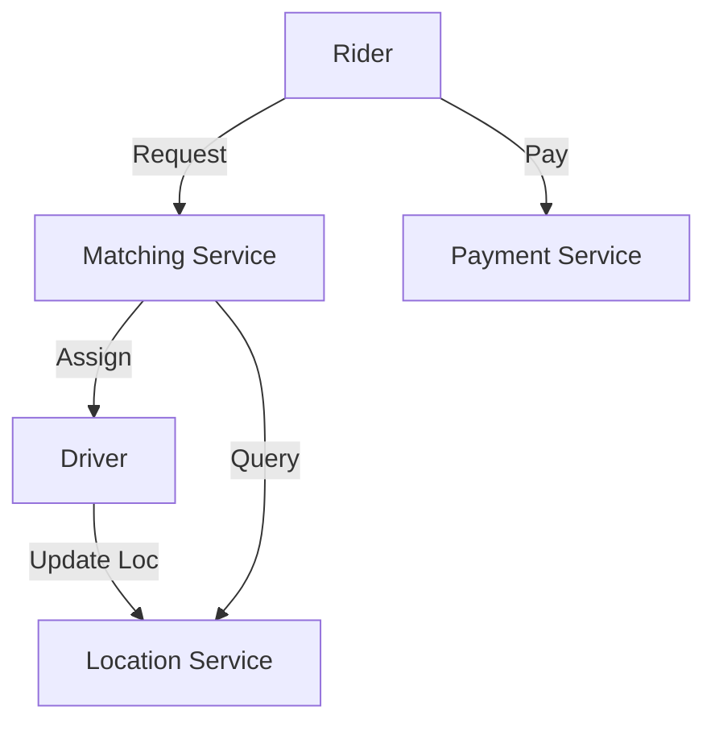
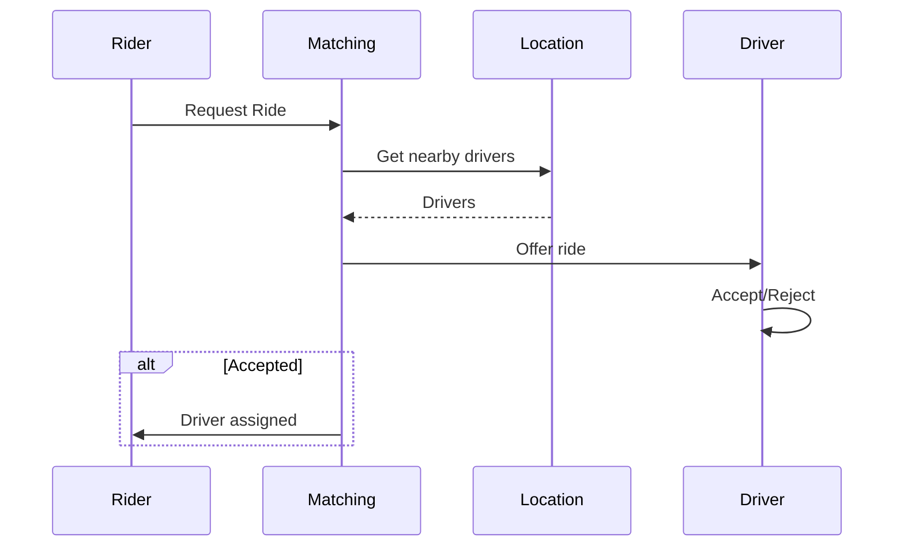

# Ride-Sharing System

## Problem Statement
Design an Uber-like system matching riders with drivers in real-time.

**Operations:**
- `requestRide(rider_location)` — Request ride
- `acceptRide(driver_id, ride_id)` — Driver accepts
- `updateLocation(user_id, location)` — Live location
- `completeRide(ride_id)` — Complete trip

## Design

### Matching Algorithm

```
Spatial indexing: Grid or quadtree
For rider request:
  1. Find nearby drivers (radius search)
  2. Calculate ETA
  3. Send offers
  4. Accept first responder
```

### Real-time Tracking

```
Pub-sub for location updates
WebSocket for live position
Redis for driver availability cache
```

### Payment

```
Calculate distance + time
Apply surge pricing
Process payment
Generate receipt
```


## Scenario

Ride-Sharing System is a critical component in modern distributed systems. In real-world applications, handling complex business logic at scale with high reliability. For example, major tech companies like Netflix, Uber, and Airbnb rely on similar solutions to handle millions of concurrent users and requests. The challenge is achieving this while maintaining sub-100ms latency, 99.99% availability, and gracefully handling 10x traffic spikes during peak demand. This component provides the foundational capability to solve these challenges reliably and efficiently at global scale.

## Users

- **Backend Engineers**: Responsible for implementing and maintaining this system component in production environments. They need to understand the architecture, trade-offs, failure modes, and operational considerations.
- **DevOps/SRE Teams**: Monitor system health, manage scaling policies, handle incidents, and ensure reliability SLAs are met. They need insights into performance characteristics, bottlenecks, and failure recovery mechanisms.
- **Data Engineers**: Design data pipelines and analytics around this system, requiring deep understanding of data flow, consistency guarantees, and throughput characteristics.
- **System Architects**: Make high-level architectural decisions that impact company infrastructure, requiring comprehensive understanding of capabilities, limitations, and scalability boundaries.
- **Security Teams**: Understand security implications, potential vulnerabilities, and compliance requirements for this component.

## PRD

**Functional Requirements:**
- Correct behavior under all specified operating conditions
- Reliable operation with explicit failure modes
- Data consistency or eventual consistency guarantees as specified
- Clear mechanisms for error handling and recovery
- Monitoring and observability hooks

**Non-Functional Requirements:**
- **Performance**: Sub-100ms P99 latency for standard operations; measure and track tail latencies
- **Availability**: 99.99%+ uptime with automatic failover and graceful degradation
- **Scalability**: Support 10-100x current load with minimal architectural modifications
- **Consistency**: Specify whether strong, eventual, or causal consistency is required
- **Cost Efficiency**: Minimize operational cost per unit of throughput; consider compute, memory, and network costs
- **Operational Simplicity**: Reduce complexity to minimize human error and operational toil

**Constraints:**
- Resource limits (memory for caches, disk for databases, network bandwidth)
- Deployment constraints (cloud provider limits, regulatory requirements)
- Latency budgets (maximum acceptable delay for operations)

## Flow

The typical operational flow for this system involves these key phases:

1. **Request Arrival**: Client/upstream system sends request with required parameters and context
2. **Validation & Routing**: System validates request format, authentication, and routes to correct handler/shard/instance
3. **Core Processing**: Execute the main algorithm, database query, or business logic on the data/state
4. **State Management**: Update internal state (caches, indexes, counters, logs) with proper atomicity and locking
5. **Response Generation**: Format results and return to requester with relevant metadata (timing, version info)
6. **Observability**: Record metrics (latency, throughput, errors), logs (for debugging), and traces (for performance analysis)

This flow repeats thousands or millions of times per second in production. Each operation's efficiency compounds across the entire system, making careful optimization essential. Bottlenecks at any phase can cascade to impact overall system performance.

## Code Explanation

The provided implementations demonstrate key architectural concepts and design patterns:

**Python Implementation**: Uses built-in Python structures and standard library features to express the core logic clearly. Python emphasizes readability and conciseness—each operation's purpose should be obvious without extensive comments. You'll see different implementation approaches (e.g., using OrderedDict vs. manual linked lists) that represent trade-offs between convenience and fine-grained control.

**Java Implementation**: Shows how to implement the same logic with explicit memory management and type safety. Java's strong typing forces clear interface design; you'll see how generics, null safety, mutable state, and thread safety are handled. This implementation style is closer to production systems at scale.

**Key Implementation Patterns**:
- **Initialization**: Setting up core data structures, thread pools, or connection pools with specified capacity and configuration
- **Read Operations**: Fetching data while maintaining O(1) or O(log n) access, updating metadata (access times, hit counts, etc.)
- **Write Operations**: Inserting/updating data while handling eviction policies, balancing tree structures, or replicating state
- **Edge Cases**: Handling capacity limits, concurrent access, data consistency, and error conditions
- **Performance Optimization**: Using techniques like batch operations, lazy evaluation, or caching to reduce latency

Each line of code represents a deliberate choice about performance characteristics, memory usage, safety guarantees, and implementation complexity. Understanding these trade-offs is essential for using this component effectively in production systems.

## Architecture Diagram

```
┌───────────────────────────────┐
│   Ride-sharing Service        │
│  Driver Location (GeoHash)    │
│  - Update: every 2-5 sec      │
│  Matching: distance < 5km     │
│  Payment & Trip               │
│  - Real-time tracking         │
│  - Surge pricing              │
└───────────────────────────────┘
```

## Common Questions & Answers

**Q: Finding drivers within 5km?** A: GeoHash cells or Quadtree. Redis GeoHash O(log n) for radius queries.

**Q: Surge pricing?** A: Real-time demand/supply ratio. Update every 5 min. Detect surge from queued requests.

**Q: Match consistency?** A: Server decides (fair), client suggests (fast). Hybrid: server proposes top-3.

**Q: Disputes?** A: Trip log (immutable). Manual review if disputed.

## Back-of-Envelope Calculations

1M drivers, 10M requests/day, 5K concurrent matches. Driver updates: 3M/sec (Redis). Match latency: ~10ms.
## Design Choice Comparison

| Approach | Pros | Cons |
|----------|------|------|
| Client matching | Fast | Unfair |
| Server matching | Fair | Bottleneck |
| Hybrid | Balanced | Complex |

## Follow-up Interview Questions

1. Ghost rides (fake location)? 2. Incentives for low-pay rides? 3. Real-time ETA? 4. Matching bottleneck at 10x? 5. Fairness testing?

## Example Scenario Walkthrough

[Describe a concrete example with step-by-step execution]

### Architecture Diagram



### Flow Diagram



## Complexity

| Operation | Time |
|-----------|------|
| Find drivers | O(log n) |
| Calculate ETA | O(1) |
| Update location | O(1) |
| Complete ride | O(1) |

## Python Implementation

```python
from dataclasses import dataclass
from typing import List, Optional, Tuple
import math

@dataclass
class Location:
    lat: float
    lng: float

    def distance_to(self, other: "Location") -> float:
        return math.sqrt((self.lat - other.lat)**2 + (self.lng - other.lng)**2)

@dataclass
class Driver:
    driver_id: str
    name: str
    location: Location
    available: bool = True

@dataclass
class Ride:
    ride_id: str
    rider_id: str
    driver_id: str
    pickup: Location
    dropoff: Location
    status: str = "requested"

class RideSharingService:
    def __init__(self):
        self._drivers: List[Driver] = []
        self._rides: dict[str, Ride] = {}

    def register_driver(self, driver: Driver):
        self._drivers.append(driver)

    def request_ride(self, rider_id: str, pickup: Location, dropoff: Location) -> Optional[Ride]:
        available = [d for d in self._drivers if d.available]
        if not available:
            return None
        nearest = min(available, key=lambda d: d.location.distance_to(pickup))
        nearest.available = False
        ride_id = f"RIDE-{len(self._rides)+1}"
        ride = Ride(ride_id, rider_id, nearest.driver_id, pickup, dropoff)
        self._rides[ride_id] = ride
        return ride

# Usage
svc = RideSharingService()
svc.register_driver(Driver("D1", "Alice", Location(37.7, -122.4)))
ride = svc.request_ride("R1", Location(37.8, -122.5), Location(37.9, -122.6))
print(ride.ride_id, ride.driver_id)  # RIDE-1 D1
```

## Java Implementation

```java
import java.util.*;

public class RideSharingService {
    record Location(double lat, double lng) {
        double distanceTo(Location o) {
            return Math.sqrt(Math.pow(lat-o.lat, 2) + Math.pow(lng-o.lng, 2));
        }
    }
    static class Driver {
        String id, name; Location loc; boolean available = true;
        Driver(String id, String name, Location loc) { this.id=id; this.name=name; this.loc=loc; }
    }
    record Ride(String id, String riderId, String driverId, Location pickup, Location dropoff) {}

    private List<Driver> drivers = new ArrayList<>();

    public void registerDriver(Driver d) { drivers.add(d); }

    public Optional<Ride> requestRide(String riderId, Location pickup, Location dropoff) {
        return drivers.stream().filter(d -> d.available)
            .min(Comparator.comparingDouble(d -> d.loc.distanceTo(pickup)))
            .map(d -> { d.available = false; return new Ride("R-1", riderId, d.id, pickup, dropoff); });
    }
}
```
