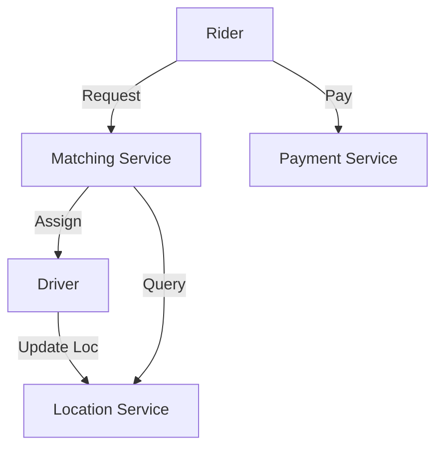
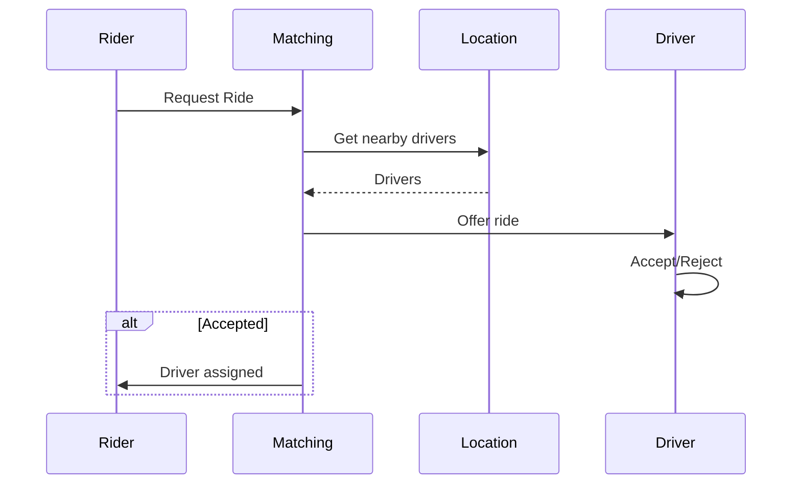

# Ride-Sharing System

## Problem Statement
Design an Uber-like system matching riders with drivers in real-time.

**Operations:**
- `requestRide(rider_location)` — Request ride
- `acceptRide(driver_id, ride_id)` — Driver accepts
- `updateLocation(user_id, location)` — Live location
- `completeRide(ride_id)` — Complete trip

## Design

### Matching Algorithm

```
Spatial indexing: Grid or quadtree
For rider request:
  1. Find nearby drivers (radius search)
  2. Calculate ETA
  3. Send offers
  4. Accept first responder
```

### Real-time Tracking

```
Pub-sub for location updates
WebSocket for live position
Redis for driver availability cache
```

### Payment

```
Calculate distance + time
Apply surge pricing
Process payment
Generate receipt
```


## Architecture Diagram

```
┌───────────────────────────────┐
│   Ride-sharing Service        │
│  Driver Location (GeoHash)    │
│  - Update: every 2-5 sec      │
│  Matching: distance < 5km     │
│  Payment & Trip               │
│  - Real-time tracking         │
│  - Surge pricing              │
└───────────────────────────────┘
```

## Common Questions & Answers

**Q: Finding drivers within 5km?** A: GeoHash cells or Quadtree. Redis GeoHash O(log n) for radius queries.

**Q: Surge pricing?** A: Real-time demand/supply ratio. Update every 5 min. Detect surge from queued requests.

**Q: Match consistency?** A: Server decides (fair), client suggests (fast). Hybrid: server proposes top-3.

**Q: Disputes?** A: Trip log (immutable). Manual review if disputed.

## Back-of-Envelope Calculations

1M drivers, 10M requests/day, 5K concurrent matches. Driver updates: 3M/sec (Redis). Match latency: ~10ms.
## Design Choice Comparison

| Approach | Pros | Cons |
|----------|------|------|
| Client matching | Fast | Unfair |
| Server matching | Fair | Bottleneck |
| Hybrid | Balanced | Complex |

## Follow-up Interview Questions

1. Ghost rides (fake location)? 2. Incentives for low-pay rides? 3. Real-time ETA? 4. Matching bottleneck at 10x? 5. Fairness testing?

## Example Scenario Walkthrough

[Describe a concrete example with step-by-step execution]

### Architecture Diagram



### Flow Diagram



## Complexity

| Operation | Time |
|-----------|------|
| Find drivers | O(log n) |
| Calculate ETA | O(1) |
| Update location | O(1) |
| Complete ride | O(1) |

## Python Implementation

```python
from dataclasses import dataclass
from typing import List, Optional, Tuple
import math

@dataclass
class Location:
    lat: float
    lng: float

    def distance_to(self, other: "Location") -> float:
        return math.sqrt((self.lat - other.lat)**2 + (self.lng - other.lng)**2)

@dataclass
class Driver:
    driver_id: str
    name: str
    location: Location
    available: bool = True

@dataclass
class Ride:
    ride_id: str
    rider_id: str
    driver_id: str
    pickup: Location
    dropoff: Location
    status: str = "requested"

class RideSharingService:
    def __init__(self):
        self._drivers: List[Driver] = []
        self._rides: dict[str, Ride] = {}

    def register_driver(self, driver: Driver):
        self._drivers.append(driver)

    def request_ride(self, rider_id: str, pickup: Location, dropoff: Location) -> Optional[Ride]:
        available = [d for d in self._drivers if d.available]
        if not available:
            return None
        nearest = min(available, key=lambda d: d.location.distance_to(pickup))
        nearest.available = False
        ride_id = f"RIDE-{len(self._rides)+1}"
        ride = Ride(ride_id, rider_id, nearest.driver_id, pickup, dropoff)
        self._rides[ride_id] = ride
        return ride

# Usage
svc = RideSharingService()
svc.register_driver(Driver("D1", "Alice", Location(37.7, -122.4)))
ride = svc.request_ride("R1", Location(37.8, -122.5), Location(37.9, -122.6))
print(ride.ride_id, ride.driver_id)  # RIDE-1 D1
```

## Java Implementation

```java
import java.util.*;

public class RideSharingService {
    record Location(double lat, double lng) {
        double distanceTo(Location o) {
            return Math.sqrt(Math.pow(lat-o.lat, 2) + Math.pow(lng-o.lng, 2));
        }
    }
    static class Driver {
        String id, name; Location loc; boolean available = true;
        Driver(String id, String name, Location loc) { this.id=id; this.name=name; this.loc=loc; }
    }
    record Ride(String id, String riderId, String driverId, Location pickup, Location dropoff) {}

    private List<Driver> drivers = new ArrayList<>();

    public void registerDriver(Driver d) { drivers.add(d); }

    public Optional<Ride> requestRide(String riderId, Location pickup, Location dropoff) {
        return drivers.stream().filter(d -> d.available)
            .min(Comparator.comparingDouble(d -> d.loc.distanceTo(pickup)))
            .map(d -> { d.available = false; return new Ride("R-1", riderId, d.id, pickup, dropoff); });
    }
}
```
