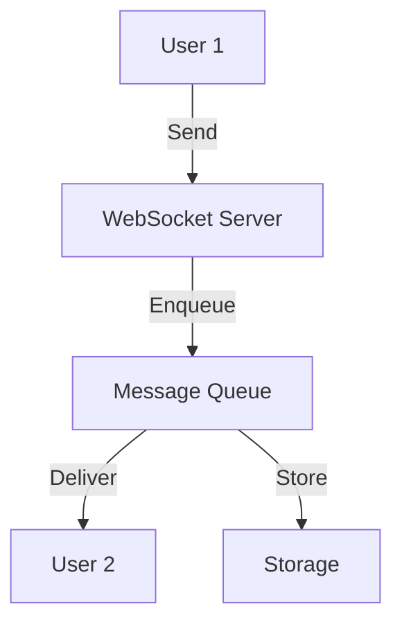
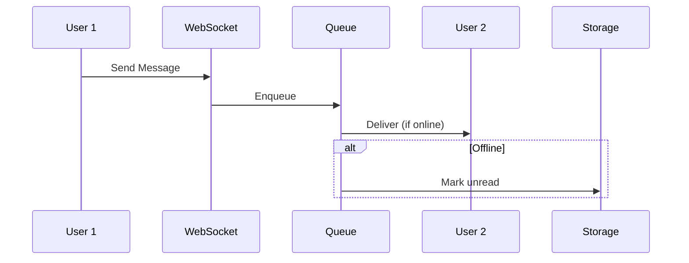

# Chat System

## Problem Statement
Design a real-time messaging system supporting one-to-one and group chat.

**Operations:**
- `sendMessage(from, to, text)` — Send message
- `getMessages(user_id, thread_id)` — Get conversation
- `createGroup(members)` — Create group
- `updateGroupMembers(group_id, members)` — Modify group

## Design

### Message Storage

```
One-to-one: Bilateral storage (both users get copy)
Group: Centralized, sync to members
Indexing: (user_id, timestamp) for fast retrieval
```

### Delivery Guarantees

```
At-least-once: Message queued until ACK
Message status: Sent, Delivered, Read
Retry on failure: Exponential backoff
```

### Notifications

```
Online: WebSocket push
Offline: Store and push when online
Badges: Unread count per user
```


## Architecture Diagram

```
┌───────────────────────────────┐
│   Chat Application            │
│  WebSocket Server             │
│  - User connection mgmt       │
│  - Message broadcast          │
│  Message Persistence          │
│  - MongoDB (flexible)         │
│  - Sharded by conversation_id │
│  Delivery Tracking            │
│  - Sent, Delivered, Read      │
└───────────────────────────────┘
```

## Common Questions & Answers

**Q: Message ordering (FIFO)?** A: Sequence numbers + validation. If out-of-order, buffer & replay.

**Q: Offline delivery?** A: Queue with TTL (30 days). Deliver on reconnect.

**Q: Typing indicator?** A: Send every 1-2 chars, debounce. Broadcast to participants. ~100ms acceptable.

**Q: Group chat scaling?** A: <10: broadcast. 100+: fan-out via queue. 1000+: pub-sub topic.

## Back-of-Envelope Calculations

100M users, 1M concurrent, 10K msg/sec. WebSocket: 1M × 10KB = 10GB. Throughput: 10K/sec × 200B = 2MB/sec storage.
## Design Choice Comparison

| Approach | Pros | Cons |
|----------|------|------|
| Polling | Simple | High latency |
| Long-polling | Better | Connection overhead |
| WebSocket | Real-time | Firewall |

## Follow-up Interview Questions

1. Message search across convos? 2. E2E encryption? 3. Spam detection? 4. WebSocket bottleneck? 5. Message migration?

## Example Scenario Walkthrough

[Describe a concrete example with step-by-step execution]

### Architecture Diagram



### Flow Diagram



## Complexity

| Operation | Time |
|-----------|------|
| Send message | O(1) |
| Get messages | O(k) where k=messages |
| Group update | O(n) where n=members |

## Python Implementation

```python
from dataclasses import dataclass, field
from typing import List, Dict
from datetime import datetime

@dataclass
class Message:
    sender_id: str
    content: str
    timestamp: datetime = field(default_factory=datetime.now)

@dataclass
class ChatRoom:
    room_id: str
    members: List[str] = field(default_factory=list)
    messages: List[Message] = field(default_factory=list)

class ChatService:
    def __init__(self):
        self._rooms: Dict[str, ChatRoom] = {}
        self._user_rooms: Dict[str, List[str]] = {}

    def create_room(self, room_id: str) -> ChatRoom:
        room = ChatRoom(room_id)
        self._rooms[room_id] = room
        return room

    def join_room(self, user_id: str, room_id: str):
        self._rooms[room_id].members.append(user_id)
        self._user_rooms.setdefault(user_id, []).append(room_id)

    def send_message(self, room_id: str, sender_id: str, content: str) -> Message:
        msg = Message(sender_id, content)
        self._rooms[room_id].messages.append(msg)
        return msg

    def get_history(self, room_id: str, limit: int = 50) -> List[Message]:
        return self._rooms[room_id].messages[-limit:]

# Usage
chat = ChatService()
chat.create_room("room1")
chat.join_room("alice", "room1")
chat.join_room("bob", "room1")
chat.send_message("room1", "alice", "Hello!")
msgs = chat.get_history("room1")
print(msgs[0].content)  # Hello!
```

## Java Implementation

```java
import java.util.*;
import java.time.Instant;

public class ChatService {
    record Message(String senderId, String content, Instant ts) {}
    record Room(String id, List<String> members, List<Message> messages) {}

    private Map<String, Room> rooms = new HashMap<>();

    public Room createRoom(String id) {
        Room room = new Room(id, new ArrayList<>(), new ArrayList<>());
        rooms.put(id, room);
        return room;
    }

    public void joinRoom(String userId, String roomId) {
        rooms.get(roomId).members().add(userId);
    }

    public Message sendMessage(String roomId, String senderId, String content) {
        Message msg = new Message(senderId, content, Instant.now());
        rooms.get(roomId).messages().add(msg);
        return msg;
    }

    public List<Message> getHistory(String roomId, int limit) {
        List<Message> msgs = rooms.get(roomId).messages();
        return msgs.subList(Math.max(0, msgs.size() - limit), msgs.size());
    }
}
```
