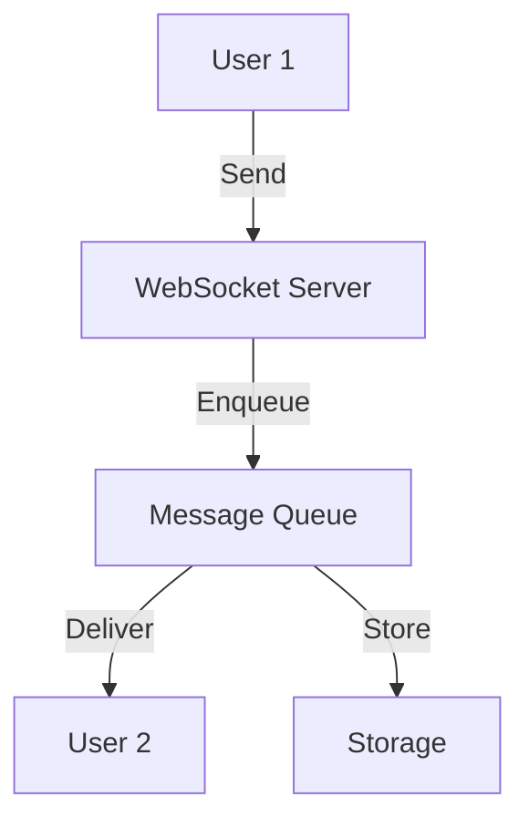
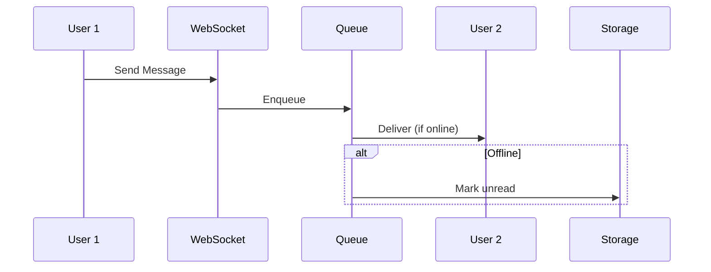

# Chat System

## Problem Statement
Design a real-time messaging system supporting one-to-one and group chat.

**Operations:**
- `sendMessage(from, to, text)` — Send message
- `getMessages(user_id, thread_id)` — Get conversation
- `createGroup(members)` — Create group
- `updateGroupMembers(group_id, members)` — Modify group

## Design

### Message Storage

```
One-to-one: Bilateral storage (both users get copy)
Group: Centralized, sync to members
Indexing: (user_id, timestamp) for fast retrieval
```

### Delivery Guarantees

```
At-least-once: Message queued until ACK
Message status: Sent, Delivered, Read
Retry on failure: Exponential backoff
```

### Notifications

```
Online: WebSocket push
Offline: Store and push when online
Badges: Unread count per user
```


## Architecture Diagram

```
┌───────────────────────────────┐
│   Chat Application            │
│  WebSocket Server             │
│  - User connection mgmt       │
│  - Message broadcast          │
│  Message Persistence          │
│  - MongoDB (flexible)         │
│  - Sharded by conversation_id │
│  Delivery Tracking            │
│  - Sent, Delivered, Read      │
└───────────────────────────────┘
```

## Common Questions & Answers

**Q: Message ordering (FIFO)?** A: Sequence numbers + validation. If out-of-order, buffer & replay.

**Q: Offline delivery?** A: Queue with TTL (30 days). Deliver on reconnect.

**Q: Typing indicator?** A: Send every 1-2 chars, debounce. Broadcast to participants. ~100ms acceptable.

**Q: Group chat scaling?** A: <10: broadcast. 100+: fan-out via queue. 1000+: pub-sub topic.

## Back-of-Envelope Calculations

100M users, 1M concurrent, 10K msg/sec. WebSocket: 1M × 10KB = 10GB. Throughput: 10K/sec × 200B = 2MB/sec storage.
## Design Choice Comparison

| Approach | Pros | Cons |
|----------|------|------|
| Polling | Simple | High latency |
| Long-polling | Better | Connection overhead |
| WebSocket | Real-time | Firewall |

## Follow-up Interview Questions

1. Message search across convos? 2. E2E encryption? 3. Spam detection? 4. WebSocket bottleneck? 5. Message migration?

## Example Scenario Walkthrough

[Describe a concrete example with step-by-step execution]

### Architecture Diagram



### Flow Diagram



## Complexity

| Operation | Time |
|-----------|------|
| Send message | O(1) |
| Get messages | O(k) where k=messages |
| Group update | O(n) where n=members |
