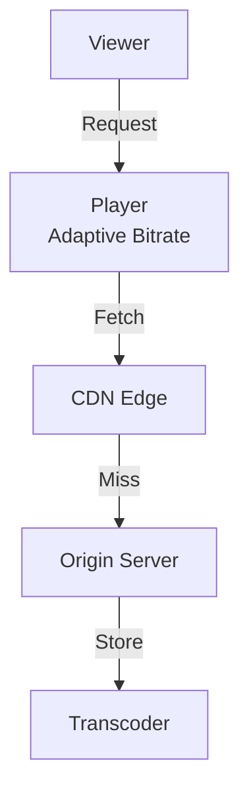
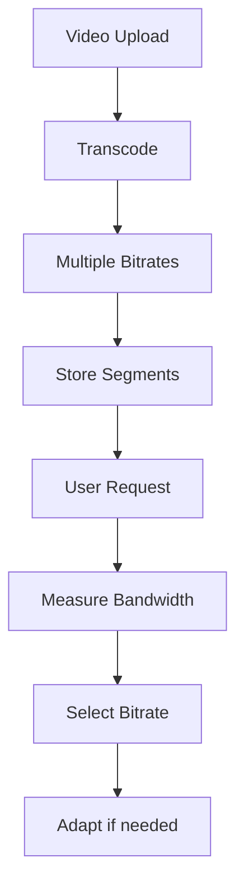

# Video Streaming Platform

## Problem Statement
Design a platform for video streaming with adaptive bitrate and CDN delivery.

**Requirements:**
- Upload video
- Transcode to multiple bitrates
- Stream with adaptive quality
- Cache across CDN
- Track playback analytics

## Design

### Transcoding Pipeline

```
Upload → Queue task
Worker picks task → Transcode to bitrates (480p, 720p, 1080p)
Store segments → CDN
Index in metadata DB
```

### Adaptive Bitrate Streaming

```
Client measures bandwidth
Request appropriate quality
Manifest file lists available bitrates
Switch on connection change
```

### CDN Strategy

```
Popular videos → Edge cache
Edge cache bandwidth exceeds → Origin pulls
LRU eviction for capacity
Geographic distribution
```


## Scenario

Video Streaming Platform is a critical component in modern distributed systems. In real-world applications, handling complex business logic at scale with high reliability. For example, major tech companies like Netflix, Uber, and Airbnb rely on similar solutions to handle millions of concurrent users and requests. The challenge is achieving this while maintaining sub-100ms latency, 99.99% availability, and gracefully handling 10x traffic spikes during peak demand. This component provides the foundational capability to solve these challenges reliably and efficiently at global scale.

## Users

- **Backend Engineers**: Responsible for implementing and maintaining this system component in production environments. They need to understand the architecture, trade-offs, failure modes, and operational considerations.
- **DevOps/SRE Teams**: Monitor system health, manage scaling policies, handle incidents, and ensure reliability SLAs are met. They need insights into performance characteristics, bottlenecks, and failure recovery mechanisms.
- **Data Engineers**: Design data pipelines and analytics around this system, requiring deep understanding of data flow, consistency guarantees, and throughput characteristics.
- **System Architects**: Make high-level architectural decisions that impact company infrastructure, requiring comprehensive understanding of capabilities, limitations, and scalability boundaries.
- **Security Teams**: Understand security implications, potential vulnerabilities, and compliance requirements for this component.

## PRD

**Functional Requirements:**
- Correct behavior under all specified operating conditions
- Reliable operation with explicit failure modes
- Data consistency or eventual consistency guarantees as specified
- Clear mechanisms for error handling and recovery
- Monitoring and observability hooks

**Non-Functional Requirements:**
- **Performance**: Sub-100ms P99 latency for standard operations; measure and track tail latencies
- **Availability**: 99.99%+ uptime with automatic failover and graceful degradation
- **Scalability**: Support 10-100x current load with minimal architectural modifications
- **Consistency**: Specify whether strong, eventual, or causal consistency is required
- **Cost Efficiency**: Minimize operational cost per unit of throughput; consider compute, memory, and network costs
- **Operational Simplicity**: Reduce complexity to minimize human error and operational toil

**Constraints:**
- Resource limits (memory for caches, disk for databases, network bandwidth)
- Deployment constraints (cloud provider limits, regulatory requirements)
- Latency budgets (maximum acceptable delay for operations)

## Flow

The typical operational flow for this system involves these key phases:

1. **Request Arrival**: Client/upstream system sends request with required parameters and context
2. **Validation & Routing**: System validates request format, authentication, and routes to correct handler/shard/instance
3. **Core Processing**: Execute the main algorithm, database query, or business logic on the data/state
4. **State Management**: Update internal state (caches, indexes, counters, logs) with proper atomicity and locking
5. **Response Generation**: Format results and return to requester with relevant metadata (timing, version info)
6. **Observability**: Record metrics (latency, throughput, errors), logs (for debugging), and traces (for performance analysis)

This flow repeats thousands or millions of times per second in production. Each operation's efficiency compounds across the entire system, making careful optimization essential. Bottlenecks at any phase can cascade to impact overall system performance.

## Code Explanation

The provided implementations demonstrate key architectural concepts and design patterns:

**Python Implementation**: Uses built-in Python structures and standard library features to express the core logic clearly. Python emphasizes readability and conciseness—each operation's purpose should be obvious without extensive comments. You'll see different implementation approaches (e.g., using OrderedDict vs. manual linked lists) that represent trade-offs between convenience and fine-grained control.

**Java Implementation**: Shows how to implement the same logic with explicit memory management and type safety. Java's strong typing forces clear interface design; you'll see how generics, null safety, mutable state, and thread safety are handled. This implementation style is closer to production systems at scale.

**Key Implementation Patterns**:
- **Initialization**: Setting up core data structures, thread pools, or connection pools with specified capacity and configuration
- **Read Operations**: Fetching data while maintaining O(1) or O(log n) access, updating metadata (access times, hit counts, etc.)
- **Write Operations**: Inserting/updating data while handling eviction policies, balancing tree structures, or replicating state
- **Edge Cases**: Handling capacity limits, concurrent access, data consistency, and error conditions
- **Performance Optimization**: Using techniques like batch operations, lazy evaluation, or caching to reduce latency

Each line of code represents a deliberate choice about performance characteristics, memory usage, safety guarantees, and implementation complexity. Understanding these trade-offs is essential for using this component effectively in production systems.

## Architecture Diagram

```
┌───────────────────────────────┐
│   Video Streaming Platform    │
│  Video Ingestion              │
│  - Upload to S3               │
│  - Transcode to multiple res  │
│  - CDN distribution           │
│  Adaptive Bitrate Playback    │
│  - Monitor bandwidth          │
│  - Switch resolution per 4s   │
│  Analytics                    │
│  - Watch time, completion     │
└───────────────────────────────┘
```

## Common Questions & Answers

**Q: Adaptive bitrate switching?** A: Monitor download speed, estimate bandwidth. Downgrade if slow, upgrade if fast. Switch at chunk boundary (4s).

**Q: Transcoding cost?** A: Pre-transcode (slow ingestion) vs on-demand (slow playback). Cache formats (storage cost). Usually: 3-4 resolutions.

**Q: Low startup latency?** A: Cache first chunk locally, CDN edge, start low res + switch up.

**Q: Live streaming?** A: RTMP ingest to multiple servers, HLS distribution.

## Back-of-Envelope Calculations

1M concurrent, 4 Mbps avg. Bandwidth: 4Tbps. Storage: 1M × 2GB = 2EB. Transcoding: 1h video = ~5h encode.
## Design Choice Comparison

| Approach | Pros | Cons |
|----------|------|------|
| Progressive download | Simple | No ABR |
| DASH streaming | Adaptive | Latency |
| RTMP | Low latency | Not web |

## Follow-up Interview Questions

1. Live with 1M concurrent? 2. DRM implementation? 3. P2P optimization? 4. CDN bottleneck? 5. Content popularity caching?

## Example Scenario Walkthrough

[Describe a concrete example with step-by-step execution]

### Architecture Diagram



### Flow Diagram



## Complexity

| Operation | Time |
|-----------|------|
| Upload | O(n) where n=file size |
| Transcode | O(n) CPU-intensive |
| Stream | O(1) per request |
| Store segment | O(log n) |

## Python Implementation

```python
from dataclasses import dataclass, field
from typing import List, Dict, Optional
from enum import Enum

class VideoQuality(Enum):
    SD = "480p"
    HD = "720p"
    FHD = "1080p"
    UHD = "4K"

@dataclass
class VideoSegment:
    segment_id: int
    quality: VideoQuality
    url: str
    duration_s: float

@dataclass
class Video:
    video_id: str
    title: str
    segments: Dict[VideoQuality, List[VideoSegment]] = field(default_factory=dict)
    thumbnail_url: str = ""

class StreamingService:
    def __init__(self):
        self._videos: Dict[str, Video] = {}
        self._cdn_nodes: List[str] = []

    def upload(self, video: Video):
        self._videos[video.video_id] = video

    def get_manifest(self, video_id: str) -> Dict:
        video = self._videos[video_id]
        return {
            "video_id": video_id,
            "title": video.title,
            "qualities": [q.value for q in video.segments.keys()],
            "thumbnail": video.thumbnail_url,
        }

    def get_segment(self, video_id: str, quality: VideoQuality, segment_id: int) -> Optional[VideoSegment]:
        segs = self._videos[video_id].segments.get(quality, [])
        return segs[segment_id] if segment_id < len(segs) else None

    def adaptive_quality(self, bandwidth_mbps: float) -> VideoQuality:
        if bandwidth_mbps >= 25: return VideoQuality.UHD
        if bandwidth_mbps >= 8: return VideoQuality.FHD
        if bandwidth_mbps >= 5: return VideoQuality.HD
        return VideoQuality.SD

# Usage
svc = StreamingService()
v = Video("v1", "My Video")
svc.upload(v)
quality = svc.adaptive_quality(10)
print(quality)  # VideoQuality.FHD
```

## Java Implementation

```java
import java.util.*;

public class StreamingService {
    enum Quality { SD, HD, FHD, UHD }
    record Segment(int id, Quality quality, String url) {}
    record Video(String id, String title, Map<Quality, List<Segment>> segments) {}

    private Map<String, Video> videos = new HashMap<>();

    public void upload(Video v) { videos.put(v.id(), v); }

    public Quality adaptiveQuality(double bandwidthMbps) {
        if (bandwidthMbps >= 25) return Quality.UHD;
        if (bandwidthMbps >= 8)  return Quality.FHD;
        if (bandwidthMbps >= 5)  return Quality.HD;
        return Quality.SD;
    }

    public Optional<Segment> getSegment(String videoId, Quality q, int idx) {
        List<Segment> segs = videos.get(videoId).segments().getOrDefault(q, List.of());
        return idx < segs.size() ? Optional.of(segs.get(idx)) : Optional.empty();
    }
}
```
