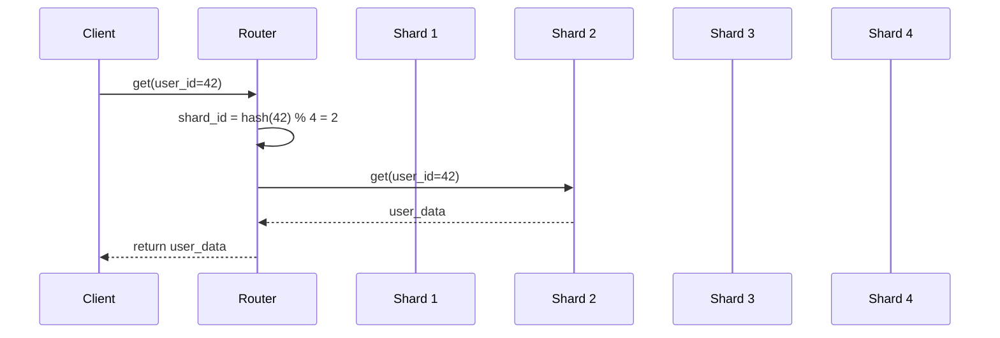

# Database Sharding

## Problem Statement
Design a sharding strategy for horizontally scaling database across multiple nodes.

**Requirements:**
- Distribute data evenly
- Route queries to correct shard
- Minimal data movement on scale
- Handle shard failures

## Design

### Sharding Keys

```
User ID: Good for user-centric apps
Timestamp: Good for time-series data
Geographic: Good for region-based queries
Composite: Combination for better distribution
```

### Consistent Hashing

```
Hash key → Ring of servers
Add/remove server: Minimal rehashing
Virtual nodes: Better distribution
```

### Cross-shard Queries

```
Scatter-gather: Query all shards
Merge results
Use fan-out pattern
```


## Architecture Diagram

```
┌──────────────────────────────────────┐
│   Sharded Database Architecture      │
│  ┌──────────────────────────────────┐  │
│  │ Sharding Key: user_id            │  │
│  │ Shard 1: user_id % 4 == 0        │  │
│  │ Shard 2: user_id % 4 == 1        │  │
│  │ Shard 3: user_id % 4 == 2        │  │
│  │ Shard 4: user_id % 4 == 3        │  │
│  │                                  │  │
│  │ Directory: user_id → shard_id    │  │
│  └──────────────────────────────────┘  │
└──────────────────────────────────────────┘
```

## Flow Diagram



## Common Questions & Answers

**Q: Shard key selection?** A: Choose high-cardinality (user_id good, gender bad). Enables even distribution.

**Q: Hot shard problem?** A: Uneven distribution if key skewed (celebrities). Solution: split hot shard, re-shard.

**Q: Cross-shard queries?** A: Expensive, scatter-gather to all shards. Avoid if possible.

**Q: Re-sharding complexity?** A: Double shards: migrate half of each to new shards. Zero-downtime hard, plan carefully.

## Back-of-Envelope Calculations

1B users, 4 shards: 250M per shard. Each shard: single master + replicas. Queries: shard_id = hash(user_id) % 4. Cross-shard: 4x latency.

## Design Choice Comparison

| Approach | Pros | Cons |
|----------|------|------|
| Range sharding | Easy range queries | Uneven distribution |
| Hash sharding | Even distribution | Range queries hard |
| Directory-based | Flexible, dynamic | Extra lookup latency |

## Follow-up Interview Questions

1. Dynamic re-sharding without downtime? 2. Handling growth (1B → 10B)? 3. Cross-shard transactions? 4. Load imbalance detection? 5. Disaster recovery per shard?

## Example Scenario Walkthrough

[Describe a concrete example with step-by-step execution]

## Trade-offs

| Strategy | Pros | Cons |
|----------|------|------|
| Range | Simple joins | Uneven distribution |
| Hash | Even distribution | Hard to scale |
| Consistent hash | Scale-friendly | Complex implementation |

## Python Implementation

```python
import hashlib
from typing import Any, Dict, List

class Shard:
    def __init__(self, shard_id: int):
        self.shard_id = shard_id
        self._data: Dict[str, Any] = {}

    def get(self, key: str) -> Any:
        return self._data.get(key)

    def put(self, key: str, value: Any):
        self._data[key] = value

class ShardedDatabase:
    def __init__(self, num_shards: int = 4):
        self._shards = [Shard(i) for i in range(num_shards)]
        self._num_shards = num_shards

    def _shard_for(self, key: str) -> Shard:
        hash_val = int(hashlib.md5(key.encode()).hexdigest(), 16)
        return self._shards[hash_val % self._num_shards]

    def get(self, key: str) -> Any:
        return self._shard_for(key).get(key)

    def put(self, key: str, value: Any):
        self._shard_for(key).put(key, value)

# Usage
db = ShardedDatabase(num_shards=4)
db.put("user:1001", {"name": "Alice"})
db.put("user:1002", {"name": "Bob"})
print(db.get("user:1001"))  # {'name': 'Alice'}
```

## Java Implementation

```java
import java.util.*;

public class ShardedDatabase {
    private List<Map<String, Object>> shards;
    private int numShards;

    public ShardedDatabase(int numShards) {
        this.numShards = numShards;
        this.shards = new ArrayList<>();
        for (int i = 0; i < numShards; i++) shards.add(new HashMap<>());
    }

    private int shardFor(String key) {
        return Math.abs(key.hashCode()) % numShards;
    }

    public void put(String key, Object value) {
        shards.get(shardFor(key)).put(key, value);
    }

    public Object get(String key) {
        return shards.get(shardFor(key)).get(key);
    }

    public static void main(String[] args) {
        ShardedDatabase db = new ShardedDatabase(4);
        db.put("user:1", Map.of("name", "Alice"));
        System.out.println(db.get("user:1")); // {name=Alice}
    }
}
```
