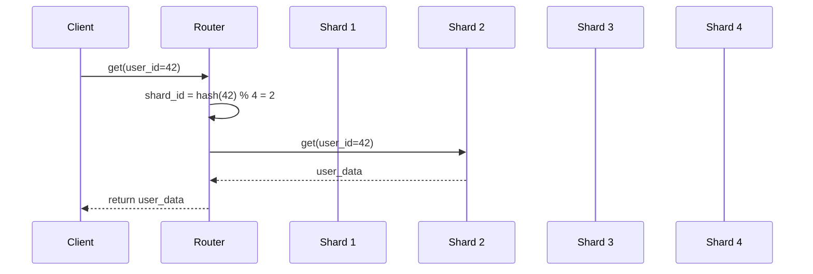

# Database Sharding

## Problem Statement
Design a sharding strategy for horizontally scaling database across multiple nodes.

**Requirements:**
- Distribute data evenly
- Route queries to correct shard
- Minimal data movement on scale
- Handle shard failures

## Design

### Sharding Keys

```
User ID: Good for user-centric apps
Timestamp: Good for time-series data
Geographic: Good for region-based queries
Composite: Combination for better distribution
```

### Consistent Hashing

```
Hash key → Ring of servers
Add/remove server: Minimal rehashing
Virtual nodes: Better distribution
```

### Cross-shard Queries

```
Scatter-gather: Query all shards
Merge results
Use fan-out pattern
```


## Scenario

Database Sharding is a critical component in modern distributed systems. In real-world applications, horizontally scaling databases by partitioning data. For example, major tech companies like Netflix, Uber, and Airbnb rely on similar solutions to handle millions of concurrent users and requests. The challenge is achieving this while maintaining sub-100ms latency, 99.99% availability, and gracefully handling 10x traffic spikes during peak demand. This component provides the foundational capability to solve these challenges reliably and efficiently at global scale.

## Users

- **Backend Engineers**: Responsible for implementing and maintaining this system component in production environments. They need to understand the architecture, trade-offs, failure modes, and operational considerations.
- **DevOps/SRE Teams**: Monitor system health, manage scaling policies, handle incidents, and ensure reliability SLAs are met. They need insights into performance characteristics, bottlenecks, and failure recovery mechanisms.
- **Data Engineers**: Design data pipelines and analytics around this system, requiring deep understanding of data flow, consistency guarantees, and throughput characteristics.
- **System Architects**: Make high-level architectural decisions that impact company infrastructure, requiring comprehensive understanding of capabilities, limitations, and scalability boundaries.
- **Security Teams**: Understand security implications, potential vulnerabilities, and compliance requirements for this component.

## PRD

**Functional Requirements:**
- Correct behavior under all specified operating conditions
- Reliable operation with explicit failure modes
- Data consistency or eventual consistency guarantees as specified
- Clear mechanisms for error handling and recovery
- Monitoring and observability hooks

**Non-Functional Requirements:**
- **Performance**: Sub-100ms P99 latency for standard operations; measure and track tail latencies
- **Availability**: 99.99%+ uptime with automatic failover and graceful degradation
- **Scalability**: Support 10-100x current load with minimal architectural modifications
- **Consistency**: Specify whether strong, eventual, or causal consistency is required
- **Cost Efficiency**: Minimize operational cost per unit of throughput; consider compute, memory, and network costs
- **Operational Simplicity**: Reduce complexity to minimize human error and operational toil

**Constraints:**
- Resource limits (memory for caches, disk for databases, network bandwidth)
- Deployment constraints (cloud provider limits, regulatory requirements)
- Latency budgets (maximum acceptable delay for operations)

## Flow

The typical operational flow for this system involves these key phases:

1. **Request Arrival**: Client/upstream system sends request with required parameters and context
2. **Validation & Routing**: System validates request format, authentication, and routes to correct handler/shard/instance
3. **Core Processing**: Execute the main algorithm, database query, or business logic on the data/state
4. **State Management**: Update internal state (caches, indexes, counters, logs) with proper atomicity and locking
5. **Response Generation**: Format results and return to requester with relevant metadata (timing, version info)
6. **Observability**: Record metrics (latency, throughput, errors), logs (for debugging), and traces (for performance analysis)

This flow repeats thousands or millions of times per second in production. Each operation's efficiency compounds across the entire system, making careful optimization essential. Bottlenecks at any phase can cascade to impact overall system performance.

## Code Explanation

The provided implementations demonstrate key architectural concepts and design patterns:

**Python Implementation**: Uses built-in Python structures and standard library features to express the core logic clearly. Python emphasizes readability and conciseness—each operation's purpose should be obvious without extensive comments. You'll see different implementation approaches (e.g., using OrderedDict vs. manual linked lists) that represent trade-offs between convenience and fine-grained control.

**Java Implementation**: Shows how to implement the same logic with explicit memory management and type safety. Java's strong typing forces clear interface design; you'll see how generics, null safety, mutable state, and thread safety are handled. This implementation style is closer to production systems at scale.

**Key Implementation Patterns**:
- **Initialization**: Setting up core data structures, thread pools, or connection pools with specified capacity and configuration
- **Read Operations**: Fetching data while maintaining O(1) or O(log n) access, updating metadata (access times, hit counts, etc.)
- **Write Operations**: Inserting/updating data while handling eviction policies, balancing tree structures, or replicating state
- **Edge Cases**: Handling capacity limits, concurrent access, data consistency, and error conditions
- **Performance Optimization**: Using techniques like batch operations, lazy evaluation, or caching to reduce latency

Each line of code represents a deliberate choice about performance characteristics, memory usage, safety guarantees, and implementation complexity. Understanding these trade-offs is essential for using this component effectively in production systems.

## Architecture Diagram

```
┌──────────────────────────────────────┐
│   Sharded Database Architecture      │
│  ┌──────────────────────────────────┐  │
│  │ Sharding Key: user_id            │  │
│  │ Shard 1: user_id % 4 == 0        │  │
│  │ Shard 2: user_id % 4 == 1        │  │
│  │ Shard 3: user_id % 4 == 2        │  │
│  │ Shard 4: user_id % 4 == 3        │  │
│  │                                  │  │
│  │ Directory: user_id → shard_id    │  │
│  └──────────────────────────────────┘  │
└──────────────────────────────────────────┘
```

## Flow Diagram



## Common Questions & Answers

**Q: Shard key selection?** A: Choose high-cardinality (user_id good, gender bad). Enables even distribution.

**Q: Hot shard problem?** A: Uneven distribution if key skewed (celebrities). Solution: split hot shard, re-shard.

**Q: Cross-shard queries?** A: Expensive, scatter-gather to all shards. Avoid if possible.

**Q: Re-sharding complexity?** A: Double shards: migrate half of each to new shards. Zero-downtime hard, plan carefully.

## Back-of-Envelope Calculations

1B users, 4 shards: 250M per shard. Each shard: single master + replicas. Queries: shard_id = hash(user_id) % 4. Cross-shard: 4x latency.

## Design Choice Comparison

| Approach | Pros | Cons |
|----------|------|------|
| Range sharding | Easy range queries | Uneven distribution |
| Hash sharding | Even distribution | Range queries hard |
| Directory-based | Flexible, dynamic | Extra lookup latency |

## Follow-up Interview Questions

1. Dynamic re-sharding without downtime? 2. Handling growth (1B → 10B)? 3. Cross-shard transactions? 4. Load imbalance detection? 5. Disaster recovery per shard?

## Example Scenario Walkthrough

[Describe a concrete example with step-by-step execution]

## Trade-offs

| Strategy | Pros | Cons |
|----------|------|------|
| Range | Simple joins | Uneven distribution |
| Hash | Even distribution | Hard to scale |
| Consistent hash | Scale-friendly | Complex implementation |

## Python Implementation

```python
import hashlib
from typing import Any, Dict, List

class Shard:
    def __init__(self, shard_id: int):
        self.shard_id = shard_id
        self._data: Dict[str, Any] = {}

    def get(self, key: str) -> Any:
        return self._data.get(key)

    def put(self, key: str, value: Any):
        self._data[key] = value

class ShardedDatabase:
    def __init__(self, num_shards: int = 4):
        self._shards = [Shard(i) for i in range(num_shards)]
        self._num_shards = num_shards

    def _shard_for(self, key: str) -> Shard:
        hash_val = int(hashlib.md5(key.encode()).hexdigest(), 16)
        return self._shards[hash_val % self._num_shards]

    def get(self, key: str) -> Any:
        return self._shard_for(key).get(key)

    def put(self, key: str, value: Any):
        self._shard_for(key).put(key, value)

# Usage
db = ShardedDatabase(num_shards=4)
db.put("user:1001", {"name": "Alice"})
db.put("user:1002", {"name": "Bob"})
print(db.get("user:1001"))  # {'name': 'Alice'}
```

## Java Implementation

```java
import java.util.*;

public class ShardedDatabase {
    private List<Map<String, Object>> shards;
    private int numShards;

    public ShardedDatabase(int numShards) {
        this.numShards = numShards;
        this.shards = new ArrayList<>();
        for (int i = 0; i < numShards; i++) shards.add(new HashMap<>());
    }

    private int shardFor(String key) {
        return Math.abs(key.hashCode()) % numShards;
    }

    public void put(String key, Object value) {
        shards.get(shardFor(key)).put(key, value);
    }

    public Object get(String key) {
        return shards.get(shardFor(key)).get(key);
    }

    public static void main(String[] args) {
        ShardedDatabase db = new ShardedDatabase(4);
        db.put("user:1", Map.of("name", "Alice"));
        System.out.println(db.get("user:1")); // {name=Alice}
    }
}
```
