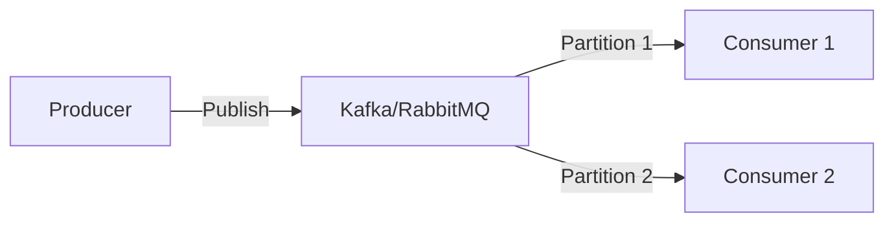
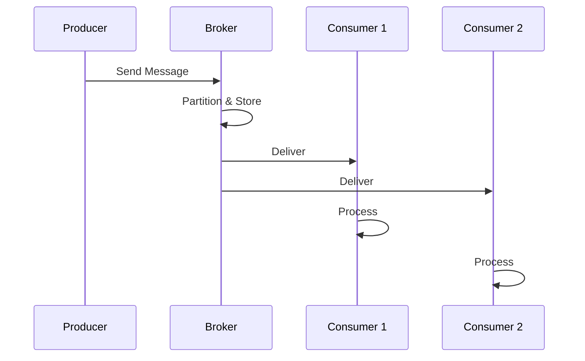

# Message Queue System

## Problem Statement
Design a publish-subscribe message queue for asynchronous processing.

**Operations:**
- `publish(topic, message)` — Publish message
- `subscribe(topic, callback)` — Subscribe to topic
- `consume(queue, n)` — Consume n messages
- `acknowledge(message_id)` — ACK processed message

## Design

### Queue Structure

```
Topics: Channels for messages
Partitions: Within topic for parallelism
Consumer groups: Multiple consumers per topic
Offset: Position in partition
```

### Delivery Guarantees

```
At-most-once: Fire and forget
At-least-once: Resend until ACK
Exactly-once: Deduplication + ordering
```

### Dead Letter Queue

```
Failed messages → DLQ
Manual inspection
Retry with backoff
```


## Architecture Diagram

```
┌──────────────────────────────────────┐
│   Message Broker (Kafka-like)        │
│  ┌──────────────────────────────────┐  │
│  │ Topics: partitioned by key        │  │
│  │ Producers: send messages          │  │
│  │ Consumers: read at own pace       │  │
│  │ Brokers: replicate, persist       │  │
│  │ Offset: consumer position         │  │
│  └──────────────────────────────────┘  │
└──────────────────────────────────────────┘
```

## Common Questions & Answers

**Q: Durability vs latency?** A: Sync write: all replicas ack (slow, safe). Async: leader only (fast, risky).

**Q: Consumer group rebalancing?** A: When consumer joins/leaves, re-partition across group. Brief pause.

**Q: Dead letter queue?** A: Messages fail N times → separate DLQ for manual review.

**Q: Message ordering guarantee?** A: Per-partition ordered. Multi-partition: no global order.

## Back-of-Envelope Calculations

1M msg/sec, 10 partitions (10x parallelism). Storage: 1M × 1KB = 1GB/sec = 86TB/day. Retention: 7 days = 600TB cluster.

## Design Choice Comparison

| Approach | Pros | Cons |
|----------|------|------|
| Queue (RabbitMQ) | Simple per-consumer | No persistence usually |
| Log (Kafka) | Durable, replay-able | More complex |
| Pub-Sub (Redis) | Real-time, in-memory | No persistence |

## Follow-up Interview Questions

1. Exactly-once delivery semantics? 2. Consumer lag monitoring? 3. Broker failover recovery? 4. Throughput bottleneck at 10x? 5. Schema evolution/versioning?

## Example Scenario Walkthrough

[Describe a concrete example with step-by-step execution]

### Architecture Diagram



### Flow Diagram



## Complexity

| Operation | Time |
|-----------|------|
| Publish | O(1) |
| Consume | O(k) where k=batch |
| ACK | O(1) |

## Python Implementation

```python
from collections import deque
from threading import Lock, Condition
from dataclasses import dataclass
from typing import Optional, Any

@dataclass
class Message:
    msg_id: int
    payload: Any
    acknowledged: bool = False

class MessageQueue:
    def __init__(self, max_size: int = 1000):
        self._queue: deque[Message] = deque()
        self._max_size = max_size
        self._lock = Lock()
        self._not_empty = Condition(self._lock)
        self._not_full = Condition(self._lock)
        self._counter = 0

    def send(self, payload: Any, timeout: float = None) -> bool:
        with self._not_full:
            if len(self._queue) >= self._max_size:
                self._not_full.wait(timeout)
                if len(self._queue) >= self._max_size:
                    return False
            self._counter += 1
            self._queue.append(Message(self._counter, payload))
            self._not_empty.notify()
            return True

    def receive(self, timeout: float = None) -> Optional[Message]:
        with self._not_empty:
            if not self._queue:
                self._not_empty.wait(timeout)
                if not self._queue:
                    return None
            msg = self._queue.popleft()
            self._not_full.notify()
            return msg

# Usage
q = MessageQueue(max_size=10)
q.send({"event": "user.signup", "user_id": 42})
msg = q.receive()
print(msg.payload)  # {'event': 'user.signup', 'user_id': 42}
```

## Java Implementation

```java
import java.util.concurrent.*;

public class MessageQueue<T> {
    private final BlockingQueue<T> queue;

    public MessageQueue(int capacity) {
        this.queue = new ArrayBlockingQueue<>(capacity);
    }

    public boolean send(T payload) throws InterruptedException {
        return queue.offer(payload, 100, TimeUnit.MILLISECONDS);
    }

    public T receive() throws InterruptedException {
        return queue.poll(100, TimeUnit.MILLISECONDS);
    }

    public static void main(String[] args) throws Exception {
        MessageQueue<String> q = new MessageQueue<>(100);
        q.send("hello");
        System.out.println(q.receive()); // hello
    }
}
```
