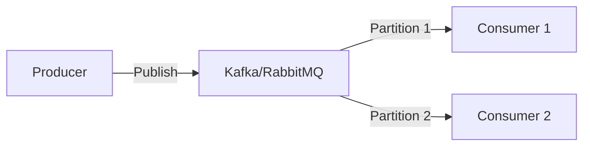
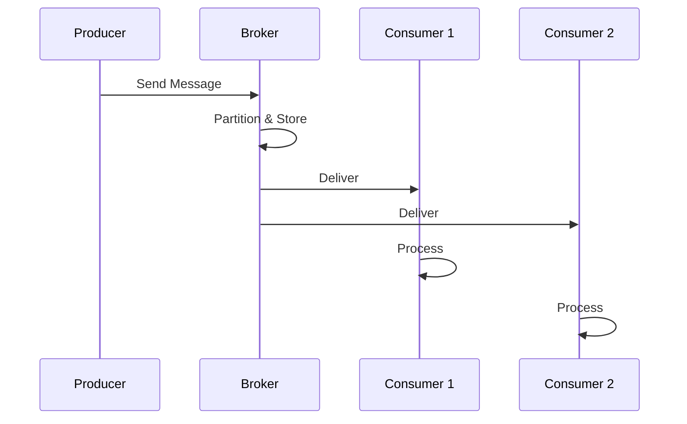

# Message Queue System

## Problem Statement
Design a publish-subscribe message queue for asynchronous processing.

**Operations:**
- `publish(topic, message)` — Publish message
- `subscribe(topic, callback)` — Subscribe to topic
- `consume(queue, n)` — Consume n messages
- `acknowledge(message_id)` — ACK processed message

## Design

### Queue Structure

```
Topics: Channels for messages
Partitions: Within topic for parallelism
Consumer groups: Multiple consumers per topic
Offset: Position in partition
```

### Delivery Guarantees

```
At-most-once: Fire and forget
At-least-once: Resend until ACK
Exactly-once: Deduplication + ordering
```

### Dead Letter Queue

```
Failed messages → DLQ
Manual inspection
Retry with backoff
```


## Scenario

Message Queue System is a critical component in modern distributed systems. In real-world applications, buffering and delivering asynchronous messages reliably. For example, major tech companies like Netflix, Uber, and Airbnb rely on similar solutions to handle millions of concurrent users and requests. The challenge is achieving this while maintaining sub-100ms latency, 99.99% availability, and gracefully handling 10x traffic spikes during peak demand. This component provides the foundational capability to solve these challenges reliably and efficiently at global scale.

## Users

- **Backend Engineers**: Responsible for implementing and maintaining this system component in production environments. They need to understand the architecture, trade-offs, failure modes, and operational considerations.
- **DevOps/SRE Teams**: Monitor system health, manage scaling policies, handle incidents, and ensure reliability SLAs are met. They need insights into performance characteristics, bottlenecks, and failure recovery mechanisms.
- **Data Engineers**: Design data pipelines and analytics around this system, requiring deep understanding of data flow, consistency guarantees, and throughput characteristics.
- **System Architects**: Make high-level architectural decisions that impact company infrastructure, requiring comprehensive understanding of capabilities, limitations, and scalability boundaries.
- **Security Teams**: Understand security implications, potential vulnerabilities, and compliance requirements for this component.

## PRD

**Functional Requirements:**
- Correct behavior under all specified operating conditions
- Reliable operation with explicit failure modes
- Data consistency or eventual consistency guarantees as specified
- Clear mechanisms for error handling and recovery
- Monitoring and observability hooks

**Non-Functional Requirements:**
- **Performance**: Sub-100ms P99 latency for standard operations; measure and track tail latencies
- **Availability**: 99.99%+ uptime with automatic failover and graceful degradation
- **Scalability**: Support 10-100x current load with minimal architectural modifications
- **Consistency**: Specify whether strong, eventual, or causal consistency is required
- **Cost Efficiency**: Minimize operational cost per unit of throughput; consider compute, memory, and network costs
- **Operational Simplicity**: Reduce complexity to minimize human error and operational toil

**Constraints:**
- Resource limits (memory for caches, disk for databases, network bandwidth)
- Deployment constraints (cloud provider limits, regulatory requirements)
- Latency budgets (maximum acceptable delay for operations)

## Flow

The typical operational flow for this system involves these key phases:

1. **Request Arrival**: Client/upstream system sends request with required parameters and context
2. **Validation & Routing**: System validates request format, authentication, and routes to correct handler/shard/instance
3. **Core Processing**: Execute the main algorithm, database query, or business logic on the data/state
4. **State Management**: Update internal state (caches, indexes, counters, logs) with proper atomicity and locking
5. **Response Generation**: Format results and return to requester with relevant metadata (timing, version info)
6. **Observability**: Record metrics (latency, throughput, errors), logs (for debugging), and traces (for performance analysis)

This flow repeats thousands or millions of times per second in production. Each operation's efficiency compounds across the entire system, making careful optimization essential. Bottlenecks at any phase can cascade to impact overall system performance.

## Code Explanation

The provided implementations demonstrate key architectural concepts and design patterns:

**Python Implementation**: Uses built-in Python structures and standard library features to express the core logic clearly. Python emphasizes readability and conciseness—each operation's purpose should be obvious without extensive comments. You'll see different implementation approaches (e.g., using OrderedDict vs. manual linked lists) that represent trade-offs between convenience and fine-grained control.

**Java Implementation**: Shows how to implement the same logic with explicit memory management and type safety. Java's strong typing forces clear interface design; you'll see how generics, null safety, mutable state, and thread safety are handled. This implementation style is closer to production systems at scale.

**Key Implementation Patterns**:
- **Initialization**: Setting up core data structures, thread pools, or connection pools with specified capacity and configuration
- **Read Operations**: Fetching data while maintaining O(1) or O(log n) access, updating metadata (access times, hit counts, etc.)
- **Write Operations**: Inserting/updating data while handling eviction policies, balancing tree structures, or replicating state
- **Edge Cases**: Handling capacity limits, concurrent access, data consistency, and error conditions
- **Performance Optimization**: Using techniques like batch operations, lazy evaluation, or caching to reduce latency

Each line of code represents a deliberate choice about performance characteristics, memory usage, safety guarantees, and implementation complexity. Understanding these trade-offs is essential for using this component effectively in production systems.

## Architecture Diagram

```
┌──────────────────────────────────────┐
│   Message Broker (Kafka-like)        │
│  ┌──────────────────────────────────┐  │
│  │ Topics: partitioned by key        │  │
│  │ Producers: send messages          │  │
│  │ Consumers: read at own pace       │  │
│  │ Brokers: replicate, persist       │  │
│  │ Offset: consumer position         │  │
│  └──────────────────────────────────┘  │
└──────────────────────────────────────────┘
```

## Common Questions & Answers

**Q: Durability vs latency?** A: Sync write: all replicas ack (slow, safe). Async: leader only (fast, risky).

**Q: Consumer group rebalancing?** A: When consumer joins/leaves, re-partition across group. Brief pause.

**Q: Dead letter queue?** A: Messages fail N times → separate DLQ for manual review.

**Q: Message ordering guarantee?** A: Per-partition ordered. Multi-partition: no global order.

## Back-of-Envelope Calculations

1M msg/sec, 10 partitions (10x parallelism). Storage: 1M × 1KB = 1GB/sec = 86TB/day. Retention: 7 days = 600TB cluster.

## Design Choice Comparison

| Approach | Pros | Cons |
|----------|------|------|
| Queue (RabbitMQ) | Simple per-consumer | No persistence usually |
| Log (Kafka) | Durable, replay-able | More complex |
| Pub-Sub (Redis) | Real-time, in-memory | No persistence |

## Follow-up Interview Questions

1. Exactly-once delivery semantics? 2. Consumer lag monitoring? 3. Broker failover recovery? 4. Throughput bottleneck at 10x? 5. Schema evolution/versioning?

## Example Scenario Walkthrough

[Describe a concrete example with step-by-step execution]

### Architecture Diagram



### Flow Diagram



## Complexity

| Operation | Time |
|-----------|------|
| Publish | O(1) |
| Consume | O(k) where k=batch |
| ACK | O(1) |

## Python Implementation

```python
from collections import deque
from threading import Lock, Condition
from dataclasses import dataclass
from typing import Optional, Any

@dataclass
class Message:
    msg_id: int
    payload: Any
    acknowledged: bool = False

class MessageQueue:
    def __init__(self, max_size: int = 1000):
        self._queue: deque[Message] = deque()
        self._max_size = max_size
        self._lock = Lock()
        self._not_empty = Condition(self._lock)
        self._not_full = Condition(self._lock)
        self._counter = 0

    def send(self, payload: Any, timeout: float = None) -> bool:
        with self._not_full:
            if len(self._queue) >= self._max_size:
                self._not_full.wait(timeout)
                if len(self._queue) >= self._max_size:
                    return False
            self._counter += 1
            self._queue.append(Message(self._counter, payload))
            self._not_empty.notify()
            return True

    def receive(self, timeout: float = None) -> Optional[Message]:
        with self._not_empty:
            if not self._queue:
                self._not_empty.wait(timeout)
                if not self._queue:
                    return None
            msg = self._queue.popleft()
            self._not_full.notify()
            return msg

# Usage
q = MessageQueue(max_size=10)
q.send({"event": "user.signup", "user_id": 42})
msg = q.receive()
print(msg.payload)  # {'event': 'user.signup', 'user_id': 42}
```

## Java Implementation

```java
import java.util.concurrent.*;

public class MessageQueue<T> {
    private final BlockingQueue<T> queue;

    public MessageQueue(int capacity) {
        this.queue = new ArrayBlockingQueue<>(capacity);
    }

    public boolean send(T payload) throws InterruptedException {
        return queue.offer(payload, 100, TimeUnit.MILLISECONDS);
    }

    public T receive() throws InterruptedException {
        return queue.poll(100, TimeUnit.MILLISECONDS);
    }

    public static void main(String[] args) throws Exception {
        MessageQueue<String> q = new MessageQueue<>(100);
        q.send("hello");
        System.out.println(q.receive()); // hello
    }
}
```
