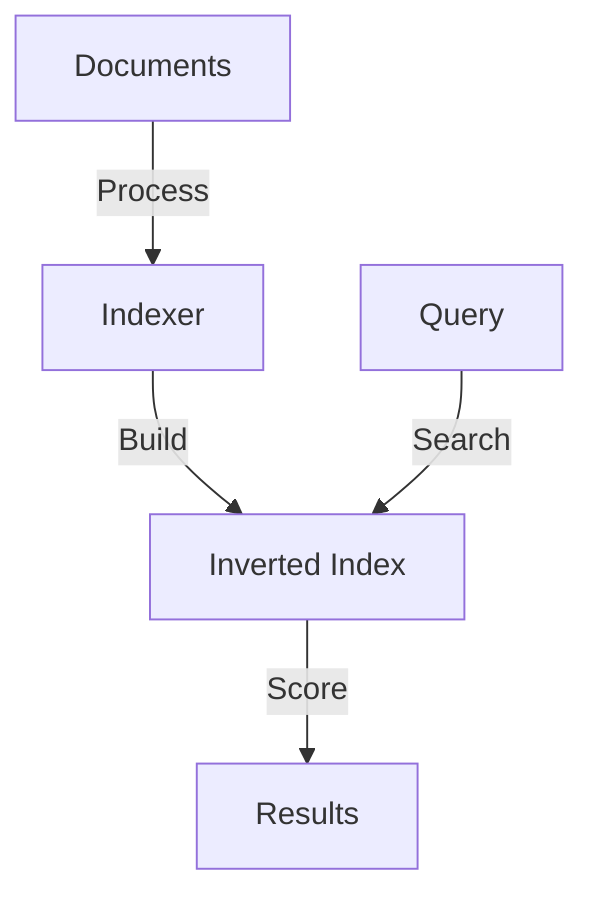
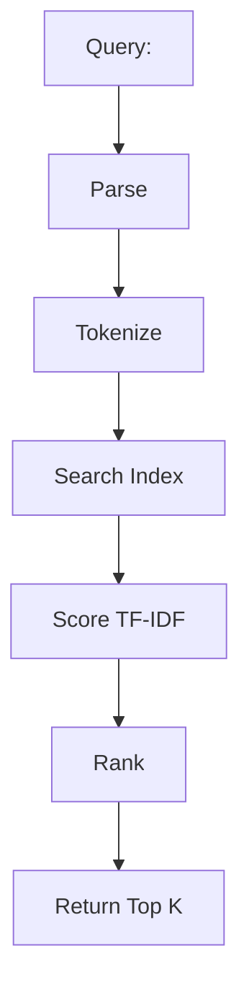

# Search Engine

## Problem Statement
Design a full-text search engine with ranking and relevance.

**Requirements:**
- Index documents
- Full-text search
- Ranking by relevance
- Handle typos/suggestions

## Design

### Inverted Index

```
Word → [doc_id, position, frequency]
Enables fast search
Compressed for storage
```

### Ranking Algorithm

```
TF-IDF: Term frequency × Inverse document frequency
BM25: Enhanced TF-IDF
PageRank: Link-based importance
Combined score
```

### Distributed Search

```
Index sharding by document ID
Query all shards
Merge and rank results
```

### Suggestion/Autocomplete

```
Trie for prefix matching
N-gram indexing
Edit distance for typos
```


## Architecture Diagram

```
┌──────────────────────────────────────┐
│   Full-Text Search Index             │
│  ┌──────────────────────────────────┐  │
│  │ Inverted Index                   │  │
│  │ term → [doc_id, position, freq]  │  │
│  │ Query: lookup term, get docs     │  │
│  │ Rank: BM25 + engagement          │  │
│  └──────────────────────────────────┘  │
└──────────────────────────────────────────┘
```

## Common Questions & Answers

**Q: Inverted index structure?** A: Map term → doc list. Query: O(log n) index lookup, retrieve ranked docs. Supports phrase, boolean.

**Q: Crawling frequency?** A: Periodic (monthly full, weekly delta) + event-based (sitemap ping).

**Q: Ranking algorithm?** A: TF-IDF (simple), BM25 (better), neural (ML, slow). Use BM25 + signals.

**Q: Privacy?** A: Don't log queries, anonymize IPs, differential privacy for aggregates.

## Back-of-Envelope Calculations

10B pages, 5KB avg = 50TB. Inverted index: 100M terms × 8B + refs = 100GB. Query: 1-5ms search, 5-10ms total.

## Design Choice Comparison

| Approach | Pros | Cons |
|----------|------|------|
| Full inverted index | Fast O(log n) | Large storage |
| Trie-based | Prefix matching | Complex |
| Bloom filters | Space efficient | False positives |

## Follow-up Interview Questions

1. Typo/spell correction? 2. Personalized search (user interests)? 3. Spam/malicious content detection? 4. Index size bottleneck. 5. Auto-complete suggestions?

## Example Scenario Walkthrough

[Describe a concrete example with step-by-step execution]

### Architecture Diagram



### Flow Diagram



## Complexity

| Operation | Time |
|-----------|------|
| Index document | O(d) where d=doc length |
| Search | O(log n + k) |
| Rank | O(k log k) |
