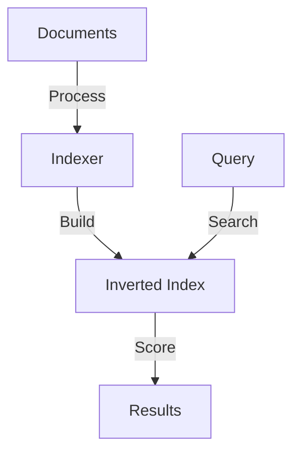
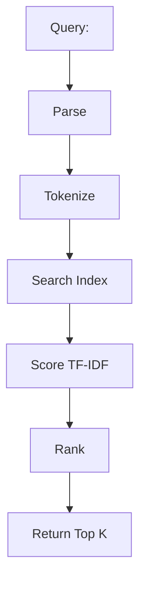

# Search Engine

## Problem Statement
Design a full-text search engine with ranking and relevance.

**Requirements:**
- Index documents
- Full-text search
- Ranking by relevance
- Handle typos/suggestions

## Design

### Inverted Index

```
Word → [doc_id, position, frequency]
Enables fast search
Compressed for storage
```

### Ranking Algorithm

```
TF-IDF: Term frequency × Inverse document frequency
BM25: Enhanced TF-IDF
PageRank: Link-based importance
Combined score
```

### Distributed Search

```
Index sharding by document ID
Query all shards
Merge and rank results
```

### Suggestion/Autocomplete

```
Trie for prefix matching
N-gram indexing
Edit distance for typos
```


## Architecture Diagram

```
┌──────────────────────────────────────┐
│   Full-Text Search Index             │
│  ┌──────────────────────────────────┐  │
│  │ Inverted Index                   │  │
│  │ term → [doc_id, position, freq]  │  │
│  │ Query: lookup term, get docs     │  │
│  │ Rank: BM25 + engagement          │  │
│  └──────────────────────────────────┘  │
└──────────────────────────────────────────┘
```

## Common Questions & Answers

**Q: Inverted index structure?** A: Map term → doc list. Query: O(log n) index lookup, retrieve ranked docs. Supports phrase, boolean.

**Q: Crawling frequency?** A: Periodic (monthly full, weekly delta) + event-based (sitemap ping).

**Q: Ranking algorithm?** A: TF-IDF (simple), BM25 (better), neural (ML, slow). Use BM25 + signals.

**Q: Privacy?** A: Don't log queries, anonymize IPs, differential privacy for aggregates.

## Back-of-Envelope Calculations

10B pages, 5KB avg = 50TB. Inverted index: 100M terms × 8B + refs = 100GB. Query: 1-5ms search, 5-10ms total.

## Design Choice Comparison

| Approach | Pros | Cons |
|----------|------|------|
| Full inverted index | Fast O(log n) | Large storage |
| Trie-based | Prefix matching | Complex |
| Bloom filters | Space efficient | False positives |

## Follow-up Interview Questions

1. Typo/spell correction? 2. Personalized search (user interests)? 3. Spam/malicious content detection? 4. Index size bottleneck. 5. Auto-complete suggestions?

## Example Scenario Walkthrough

[Describe a concrete example with step-by-step execution]

### Architecture Diagram



### Flow Diagram



## Complexity

| Operation | Time |
|-----------|------|
| Index document | O(d) where d=doc length |
| Search | O(log n + k) |
| Rank | O(k log k) |

## Python Implementation

```python
from collections import defaultdict
from typing import List, Dict, Set
import math

class SearchEngine:
    def __init__(self):
        self._index: Dict[str, Set[int]] = defaultdict(set)  # term -> doc_ids
        self._docs: Dict[int, str] = {}
        self._tf: Dict[int, Dict[str, float]] = defaultdict(dict)  # doc_id -> term -> tf

    def index(self, doc_id: int, content: str):
        self._docs[doc_id] = content
        terms = content.lower().split()
        term_counts = defaultdict(int)
        for term in terms:
            term_counts[term] += 1
            self._index[term].add(doc_id)
        for term, count in term_counts.items():
            self._tf[doc_id][term] = count / len(terms)

    def search(self, query: str, top_k: int = 10) -> List[int]:
        terms = query.lower().split()
        scores: Dict[int, float] = defaultdict(float)
        N = len(self._docs)
        for term in terms:
            doc_ids = self._index.get(term, set())
            if not doc_ids:
                continue
            idf = math.log(N / len(doc_ids))
            for doc_id in doc_ids:
                tf = self._tf[doc_id].get(term, 0)
                scores[doc_id] += tf * idf
        return sorted(scores, key=scores.get, reverse=True)[:top_k]

# Usage
engine = SearchEngine()
engine.index(1, "python is great for data science")
engine.index(2, "java is great for enterprise apps")
engine.index(3, "python web development with django")
print(engine.search("python"))  # [1, 3] or [3, 1]
```

## Java Implementation

```java
import java.util.*;

public class SearchEngine {
    private Map<String, Set<Integer>> index = new HashMap<>();
    private Map<Integer, String> docs = new HashMap<>();

    public void index(int docId, String content) {
        docs.put(docId, content);
        for (String term : content.toLowerCase().split("\s+")) {
            index.computeIfAbsent(term, k -> new HashSet<>()).add(docId);
        }
    }

    public List<Integer> search(String query) {
        Set<Integer> result = null;
        for (String term : query.toLowerCase().split("\s+")) {
            Set<Integer> docs = index.getOrDefault(term, Set.of());
            if (result == null) result = new HashSet<>(docs);
            else result.retainAll(docs);
        }
        return result == null ? List.of() : new ArrayList<>(result);
    }
}
```
