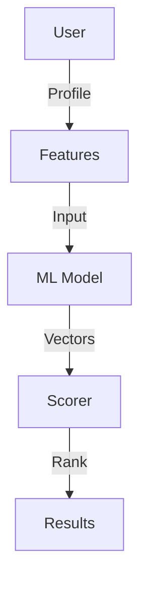
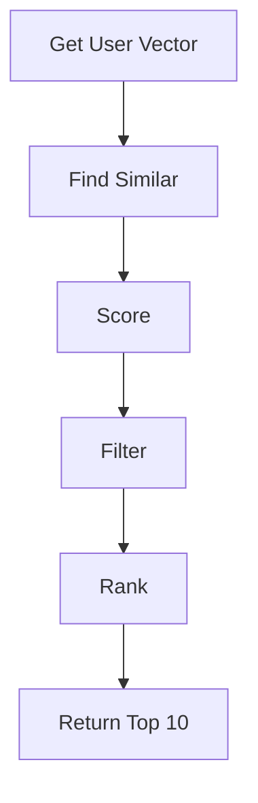

# Recommendation Engine

## Problem Statement
Design a system recommending content to users based on preferences.

**Approaches:**
- Content-based: Similar to liked items
- Collaborative filtering: Similar users' preferences
- Hybrid: Combine both

## Design

### Collaborative Filtering

```
User-item matrix (sparse)
Find similar users (cosine similarity)
Recommend items liked by similar users
```

### Content-based

```
Item features (genre, tags, etc.)
User preference vector
Rank items by similarity
```

### Cold Start Problem

```
New user: Popularity-based recommendations
New item: Content-based (feature similarity)
Hybrid approach: Mix strategies
```

### Personalization Pipeline

```
Batch: Precompute recommendations
Online: Real-time re-ranking by context
A/B test: Measure engagement
```


## Architecture Diagram

```
┌──────────────────────────────────────┐
│   ML-based Recommendations          │
│  ┌──────────────────────────────────┐  │
│  │ Collaborative Filtering          │  │
│  │ - User-item matrix (sparse)      │  │
│  │ - Matrix factorization           │  │
│  │ - KNN similar users              │  │
│  │ Content-based + Hybrid           │  │
│  └──────────────────────────────────┘  │
└──────────────────────────────────────────┘
```

## Common Questions & Answers

**Q: Cold start problem?** A: New user: popular items. New item: content match. Explore-exploit (bandit).

**Q: Recommendation staleness?** A: Batch daily + cache hot, compute cold on-demand.

**Q: Sparsity handling?** A: Matrix factorization, implicit feedback, regularization.

**Q: Diversity?** A: Lambda ranking penalty. 10% exploration for serendipity.

## Back-of-Envelope Calculations

100M users, 1M items, 1% sparsity. Matrix factorization: 100M × 100 factors × 4B = 40GB. Latency: 10-50ms KNN.

## Design Choice Comparison

| Approach | Pros | Cons |
|----------|------|------|
| Collaborative filtering | Works for all items | Cold start, sparsity |
| Content-based | Handles cold start | Needs features |
| Hybrid | Balances both | More complex |

## Follow-up Interview Questions

1. Detect recommendation gaming? 2. Explainability (why recommend)? 3. Context-aware (time, location)? 4. A/B testing safely? 5. Real-time vs batch?

## Example Scenario Walkthrough

[Describe a concrete example with step-by-step execution]

### Architecture Diagram



### Flow Diagram



## Complexity

| Operation | Time |
|-----------|------|
| User similarity | O(u) |
| Recommendations | O(u*i) precomputed |
| Re-ranking | O(k log k) |

## Python Implementation

```python
from typing import Dict, List, Set
from collections import defaultdict
import math

class RecommendationEngine:
    def __init__(self):
        self._user_items: Dict[int, Set[int]] = defaultdict(set)
        self._item_users: Dict[int, Set[int]] = defaultdict(set)

    def record_interaction(self, user_id: int, item_id: int):
        self._user_items[user_id].add(item_id)
        self._item_users[item_id].add(user_id)

    def _jaccard_similarity(self, user_a: int, user_b: int) -> float:
        a, b = self._user_items[user_a], self._user_items[user_b]
        if not a or not b:
            return 0.0
        return len(a & b) / len(a | b)

    def recommend(self, user_id: int, top_k: int = 5) -> List[int]:
        seen = self._user_items[user_id]
        scores: Dict[int, float] = defaultdict(float)
        for other_user, items in self._user_items.items():
            if other_user == user_id:
                continue
            sim = self._jaccard_similarity(user_id, other_user)
            for item in items - seen:
                scores[item] += sim
        return sorted(scores, key=scores.get, reverse=True)[:top_k]

# Usage
engine = RecommendationEngine()
engine.record_interaction(1, 10)
engine.record_interaction(1, 20)
engine.record_interaction(2, 10)
engine.record_interaction(2, 30)
print(engine.recommend(1))  # [30] (item 30 seen by similar user 2)
```

## Java Implementation

```java
import java.util.*;

public class RecommendationEngine {
    private Map<Integer, Set<Integer>> userItems = new HashMap<>();
    private Map<Integer, Set<Integer>> itemUsers = new HashMap<>();

    public void recordInteraction(int userId, int itemId) {
        userItems.computeIfAbsent(userId, k -> new HashSet<>()).add(itemId);
        itemUsers.computeIfAbsent(itemId, k -> new HashSet<>()).add(userId);
    }

    public List<Integer> recommend(int userId, int topK) {
        Set<Integer> seen = userItems.getOrDefault(userId, Set.of());
        Map<Integer, Double> scores = new HashMap<>();
        for (Map.Entry<Integer, Set<Integer>> e : userItems.entrySet()) {
            if (e.getKey() == userId) continue;
            Set<Integer> common = new HashSet<>(seen);
            common.retainAll(e.getValue());
            double sim = (double) common.size() / (seen.size() + e.getValue().size() - common.size());
            for (int item : e.getValue()) {
                if (!seen.contains(item))
                    scores.merge(item, sim, Double::sum);
            }
        }
        return scores.entrySet().stream()
            .sorted(Map.Entry.<Integer, Double>comparingByValue().reversed())
            .limit(topK).map(Map.Entry::getKey).toList();
    }
}
```
