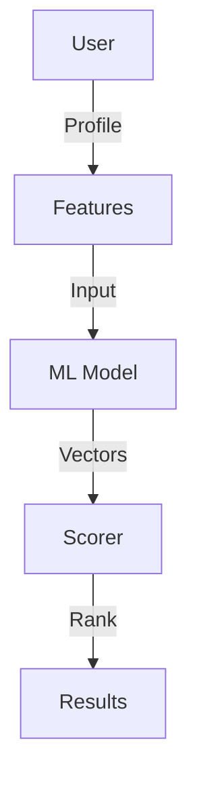
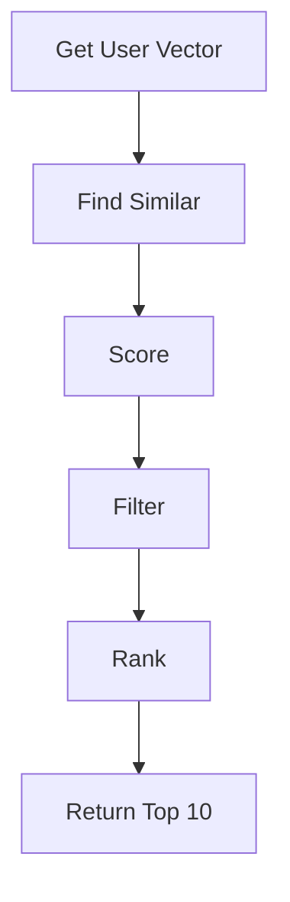

# Recommendation Engine

## Problem Statement
Design a system recommending content to users based on preferences.

**Approaches:**
- Content-based: Similar to liked items
- Collaborative filtering: Similar users' preferences
- Hybrid: Combine both

## Design

### Collaborative Filtering

```
User-item matrix (sparse)
Find similar users (cosine similarity)
Recommend items liked by similar users
```

### Content-based

```
Item features (genre, tags, etc.)
User preference vector
Rank items by similarity
```

### Cold Start Problem

```
New user: Popularity-based recommendations
New item: Content-based (feature similarity)
Hybrid approach: Mix strategies
```

### Personalization Pipeline

```
Batch: Precompute recommendations
Online: Real-time re-ranking by context
A/B test: Measure engagement
```


## Architecture Diagram

```
┌──────────────────────────────────────┐
│   ML-based Recommendations          │
│  ┌──────────────────────────────────┐  │
│  │ Collaborative Filtering          │  │
│  │ - User-item matrix (sparse)      │  │
│  │ - Matrix factorization           │  │
│  │ - KNN similar users              │  │
│  │ Content-based + Hybrid           │  │
│  └──────────────────────────────────┘  │
└──────────────────────────────────────────┘
```

## Common Questions & Answers

**Q: Cold start problem?** A: New user: popular items. New item: content match. Explore-exploit (bandit).

**Q: Recommendation staleness?** A: Batch daily + cache hot, compute cold on-demand.

**Q: Sparsity handling?** A: Matrix factorization, implicit feedback, regularization.

**Q: Diversity?** A: Lambda ranking penalty. 10% exploration for serendipity.

## Back-of-Envelope Calculations

100M users, 1M items, 1% sparsity. Matrix factorization: 100M × 100 factors × 4B = 40GB. Latency: 10-50ms KNN.

## Design Choice Comparison

| Approach | Pros | Cons |
|----------|------|------|
| Collaborative filtering | Works for all items | Cold start, sparsity |
| Content-based | Handles cold start | Needs features |
| Hybrid | Balances both | More complex |

## Follow-up Interview Questions

1. Detect recommendation gaming? 2. Explainability (why recommend)? 3. Context-aware (time, location)? 4. A/B testing safely? 5. Real-time vs batch?

## Example Scenario Walkthrough

[Describe a concrete example with step-by-step execution]

### Architecture Diagram



### Flow Diagram



## Complexity

| Operation | Time |
|-----------|------|
| User similarity | O(u) |
| Recommendations | O(u*i) precomputed |
| Re-ranking | O(k log k) |
