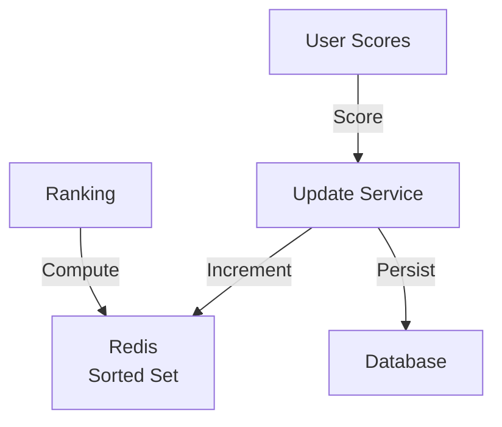
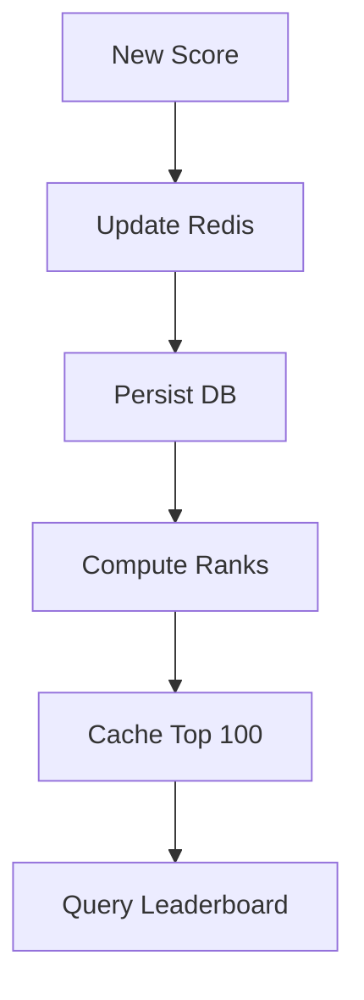

# Leaderboard System

## Problem Statement
Design a system tracking and displaying user rankings in real-time.

**Operations:**
- `updateScore(user_id, points)` — Add points
- `getLeaderboard(page)` — Get top rankings
- `getUserRank(user_id)` — Get user position
- `getUserScore(user_id)` — Get user score

## Design

### Data Structure

```
Sorted set: {score -> [user_ids]}
Or: Redis sorted set (ZSET)
Time-based: Multiple leaderboards (daily, weekly, all-time)
```

### Caching Strategy

```
Top 100 cached (hot)
User's position: On-demand calculation
Periodic refresh: Avoid stale cache
```

### Handling Ties

```
Secondary sort: Timestamp (who reached first)
Tertiary sort: User ID (deterministic)
Consistent ordering
```


## Architecture Diagram

```
┌───────────────────────────────┐
│   Real-time Leaderboard      │
│  Sorted Set (Redis)           │
│  - O(log n) insert            │
│  - O(n) rank (shard)          │
│  Ranking Queries              │
│  - Top 100: ZREVRANGE         │
│  - User rank: ZREVRANK        │
│  Snapshots (hourly)           │
│  - MySQL for persistence      │
└───────────────────────────────┘
```

## Common Questions & Answers

**Q: Tie-breaking?** A: Tiebreaker: timestamp (first wins). Secondary score. Stable rank.

**Q: Update frequency?** A: Real-time (slow refresh) vs batch (fast query). Trade consistency vs throughput.

**Q: Seasonal reset?** A: Archive old, new board starts fresh. Keep history for 'all-time'.

**Q: Regional sharding?** A: Shard by region. Global from shards. No global consensus needed.

## Back-of-Envelope Calculations

10M players, 1 Hz update = 1M updates/sec. Redis: ZADD O(log n). Throughput: 1M easily. Query: top-100 = 1ms.
## Design Choice Comparison

| Approach | Pros | Cons |
|----------|------|------|
| Redis Sorted Set | O(log n), simple | No persistence |
| DB index | Persistent | Slower |
| Sharded Set | Scalable | Complex |

## Follow-up Interview Questions

1. Prevent cheating? 2. Mobile (low bandwidth)? 3. Competitive leagues? 4. Bottleneck at 10x? 5. Real-time visualization?

## Example Scenario Walkthrough

[Describe a concrete example with step-by-step execution]

### Architecture Diagram



### Flow Diagram



## Complexity

| Operation | Time |
|-----------|------|
| Update score | O(log n) |
| Get leaderboard | O(k log n) |
| Get rank | O(log n) |

## Python Implementation

```python
import heapq
from typing import List, Tuple
from sortedcontainers import SortedList

class Leaderboard:
    def __init__(self):
        self._scores: dict[str, int] = {}
        self._sorted: SortedList = SortedList(key=lambda x: -x[0])

    def add_score(self, player_id: str, score: int):
        if player_id in self._scores:
            old_score = self._scores[player_id]
            self._sorted.remove((old_score, player_id))
        self._scores[player_id] = score
        self._sorted.add((score, player_id))

    def top_k(self, k: int) -> List[Tuple[str, int]]:
        return [(pid, s) for s, pid in list(self._sorted)[:k]]

    def rank(self, player_id: str) -> int:
        score = self._scores.get(player_id, 0)
        for i, (s, _) in enumerate(self._sorted):
            if s <= score:
                return i + 1
        return len(self._sorted) + 1

# Simple leaderboard without sortedcontainers
class SimpleLeaderboard:
    def __init__(self):
        self._scores: dict[str, int] = {}

    def add_score(self, player_id: str, score: int):
        self._scores[player_id] = max(self._scores.get(player_id, 0), score)

    def top_k(self, k: int) -> List[Tuple[str, int]]:
        return sorted(self._scores.items(), key=lambda x: -x[1])[:k]

# Usage
lb = SimpleLeaderboard()
lb.add_score("alice", 1500)
lb.add_score("bob", 2000)
lb.add_score("carol", 1800)
print(lb.top_k(3))  # [('bob', 2000), ('carol', 1800), ('alice', 1500)]
```

## Java Implementation

```java
import java.util.*;

public class Leaderboard {
    private Map<String, Integer> scores = new HashMap<>();

    public void addScore(String playerId, int score) {
        scores.merge(playerId, score, Integer::max);
    }

    public List<Map.Entry<String, Integer>> topK(int k) {
        return scores.entrySet().stream()
            .sorted(Map.Entry.<String, Integer>comparingByValue().reversed())
            .limit(k).toList();
    }

    public static void main(String[] args) {
        Leaderboard lb = new Leaderboard();
        lb.addScore("alice", 1500);
        lb.addScore("bob", 2000);
        lb.topK(2).forEach(e -> System.out.println(e.getKey() + ": " + e.getValue()));
    }
}
```
