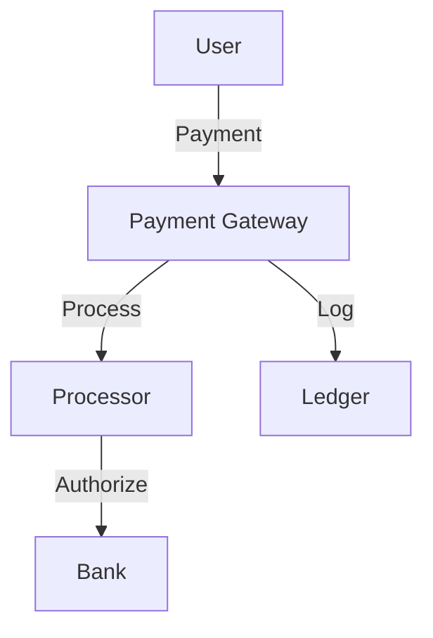
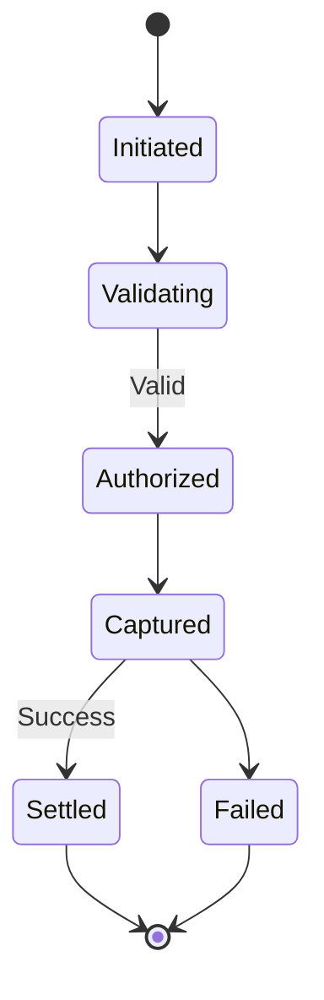

# Payment Processing System

## Problem Statement
Design a payment system handling transactions securely and reliably.

**Requirements:**
- Process payments
- Handle failures
- Ensure idempotency
- PCI compliance
- Fraud detection

## Design

### Payment Flow

```
1. Initiate payment (amount, method)
2. Call payment gateway (Stripe, PayPal)
3. Get transaction ID
4. Confirm in business DB
5. Return receipt
```

### Idempotency

```
Idempotency key: Unique per transaction
Deduplicate retries
Idempotent gateway operations
```

### Failure Handling

```
Network failure: Retry with backoff
Gateway error: Mark as pending, retry
Insufficient funds: Return error
Reconciliation: Match gateway with DB
```

### Fraud Detection

```
Velocity checks: Rate limiting per user
Amount checks: Unusual amounts
Geographic checks: Unusual locations
3D Secure: For high-risk
```


## Architecture Diagram

```
┌───────────────────────────────┐
│   Payment Processing          │
│  Payment Gateway              │
│  - Stripe, PayPal, Square     │
│  - PCI DSS compliance         │
│  - TLS + vault encryption     │
│  Transaction Processing       │
│  - Authorize, Capture, Refund │
│  Reconciliation               │
│  - Match transactions         │
│  - Anomaly detection (ML)     │
└───────────────────────────────┘
```

## Common Questions & Answers

**Q: Retry on failure?** A: Exponential backoff (1s, 2s, 4s, 8s), max 3 attempts. Store txn ID for idempotency.

**Q: Idempotency?** A: UUID from client, stored server-side. Retried request returns same result.

**Q: PCI DSS?** A: Never store card details. Tokenization: gateway issues token.

**Q: Chargeback?** A: Track evidence (order, shipping). Respond to bank within deadline.

## Back-of-Envelope Calculations

1M txn/day, $1B volume. 98% success (2% retry). 2-5s per txn. Fraud: 0.1% (1K false positives, need review).
## Design Choice Comparison

| Approach | Pros | Cons |
|----------|------|------|
| Gateway only | Simple | Less control |
| Custom processor | Full control | PCI burden |
| PSP | Balanced | Fees |

## Follow-up Interview Questions

1. Currency/forex risk? 2. Subscription billing? 3. Settlement timing? 4. Gateway bottleneck? 5. International methods?

## Example Scenario Walkthrough

[Describe a concrete example with step-by-step execution]

### Architecture Diagram



### Flow Diagram



## Complexity

| Operation | Time |
|-----------|------|
| Process payment | O(network) |
| Confirm | O(1) DB |
| Retry | Exponential backoff |

## Python Implementation

```python
from dataclasses import dataclass
from typing import Dict, Optional
from enum import Enum
from decimal import Decimal
import uuid

class PaymentStatus(Enum):
    PENDING = "pending"
    COMPLETED = "completed"
    FAILED = "failed"
    REFUNDED = "refunded"

@dataclass
class Payment:
    payment_id: str
    user_id: str
    amount: Decimal
    currency: str
    status: PaymentStatus = PaymentStatus.PENDING

class PaymentService:
    def __init__(self):
        self._payments: Dict[str, Payment] = {}
        self._balances: Dict[str, Decimal] = {}

    def deposit(self, user_id: str, amount: Decimal):
        self._balances[user_id] = self._balances.get(user_id, Decimal(0)) + amount

    def process_payment(self, user_id: str, amount: Decimal, currency: str) -> Payment:
        payment_id = str(uuid.uuid4())[:8]
        payment = Payment(payment_id, user_id, amount, currency)
        balance = self._balances.get(user_id, Decimal(0))
        if balance >= amount:
            self._balances[user_id] = balance - amount
            payment.status = PaymentStatus.COMPLETED
        else:
            payment.status = PaymentStatus.FAILED
        self._payments[payment_id] = payment
        return payment

    def refund(self, payment_id: str) -> bool:
        payment = self._payments.get(payment_id)
        if payment and payment.status == PaymentStatus.COMPLETED:
            self._balances[payment.user_id] = self._balances.get(payment.user_id, Decimal(0)) + payment.amount
            payment.status = PaymentStatus.REFUNDED
            return True
        return False

# Usage
svc = PaymentService()
svc.deposit("user1", Decimal("100.00"))
p = svc.process_payment("user1", Decimal("25.00"), "USD")
print(p.status, p.amount)  # PaymentStatus.COMPLETED 25.00
```

## Java Implementation

```java
import java.math.BigDecimal;
import java.util.*;

public class PaymentService {
    enum Status { PENDING, COMPLETED, FAILED, REFUNDED }
    record Payment(String id, String userId, BigDecimal amount, Status status) {}

    private Map<String, BigDecimal> balances = new HashMap<>();
    private Map<String, Payment> payments = new HashMap<>();

    public void deposit(String userId, BigDecimal amount) {
        balances.merge(userId, amount, BigDecimal::add);
    }

    public Payment processPayment(String userId, BigDecimal amount) {
        String id = UUID.randomUUID().toString().substring(0, 8);
        BigDecimal balance = balances.getOrDefault(userId, BigDecimal.ZERO);
        Status status = balance.compareTo(amount) >= 0 ? Status.COMPLETED : Status.FAILED;
        if (status == Status.COMPLETED)
            balances.put(userId, balance.subtract(amount));
        Payment p = new Payment(id, userId, amount, status);
        payments.put(id, p);
        return p;
    }
}
```
