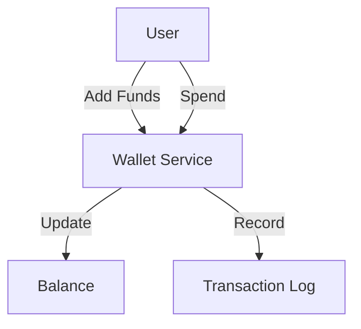
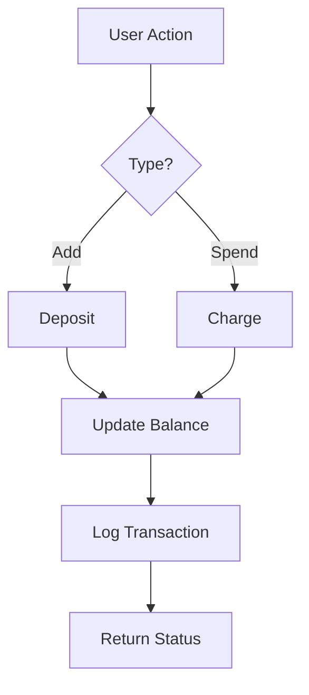

# Wallet System

## Problem Statement
Design an e-wallet for storing and transferring money.

**Operations:**
- `deposit(user_id, amount)` — Add money
- `withdraw(user_id, amount)` — Remove money
- `transfer(from_id, to_id, amount)` — Transfer
- `getBalance(user_id)` — Check balance

## Design

### Balance Tracking

```
Current balance: User's account
Transaction ledger: Immutable log
Reconciliation: Daily settlement
```

### Consistency Guarantees

```
Serializable isolation: All transactions ordered
Atomic operations: All-or-nothing
Double-entry bookkeeping: Debit = Credit
```

### Currency Exchange

```
Exchange rate cache (hourly refresh)
Quote validity window (30s)
Lock rate during transaction
Settlement in base currency
```

### Disputes & Chargebacks

```
Transaction immutable
Reversal creates new transaction
Audit trail
Chargeback protection: Crypto signature
```


## Architecture Diagram

```
┌───────────────────────────────┐
│   Digital Wallet              │
│  Account Balance              │
│  - Redis (real-time)          │
│  - DB (persistent, immutable) │
│  - Strongly consistent        │
│  Transaction Log              │
│  - Append-only, audit trail   │
│  Transfers & Settlement       │
│  - P2P (A to B)               │
│  - Atomic (all or nothing)    │
└───────────────────────────────┘
```

## Common Questions & Answers

**Q: Balance consistency?** A: Strong consistency: lock during update (safe). Eventual: optimistic lock (faster).

**Q: Negative balance?** A: Prevent (check before debit) or allow (overdraft limit, risky).

**Q: Lost txn recovery?** A: Write-ahead log, replay on restart. Idempotency prevents double-posting.

## Back-of-Envelope Calculations

100M users, $100 avg = $10B. Txns: 100K/sec. Balance updates: 100M × 8B = 800MB. Log: 100K/sec × 200B = 20MB/sec.
## Design Choice Comparison

| Approach | Pros | Cons |
|----------|------|------|
| Redis | Fast, atomic | Limited capacity |
| DB | Persistent | Slower |
| Blockchain | Immutable | Slow |

## Follow-up Interview Questions

1. Concurrent deposits/withdrawals? 2. Loyalty points? 3. Wallet-to-bank transfers? 4. Settlement bottleneck? 5. Compliance audit?

## Example Scenario Walkthrough

[Describe a concrete example with step-by-step execution]

### Architecture Diagram



### Flow Diagram



## Complexity

| Operation | Time |
|-----------|------|
| Deposit | O(1) |
| Withdraw | O(1) |
| Transfer | O(1) |
| Check balance | O(1) |

## Python Implementation

```python
from dataclasses import dataclass
from typing import Dict, List
from decimal import Decimal
from datetime import datetime
from enum import Enum

class TxnType(Enum):
    CREDIT = "credit"
    DEBIT = "debit"
    TRANSFER = "transfer"

@dataclass
class Transaction:
    txn_id: str
    user_id: str
    amount: Decimal
    txn_type: TxnType
    timestamp: datetime = None

    def __post_init__(self):
        if not self.timestamp:
            self.timestamp = datetime.now()

class WalletService:
    def __init__(self):
        self._balances: Dict[str, Decimal] = {}
        self._history: Dict[str, List[Transaction]] = {}
        self._txn_count = 0

    def _new_txn_id(self) -> str:
        self._txn_count += 1
        return f"TXN-{self._txn_count}"

    def credit(self, user_id: str, amount: Decimal) -> Transaction:
        self._balances[user_id] = self._balances.get(user_id, Decimal(0)) + amount
        txn = Transaction(self._new_txn_id(), user_id, amount, TxnType.CREDIT)
        self._history.setdefault(user_id, []).append(txn)
        return txn

    def transfer(self, from_id: str, to_id: str, amount: Decimal) -> bool:
        if self._balances.get(from_id, Decimal(0)) < amount:
            return False
        self._balances[from_id] -= amount
        self._balances[to_id] = self._balances.get(to_id, Decimal(0)) + amount
        txn = Transaction(self._new_txn_id(), from_id, amount, TxnType.TRANSFER)
        self._history.setdefault(from_id, []).append(txn)
        return True

    def balance(self, user_id: str) -> Decimal:
        return self._balances.get(user_id, Decimal(0))

# Usage
wallet = WalletService()
wallet.credit("alice", Decimal("100"))
wallet.credit("bob", Decimal("50"))
wallet.transfer("alice", "bob", Decimal("30"))
print(wallet.balance("alice"), wallet.balance("bob"))  # 70 80
```

## Java Implementation

```java
import java.math.BigDecimal;
import java.util.*;

public class WalletService {
    private Map<String, BigDecimal> balances = new HashMap<>();
    private int txnCount = 0;

    public void credit(String userId, BigDecimal amount) {
        balances.merge(userId, amount, BigDecimal::add);
    }

    public boolean transfer(String from, String to, BigDecimal amount) {
        BigDecimal fromBal = balances.getOrDefault(from, BigDecimal.ZERO);
        if (fromBal.compareTo(amount) < 0) return false;
        balances.put(from, fromBal.subtract(amount));
        balances.merge(to, amount, BigDecimal::add);
        return true;
    }

    public BigDecimal balance(String userId) {
        return balances.getOrDefault(userId, BigDecimal.ZERO);
    }
}
```
