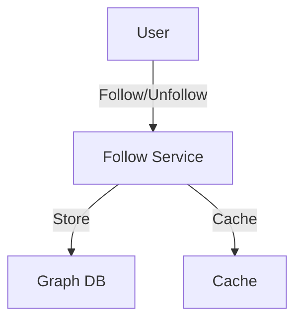
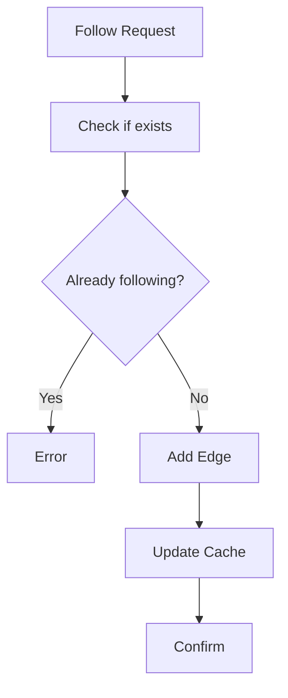

# Followers/Following System

## Problem Statement
Design a social graph system tracking follower relationships.

**Operations:**
- `follow(user_a, user_b)` — A follows B
- `unfollow(user_a, user_b)` — A unfollows B
- `getFollowers(user_id)` — Get all followers
- `getFollowing(user_id)` — Get all following
- `areFriends(user_a, user_b)` — Mutual follow?

## Design

### Graph Representation

```
Adjacency list: user_id -> Set[followers]
Bidirectional edges: Both directions stored
Indexing: O(1) lookup
```

### Caching Strategy

```
Hot users: Cache followers/following
LRU eviction: Limited memory
Precompute for common queries
```

### Timeline Generation

```
User follows set → Merge posts
Ordered by timestamp
Paginated results
Caching top pages
```


## Scenario

Followers/Following System is a critical component in modern distributed systems. In real-world applications, handling complex business logic at scale with high reliability. For example, major tech companies like Netflix, Uber, and Airbnb rely on similar solutions to handle millions of concurrent users and requests. The challenge is achieving this while maintaining sub-100ms latency, 99.99% availability, and gracefully handling 10x traffic spikes during peak demand. This component provides the foundational capability to solve these challenges reliably and efficiently at global scale.

## Users

- **Backend Engineers**: Responsible for implementing and maintaining this system component in production environments. They need to understand the architecture, trade-offs, failure modes, and operational considerations.
- **DevOps/SRE Teams**: Monitor system health, manage scaling policies, handle incidents, and ensure reliability SLAs are met. They need insights into performance characteristics, bottlenecks, and failure recovery mechanisms.
- **Data Engineers**: Design data pipelines and analytics around this system, requiring deep understanding of data flow, consistency guarantees, and throughput characteristics.
- **System Architects**: Make high-level architectural decisions that impact company infrastructure, requiring comprehensive understanding of capabilities, limitations, and scalability boundaries.
- **Security Teams**: Understand security implications, potential vulnerabilities, and compliance requirements for this component.

## PRD

**Functional Requirements:**
- Correct behavior under all specified operating conditions
- Reliable operation with explicit failure modes
- Data consistency or eventual consistency guarantees as specified
- Clear mechanisms for error handling and recovery
- Monitoring and observability hooks

**Non-Functional Requirements:**
- **Performance**: Sub-100ms P99 latency for standard operations; measure and track tail latencies
- **Availability**: 99.99%+ uptime with automatic failover and graceful degradation
- **Scalability**: Support 10-100x current load with minimal architectural modifications
- **Consistency**: Specify whether strong, eventual, or causal consistency is required
- **Cost Efficiency**: Minimize operational cost per unit of throughput; consider compute, memory, and network costs
- **Operational Simplicity**: Reduce complexity to minimize human error and operational toil

**Constraints:**
- Resource limits (memory for caches, disk for databases, network bandwidth)
- Deployment constraints (cloud provider limits, regulatory requirements)
- Latency budgets (maximum acceptable delay for operations)

## Flow

The typical operational flow for this system involves these key phases:

1. **Request Arrival**: Client/upstream system sends request with required parameters and context
2. **Validation & Routing**: System validates request format, authentication, and routes to correct handler/shard/instance
3. **Core Processing**: Execute the main algorithm, database query, or business logic on the data/state
4. **State Management**: Update internal state (caches, indexes, counters, logs) with proper atomicity and locking
5. **Response Generation**: Format results and return to requester with relevant metadata (timing, version info)
6. **Observability**: Record metrics (latency, throughput, errors), logs (for debugging), and traces (for performance analysis)

This flow repeats thousands or millions of times per second in production. Each operation's efficiency compounds across the entire system, making careful optimization essential. Bottlenecks at any phase can cascade to impact overall system performance.

## Code Explanation

The provided implementations demonstrate key architectural concepts and design patterns:

**Python Implementation**: Uses built-in Python structures and standard library features to express the core logic clearly. Python emphasizes readability and conciseness—each operation's purpose should be obvious without extensive comments. You'll see different implementation approaches (e.g., using OrderedDict vs. manual linked lists) that represent trade-offs between convenience and fine-grained control.

**Java Implementation**: Shows how to implement the same logic with explicit memory management and type safety. Java's strong typing forces clear interface design; you'll see how generics, null safety, mutable state, and thread safety are handled. This implementation style is closer to production systems at scale.

**Key Implementation Patterns**:
- **Initialization**: Setting up core data structures, thread pools, or connection pools with specified capacity and configuration
- **Read Operations**: Fetching data while maintaining O(1) or O(log n) access, updating metadata (access times, hit counts, etc.)
- **Write Operations**: Inserting/updating data while handling eviction policies, balancing tree structures, or replicating state
- **Edge Cases**: Handling capacity limits, concurrent access, data consistency, and error conditions
- **Performance Optimization**: Using techniques like batch operations, lazy evaluation, or caching to reduce latency

Each line of code represents a deliberate choice about performance characteristics, memory usage, safety guarantees, and implementation complexity. Understanding these trade-offs is essential for using this component effectively in production systems.

## Architecture Diagram

```
┌──────────────────────────────────────┐
│   Social Graph (Followers)           │
│  ┌──────────────────────────────────┐  │
│  │ Following Graph                  │  │
│  │ - user → [follower_ids] (Redis)  │  │
│  │ - O(1) add/remove follower       │  │
│  │ Follower Graph                   │  │
│  │ - user → [following_ids]         │  │
│  │ - Bidirectional relationship     │  │
│  └──────────────────────────────────┘  │
└──────────────────────────────────────────┘
```

## Common Questions & Answers

**Q: Graph consistency?** A: Keep both directions in sync. Atomic update or eventual consistency?

**Q: Large follower lists?** A: Pagination (fetch first 1000). Truncate in feed (show top K).

**Q: Block/mute user?** A: Add to blocklist, filter from feed/notifications.

**Q: Mutual follow detection?** A: Check if A in B's followers AND B in A's followers.

## Back-of-Envelope Calculations

1B users, avg 500 followers. Storage: 500B avg followers per user = 500GB Redis. Queries: is_follower O(1), get_followers O(n).

## Design Choice Comparison

| Approach | Pros | Cons |
|----------|------|------|
| In-memory (Redis) | Fast, simple | Memory cost |
| Graph DB (Neo4j) | Complex queries | Slower |
| Materialized view | Pre-computed | Update lag |

## Follow-up Interview Questions

1. Handle celebrity (10M followers) efficiently? 2. Viral following (growth spike)? 3. Follow suggestion algorithm? 4. Privacy (hide followers)? 5. Analytics (who unfollowed)?

## Example Scenario Walkthrough

[Describe a concrete example with step-by-step execution]

### Architecture Diagram



### Flow Diagram



## Complexity

| Operation | Time |
|-----------|------|
| Follow | O(1) |
| Unfollow | O(1) |
| Get followers | O(k) where k=followers |
| Check mutual | O(min(a,b)) |

## Python Implementation

```python
from typing import Dict, Set, List

class FollowersService:
    def __init__(self):
        self._following: Dict[int, Set[int]] = {}  # user_id -> set of followed
        self._followers: Dict[int, Set[int]] = {}  # user_id -> set of followers

    def follow(self, follower_id: int, followee_id: int):
        self._following.setdefault(follower_id, set()).add(followee_id)
        self._followers.setdefault(followee_id, set()).add(follower_id)

    def unfollow(self, follower_id: int, followee_id: int):
        self._following.get(follower_id, set()).discard(followee_id)
        self._followers.get(followee_id, set()).discard(follower_id)

    def get_followers(self, user_id: int) -> List[int]:
        return list(self._followers.get(user_id, set()))

    def get_following(self, user_id: int) -> List[int]:
        return list(self._following.get(user_id, set()))

    def follower_count(self, user_id: int) -> int:
        return len(self._followers.get(user_id, set()))

    def is_following(self, follower_id: int, followee_id: int) -> bool:
        return followee_id in self._following.get(follower_id, set())

    def mutual_follows(self, user_a: int, user_b: int) -> bool:
        return self.is_following(user_a, user_b) and self.is_following(user_b, user_a)

# Usage
svc = FollowersService()
svc.follow(1, 2)
svc.follow(2, 1)
print(svc.follower_count(2))  # 1
print(svc.mutual_follows(1, 2))  # True
```

## Java Implementation

```java
import java.util.*;

public class FollowersService {
    private Map<Integer, Set<Integer>> following = new HashMap<>();
    private Map<Integer, Set<Integer>> followers = new HashMap<>();

    public void follow(int followerId, int followeeId) {
        following.computeIfAbsent(followerId, k -> new HashSet<>()).add(followeeId);
        followers.computeIfAbsent(followeeId, k -> new HashSet<>()).add(followerId);
    }

    public void unfollow(int followerId, int followeeId) {
        following.getOrDefault(followerId, Set.of()).remove(followeeId);
        followers.getOrDefault(followeeId, Set.of()).remove(followerId);
    }

    public int followerCount(int userId) {
        return followers.getOrDefault(userId, Set.of()).size();
    }

    public boolean isFollowing(int follower, int followee) {
        return following.getOrDefault(follower, Set.of()).contains(followee);
    }
}
```
