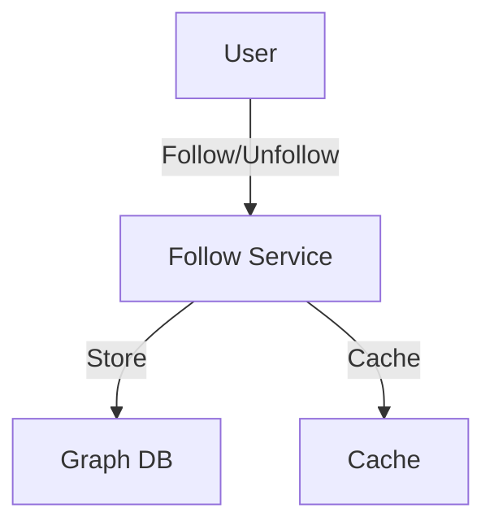
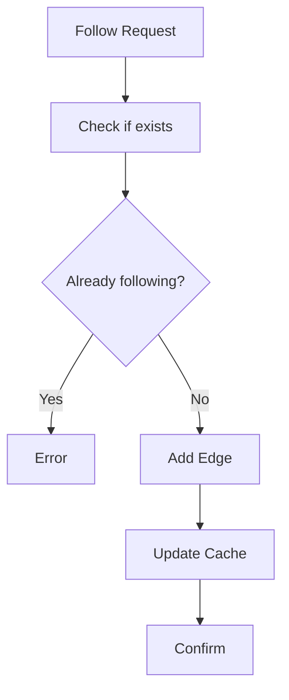

# Followers/Following System

## Problem Statement
Design a social graph system tracking follower relationships.

**Operations:**
- `follow(user_a, user_b)` — A follows B
- `unfollow(user_a, user_b)` — A unfollows B
- `getFollowers(user_id)` — Get all followers
- `getFollowing(user_id)` — Get all following
- `areFriends(user_a, user_b)` — Mutual follow?

## Design

### Graph Representation

```
Adjacency list: user_id -> Set[followers]
Bidirectional edges: Both directions stored
Indexing: O(1) lookup
```

### Caching Strategy

```
Hot users: Cache followers/following
LRU eviction: Limited memory
Precompute for common queries
```

### Timeline Generation

```
User follows set → Merge posts
Ordered by timestamp
Paginated results
Caching top pages
```


## Architecture Diagram

```
┌──────────────────────────────────────┐
│   Social Graph (Followers)           │
│  ┌──────────────────────────────────┐  │
│  │ Following Graph                  │  │
│  │ - user → [follower_ids] (Redis)  │  │
│  │ - O(1) add/remove follower       │  │
│  │ Follower Graph                   │  │
│  │ - user → [following_ids]         │  │
│  │ - Bidirectional relationship     │  │
│  └──────────────────────────────────┘  │
└──────────────────────────────────────────┘
```

## Common Questions & Answers

**Q: Graph consistency?** A: Keep both directions in sync. Atomic update or eventual consistency?

**Q: Large follower lists?** A: Pagination (fetch first 1000). Truncate in feed (show top K).

**Q: Block/mute user?** A: Add to blocklist, filter from feed/notifications.

**Q: Mutual follow detection?** A: Check if A in B's followers AND B in A's followers.

## Back-of-Envelope Calculations

1B users, avg 500 followers. Storage: 500B avg followers per user = 500GB Redis. Queries: is_follower O(1), get_followers O(n).

## Design Choice Comparison

| Approach | Pros | Cons |
|----------|------|------|
| In-memory (Redis) | Fast, simple | Memory cost |
| Graph DB (Neo4j) | Complex queries | Slower |
| Materialized view | Pre-computed | Update lag |

## Follow-up Interview Questions

1. Handle celebrity (10M followers) efficiently? 2. Viral following (growth spike)? 3. Follow suggestion algorithm? 4. Privacy (hide followers)? 5. Analytics (who unfollowed)?

## Example Scenario Walkthrough

[Describe a concrete example with step-by-step execution]

### Architecture Diagram



### Flow Diagram



## Complexity

| Operation | Time |
|-----------|------|
| Follow | O(1) |
| Unfollow | O(1) |
| Get followers | O(k) where k=followers |
| Check mutual | O(min(a,b)) |

## Python Implementation

```python
from typing import Dict, Set, List

class FollowersService:
    def __init__(self):
        self._following: Dict[int, Set[int]] = {}  # user_id -> set of followed
        self._followers: Dict[int, Set[int]] = {}  # user_id -> set of followers

    def follow(self, follower_id: int, followee_id: int):
        self._following.setdefault(follower_id, set()).add(followee_id)
        self._followers.setdefault(followee_id, set()).add(follower_id)

    def unfollow(self, follower_id: int, followee_id: int):
        self._following.get(follower_id, set()).discard(followee_id)
        self._followers.get(followee_id, set()).discard(follower_id)

    def get_followers(self, user_id: int) -> List[int]:
        return list(self._followers.get(user_id, set()))

    def get_following(self, user_id: int) -> List[int]:
        return list(self._following.get(user_id, set()))

    def follower_count(self, user_id: int) -> int:
        return len(self._followers.get(user_id, set()))

    def is_following(self, follower_id: int, followee_id: int) -> bool:
        return followee_id in self._following.get(follower_id, set())

    def mutual_follows(self, user_a: int, user_b: int) -> bool:
        return self.is_following(user_a, user_b) and self.is_following(user_b, user_a)

# Usage
svc = FollowersService()
svc.follow(1, 2)
svc.follow(2, 1)
print(svc.follower_count(2))  # 1
print(svc.mutual_follows(1, 2))  # True
```

## Java Implementation

```java
import java.util.*;

public class FollowersService {
    private Map<Integer, Set<Integer>> following = new HashMap<>();
    private Map<Integer, Set<Integer>> followers = new HashMap<>();

    public void follow(int followerId, int followeeId) {
        following.computeIfAbsent(followerId, k -> new HashSet<>()).add(followeeId);
        followers.computeIfAbsent(followeeId, k -> new HashSet<>()).add(followerId);
    }

    public void unfollow(int followerId, int followeeId) {
        following.getOrDefault(followerId, Set.of()).remove(followeeId);
        followers.getOrDefault(followeeId, Set.of()).remove(followerId);
    }

    public int followerCount(int userId) {
        return followers.getOrDefault(userId, Set.of()).size();
    }

    public boolean isFollowing(int follower, int followee) {
        return following.getOrDefault(follower, Set.of()).contains(followee);
    }
}
```
