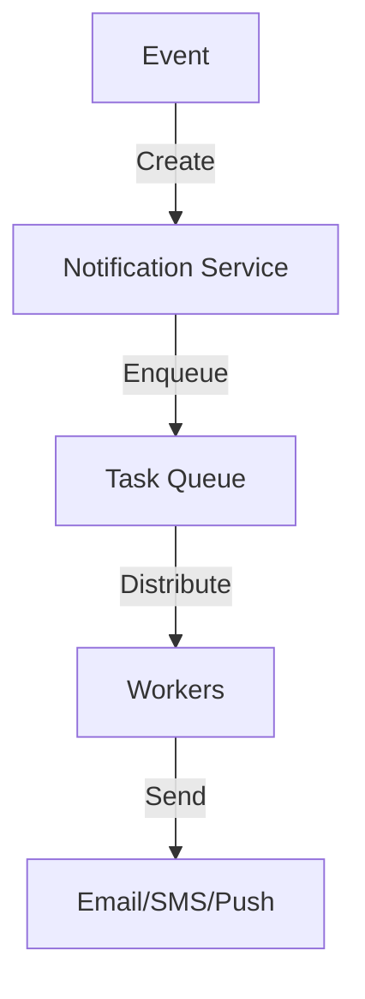
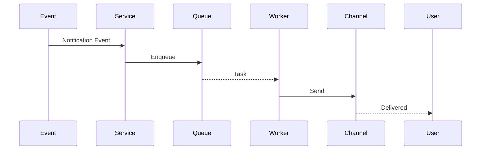

# Notifications System

## Problem Statement
Design a multi-channel notification system delivering alerts via email, SMS, push, and in-app.

**Operations:**
- `sendNotification(user_id, message, channels)` — Send notification
- `getNotifications(user_id)` — Get user notifications
- `markAsRead(notification_id)` — Mark read
- `setPreferences(user_id, channels, frequency)` — User preferences

## Design

### Multi-Channel Delivery

```
Email: SMTP service, batch processing
SMS: Third-party API (Twilio)
Push: FCM/APNs, device registration
In-app: Database, real-time via WebSocket
```

### Notification Queue

```
User preferences: Which channels enabled
Rate limiting: Max notifications per hour
Deduplication: Same message not sent twice
Retries: Failed channels retry
```

### Delivery Guarantee

```
At-least-once: Resend if no ACK
Tracking: Status per channel
Dead letter: Failed after retries
```


## Architecture Diagram

```
┌──────────────────────────────────────┐
│   Notification Service               │
│  ┌──────────────────────────────────┐  │
│  │ Events: like, follow, mention    │  │
│  │ Channels: push, email, SMS       │  │
│  │ Delivery: queue-based (Kafka)    │  │
│  │ Preferences: user opt-in/out     │  │
│  └──────────────────────────────────┘  │
└──────────────────────────────────────────┘
```

## Common Questions & Answers

**Q: Notification delivery reliability?** A: Persistent queue, retry exponential backoff, dead letter queue.

**Q: Thundering herd (all wake at once)?** A: Stagger notifications across time window, use jitter.

**Q: Preference system?** A: Per notification type opt-in. Don't spam = healthy user experience.

**Q: Real-time vs digest?** A: Real-time for critical (comment reply), digest for daily summary.

## Back-of-Envelope Calculations

1B users, 10 notifications/day avg. Throughput: 100K notif/sec. Delivery: 1% hard bounce rate. Cost: $0.01 per push, $10M/month at scale.

## Design Choice Comparison

| Approach | Pros | Cons |
|----------|------|------|
| Real-time push | Immediate, engaging | Battery drain, spam |
| Digest email | Non-intrusive | Lower engagement |
| Hybrid | Balances both | More complex |

## Follow-up Interview Questions

1. Handle notification fatigue (user unsubscribes)? 2. Personalization (frequency, time)? 3. Multi-device synchronization? 4. Delivery channel failure (fall back)? 5. Cost optimization?

## Example Scenario Walkthrough

[Describe a concrete example with step-by-step execution]

### Architecture Diagram



### Flow Diagram



## Complexity

| Operation | Time |
|-----------|------|
| Send | O(1) queue |
| Deliver | O(1) per channel |
| Get notifications | O(k) |

## Python Implementation

```python
from dataclasses import dataclass
from typing import List, Dict, Callable
from enum import Enum
from datetime import datetime
import threading

class NotifChannel(Enum):
    PUSH = "push"
    EMAIL = "email"
    SMS = "sms"
    IN_APP = "in_app"

@dataclass
class Notification:
    notif_id: str
    user_id: str
    title: str
    body: str
    channel: NotifChannel
    timestamp: datetime = None

    def __post_init__(self):
        if not self.timestamp:
            self.timestamp = datetime.now()

class NotificationService:
    def __init__(self):
        self._handlers: Dict[NotifChannel, Callable] = {}
        self._unread: Dict[str, List[Notification]] = {}
        self._counter = 0

    def register_handler(self, channel: NotifChannel, handler: Callable):
        self._handlers[channel] = handler

    def send(self, user_id: str, title: str, body: str, channel: NotifChannel):
        self._counter += 1
        notif = Notification(f"N-{self._counter}", user_id, title, body, channel)
        self._unread.setdefault(user_id, []).append(notif)
        handler = self._handlers.get(channel)
        if handler:
            threading.Thread(target=handler, args=(notif,), daemon=True).start()

    def get_unread(self, user_id: str) -> List[Notification]:
        return self._unread.get(user_id, [])

    def mark_read(self, user_id: str):
        self._unread[user_id] = []

# Usage
svc = NotificationService()
svc.register_handler(NotifChannel.IN_APP, lambda n: print(f"[IN-APP] {n.title}"))
svc.send("user1", "New follower", "Alice followed you", NotifChannel.IN_APP)
print(len(svc.get_unread("user1")))  # 1
```

## Java Implementation

```java
import java.util.*;
import java.util.concurrent.*;
import java.util.function.Consumer;

public class NotificationService {
    enum Channel { PUSH, EMAIL, SMS, IN_APP }
    record Notification(String id, String userId, String title, String body, Channel channel) {}

    private Map<Channel, Consumer<Notification>> handlers = new EnumMap<>(Channel.class);
    private Map<String, List<Notification>> unread = new HashMap<>();
    private int counter = 0;
    private ExecutorService executor = Executors.newCachedThreadPool();

    public void registerHandler(Channel ch, Consumer<Notification> handler) {
        handlers.put(ch, handler);
    }

    public void send(String userId, String title, String body, Channel ch) {
        Notification n = new Notification("N-" + (++counter), userId, title, body, ch);
        unread.computeIfAbsent(userId, k -> new ArrayList<>()).add(n);
        Consumer<Notification> h = handlers.get(ch);
        if (h != null) executor.submit(() -> h.accept(n));
    }

    public List<Notification> getUnread(String userId) {
        return unread.getOrDefault(userId, List.of());
    }
}
```
