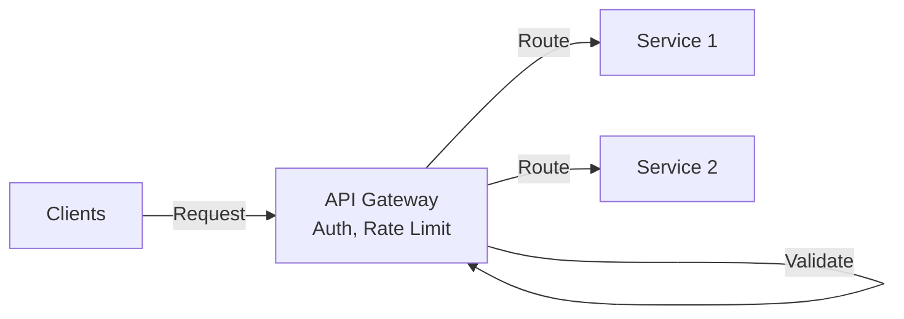
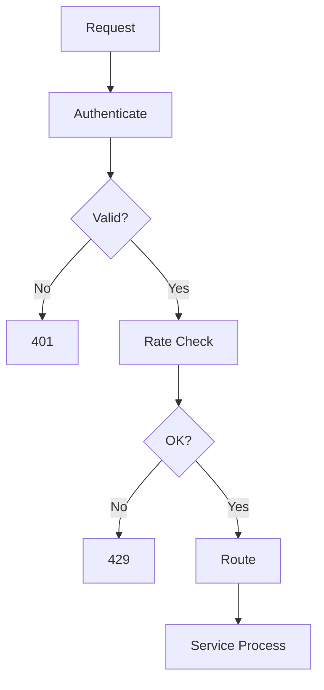

# API Gateway

## Problem Statement
Design an API gateway routing requests to microservices with rate limiting, auth, and transformation.

**Operations:**
- `route(request)` — Route to service
- `authenticate(request)` — Verify credentials
- `rateLimit(user_id)` — Check quota
- `log(request, response)` — Analytics

## Design

### Routing

```
URL path → Service mapping
Load balancing: Round-robin, least-conn
Health checks: Detect failures
Circuit breaker: Prevent cascading failures
```

### Authentication

```
JWT validation
OAuth2 integration
API key verification
Signature validation
```

### Rate Limiting

```
Per-user quotas
Per-endpoint limits
Sliding window counter
Token bucket algorithm
```

### Request/Response Transformation

```
Protocol translation: HTTP → gRPC
Header injection: Auth tokens
Response compression
Caching
```


## Scenario

API Gateway is a critical component in modern distributed systems. In real-world applications, handling complex business logic at scale with high reliability. For example, major tech companies like Netflix, Uber, and Airbnb rely on similar solutions to handle millions of concurrent users and requests. The challenge is achieving this while maintaining sub-100ms latency, 99.99% availability, and gracefully handling 10x traffic spikes during peak demand. This component provides the foundational capability to solve these challenges reliably and efficiently at global scale.

## Users

- **Backend Engineers**: Responsible for implementing and maintaining this system component in production environments. They need to understand the architecture, trade-offs, failure modes, and operational considerations.
- **DevOps/SRE Teams**: Monitor system health, manage scaling policies, handle incidents, and ensure reliability SLAs are met. They need insights into performance characteristics, bottlenecks, and failure recovery mechanisms.
- **Data Engineers**: Design data pipelines and analytics around this system, requiring deep understanding of data flow, consistency guarantees, and throughput characteristics.
- **System Architects**: Make high-level architectural decisions that impact company infrastructure, requiring comprehensive understanding of capabilities, limitations, and scalability boundaries.
- **Security Teams**: Understand security implications, potential vulnerabilities, and compliance requirements for this component.

## PRD

**Functional Requirements:**
- Correct behavior under all specified operating conditions
- Reliable operation with explicit failure modes
- Data consistency or eventual consistency guarantees as specified
- Clear mechanisms for error handling and recovery
- Monitoring and observability hooks

**Non-Functional Requirements:**
- **Performance**: Sub-100ms P99 latency for standard operations; measure and track tail latencies
- **Availability**: 99.99%+ uptime with automatic failover and graceful degradation
- **Scalability**: Support 10-100x current load with minimal architectural modifications
- **Consistency**: Specify whether strong, eventual, or causal consistency is required
- **Cost Efficiency**: Minimize operational cost per unit of throughput; consider compute, memory, and network costs
- **Operational Simplicity**: Reduce complexity to minimize human error and operational toil

**Constraints:**
- Resource limits (memory for caches, disk for databases, network bandwidth)
- Deployment constraints (cloud provider limits, regulatory requirements)
- Latency budgets (maximum acceptable delay for operations)

## Flow

The typical operational flow for this system involves these key phases:

1. **Request Arrival**: Client/upstream system sends request with required parameters and context
2. **Validation & Routing**: System validates request format, authentication, and routes to correct handler/shard/instance
3. **Core Processing**: Execute the main algorithm, database query, or business logic on the data/state
4. **State Management**: Update internal state (caches, indexes, counters, logs) with proper atomicity and locking
5. **Response Generation**: Format results and return to requester with relevant metadata (timing, version info)
6. **Observability**: Record metrics (latency, throughput, errors), logs (for debugging), and traces (for performance analysis)

This flow repeats thousands or millions of times per second in production. Each operation's efficiency compounds across the entire system, making careful optimization essential. Bottlenecks at any phase can cascade to impact overall system performance.

## Code Explanation

The provided implementations demonstrate key architectural concepts and design patterns:

**Python Implementation**: Uses built-in Python structures and standard library features to express the core logic clearly. Python emphasizes readability and conciseness—each operation's purpose should be obvious without extensive comments. You'll see different implementation approaches (e.g., using OrderedDict vs. manual linked lists) that represent trade-offs between convenience and fine-grained control.

**Java Implementation**: Shows how to implement the same logic with explicit memory management and type safety. Java's strong typing forces clear interface design; you'll see how generics, null safety, mutable state, and thread safety are handled. This implementation style is closer to production systems at scale.

**Key Implementation Patterns**:
- **Initialization**: Setting up core data structures, thread pools, or connection pools with specified capacity and configuration
- **Read Operations**: Fetching data while maintaining O(1) or O(log n) access, updating metadata (access times, hit counts, etc.)
- **Write Operations**: Inserting/updating data while handling eviction policies, balancing tree structures, or replicating state
- **Edge Cases**: Handling capacity limits, concurrent access, data consistency, and error conditions
- **Performance Optimization**: Using techniques like batch operations, lazy evaluation, or caching to reduce latency

Each line of code represents a deliberate choice about performance characteristics, memory usage, safety guarantees, and implementation complexity. Understanding these trade-offs is essential for using this component effectively in production systems.

## Architecture Diagram

```
┌──────────────────────────────────────┐
│   API Gateway (Nginx/Kong)           │
│  ┌──────────────────────────────────┐  │
│  │ Request Routing                  │  │
│  │ - Path → service mapping         │  │
│  │ - Load balancing                 │  │
│  │ Authentication                   │  │
│  │ - JWT validation, OAuth          │  │
│  │ Rate limiting, circuit breaking  │  │
│  │ Request/response transformation  │  │
│  └──────────────────────────────────┘  │
└──────────────────────────────────────────┘
```

## Common Questions & Answers

**Q: Single point of failure?** A: HA gateway cluster (active-active), stateless design, health checks.

**Q: Authentication caching?** A: Cache JWT validation (10min TTL) to reduce auth service load.

**Q: Request timeout tuning?** A: Per-route timeouts. Read timeout > write timeout. Don't timeout indefinitely.

**Q: Versioning (v1, v2)?** A: Header-based or URL path. Deprecate old versions with notice.

## Back-of-Envelope Calculations

1M req/sec, 100ms avg latency budget. Gateway: <5ms overhead ideal. RPS per gateway: 100K-200K. Need 5-10 gateways.

## Design Choice Comparison

| Approach | Pros | Cons |
|----------|------|------|
| Simple proxy | Low overhead | No auth/rate-limit |
| Full gateway | Feature-rich | More complex |
| Service mesh (Istio) | Decentralized | Operational overhead |

## Follow-up Interview Questions

1. Blue-green deployment (zero downtime)? 2. Service discovery integration? 3. Request logging/tracing? 4. Scale beyond 10 gateways? 5. Cost optimization?

## Example Scenario Walkthrough

[Describe a concrete example with step-by-step execution]

### Architecture Diagram



### Flow Diagram



## Complexity

| Operation | Time |
|-----------|------|
| Route | O(log n) |
| Authenticate | O(1) |
| Rate limit | O(1) |
| Transform | O(k) where k=payload |

## Python Implementation

```python
from dataclasses import dataclass
from typing import Dict, Callable, Optional
from collections import defaultdict
import time

@dataclass
class Request:
    method: str
    path: str
    headers: Dict[str, str]
    body: Optional[str] = None

@dataclass
class Response:
    status_code: int
    body: str
    headers: Dict[str, str] = None

class RateLimiter:
    def __init__(self, max_rps: int):
        self._max_rps = max_rps
        self._counts: Dict[str, list] = defaultdict(list)

    def is_allowed(self, client_id: str) -> bool:
        now = time.time()
        self._counts[client_id] = [t for t in self._counts[client_id] if now - t < 1.0]
        if len(self._counts[client_id]) >= self._max_rps:
            return False
        self._counts[client_id].append(now)
        return True

class APIGateway:
    def __init__(self, rate_limit: int = 100):
        self._routes: Dict[str, Callable] = {}
        self._rate_limiter = RateLimiter(rate_limit)
        self._auth_keys: set = set()

    def register_route(self, path: str, handler: Callable):
        self._routes[path] = handler

    def add_api_key(self, key: str):
        self._auth_keys.add(key)

    def handle(self, request: Request, client_id: str) -> Response:
        api_key = request.headers.get("X-API-Key", "")
        if api_key not in self._auth_keys:
            return Response(401, "Unauthorized")
        if not self._rate_limiter.is_allowed(client_id):
            return Response(429, "Too Many Requests")
        handler = self._routes.get(request.path)
        if not handler:
            return Response(404, "Not Found")
        return handler(request)

# Usage
gw = APIGateway(rate_limit=10)
gw.add_api_key("secret-key")
gw.register_route("/users", lambda req: Response(200, '{"users": []}'))
resp = gw.handle(Request("GET", "/users", {"X-API-Key": "secret-key"}), "client1")
print(resp.status_code, resp.body)  # 200 {"users": []}
```

## Java Implementation

```java
import java.util.*;
import java.util.function.Function;

public class APIGateway {
    private Map<String, Function<Map<String, String>, String>> routes = new HashMap<>();
    private Set<String> apiKeys = new HashSet<>();
    private Map<String, List<Long>> rateCounts = new HashMap<>();
    private int maxRps;

    public APIGateway(int maxRps) { this.maxRps = maxRps; }

    public void addRoute(String path, Function<Map<String, String>, String> handler) {
        routes.put(path, handler);
    }

    public void addApiKey(String key) { apiKeys.add(key); }

    public Map<String, Object> handle(String path, Map<String, String> headers, String clientId) {
        if (!apiKeys.contains(headers.getOrDefault("X-API-Key", "")))
            return Map.of("status", 401, "body", "Unauthorized");
        if (!isAllowed(clientId))
            return Map.of("status", 429, "body", "Too Many Requests");
        Function<Map<String, String>, String> handler = routes.get(path);
        if (handler == null)
            return Map.of("status", 404, "body", "Not Found");
        return Map.of("status", 200, "body", handler.apply(headers));
    }

    private boolean isAllowed(String clientId) {
        long now = System.currentTimeMillis();
        List<Long> ts = rateCounts.computeIfAbsent(clientId, k -> new ArrayList<>());
        ts.removeIf(t -> now - t > 1000);
        if (ts.size() >= maxRps) return false;
        ts.add(now);
        return true;
    }
}
```
