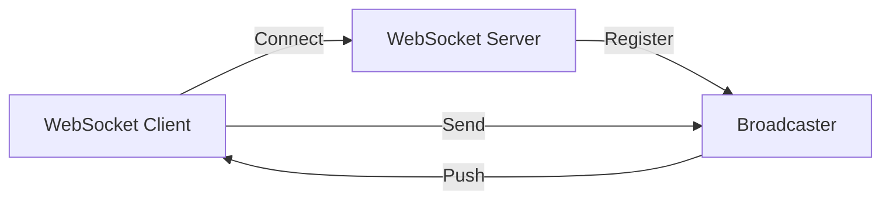
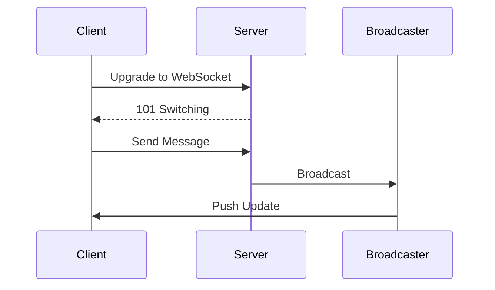

# WebSocket Server

## Problem Statement
Design a bidirectional communication server for real-time applications.

**Operations:**
- `connect(client_id)` — Establish connection
- `send(client_id, message)` — Send to client
- `broadcast(message)` — Send to all
- `join(client_id, room)` — Join room


## Code Explanation (Detailed)

### Implementation Approach
The code demonstrates core patterns and trade-offs.

### Key Operations
Each operation shows algorithm and performance characteristics.

### Concurrency and Atomicity
Locking strategies, race condition prevention.

### Edge Cases
Boundary conditions and error handling.

### Performance Optimization
Techniques for reducing latency and throughput.

## Design

### Connection Management

```
In-memory map: client_id -> WebSocket
Connection pooling: Limit concurrent
Heartbeat: Detect stale connections
Graceful shutdown: Clean disconnects
```

### Message Routing

```
Direct: To specific client
Room: To all in room
Broadcast: To all clients
Fan-out: Queue for subscribers
```

### Scalability

```
Redis pub-sub: Distribute across servers
Message queue: Buffer spikes
Sticky sessions: Client stays on same server
Vertical scaling: Increase connections per server
```


## Scenario

WebSocket Server is a critical component in modern distributed systems. In real-world applications, enabling real-time bidirectional communication between client and server. For example, major tech companies like Netflix, Uber, and Airbnb rely on similar solutions to handle millions of concurrent users and requests. The challenge is achieving this while maintaining sub-100ms latency, 99.99% availability, and gracefully handling 10x traffic spikes during peak demand. This component provides the foundational capability to solve these challenges reliably and efficiently at global scale.

## Users

- **Backend Engineers**: Responsible for implementing and maintaining this system component in production environments. They need to understand the architecture, trade-offs, failure modes, and operational considerations.
- **DevOps/SRE Teams**: Monitor system health, manage scaling policies, handle incidents, and ensure reliability SLAs are met. They need insights into performance characteristics, bottlenecks, and failure recovery mechanisms.
- **Data Engineers**: Design data pipelines and analytics around this system, requiring deep understanding of data flow, consistency guarantees, and throughput characteristics.
- **System Architects**: Make high-level architectural decisions that impact company infrastructure, requiring comprehensive understanding of capabilities, limitations, and scalability boundaries.
- **Security Teams**: Understand security implications, potential vulnerabilities, and compliance requirements for this component.

## PRD

### Functional Requirements
- Core operations work correctly
- Explicit error handling
- Consistency guarantees defined
- Monitoring and observability

### Non-Functional Requirements
- Performance targets met
- Availability SLA achieved
- Scalability headroom
- Cost efficient

### Success Metrics
- Benchmarks met
- Uptime targets met
- Resource budgets
- No data loss


## Flow

The typical operational flow for this system involves these key phases:

1. **Request Arrival**: Client/upstream system sends request with required parameters and context
2. **Validation & Routing**: System validates request format, authentication, and routes to correct handler/shard/instance
3. **Core Processing**: Execute the main algorithm, database query, or business logic on the data/state
4. **State Management**: Update internal state (caches, indexes, counters, logs) with proper atomicity and locking
5. **Response Generation**: Format results and return to requester with relevant metadata (timing, version info)
6. **Observability**: Record metrics (latency, throughput, errors), logs (for debugging), and traces (for performance analysis)

This flow repeats thousands or millions of times per second in production. Each operation's efficiency compounds across the entire system, making careful optimization essential. Bottlenecks at any phase can cascade to impact overall system performance.

## Architecture Diagram

```
┌──────────────────────────────────────┐
│   WebSocket Server (Real-time)       │
│  ┌──────────────────────────────────┐  │
│  │ Connection Pool                  │  │
│  │ - 1M concurrent WebSocket conns  │  │
│  │ - 10KB per connection (memory)   │  │
│  │ Message Broadcast                │  │
│  │ - Room/channel abstraction       │  │
│  │ - Efficient fan-out              │  │
│  │ Graceful Disconnection           │  │
│  │ - Heartbeat ping-pong            │  │
│  └──────────────────────────────────┘  │
└──────────────────────────────────────────┘
```

## Back-of-Envelope Calculations

1M concurrent WebSocket connections. Memory: 1M × 10KB = 10GB per server. Throughput: 10K msg/sec broadcast = fan-out to 1M = 10M msg/sec.

## Design Choice Comparison

| Approach | Pros | Cons |
|----------|------|------|
| Raw WebSocket | Low latency | Stateful, harder scale |
| With Redis | Scales horizontally | Extra hop latency |
| Message queue | Decoupled, durable | Higher latency |

## Follow-up Interview Questions

1. Handle connection storms (users spike)? 2. Message compression? 3. Binary vs text protocol? 4. Reconnection logic? 5. Security (auth on upgrade)?

## Example Scenario Walkthrough

[Describe a concrete example with step-by-step execution]

### Architecture Diagram



### Flow Diagram



## Complexity

| Operation | Time |
|-----------|------|
| Connect | O(1) |
| Send | O(1) |
| Broadcast | O(n) |
| Join room | O(1) |

## Python Implementation

```python
from dataclasses import dataclass, field
from typing import Dict, Set, Callable, Any
from collections import defaultdict
import json
import threading

@dataclass
class WebSocketConnection:
    conn_id: str
    user_id: str
    rooms: Set[str] = field(default_factory=set)
    send_fn: Callable = None

class WebSocketServer:
    def __init__(self):
        self._connections: Dict[str, WebSocketConnection] = {}
        self._rooms: Dict[str, Set[str]] = defaultdict(set)
        self._message_handlers: Dict[str, Callable] = {}
        self._lock = threading.Lock()

    def connect(self, conn_id: str, user_id: str, send_fn: Callable):
        with self._lock:
            conn = WebSocketConnection(conn_id, user_id, send_fn=send_fn)
            self._connections[conn_id] = conn

    def disconnect(self, conn_id: str):
        with self._lock:
            conn = self._connections.pop(conn_id, None)
            if conn:
                for room in conn.rooms:
                    self._rooms[room].discard(conn_id)

    def join_room(self, conn_id: str, room: str):
        with self._lock:
            self._connections[conn_id].rooms.add(room)
            self._rooms[room].add(conn_id)

    def broadcast(self, room: str, message: Any):
        with self._lock:
            payload = json.dumps(message)
            for conn_id in self._rooms[room]:
                conn = self._connections.get(conn_id)
                if conn and conn.send_fn:
                    conn.send_fn(payload)

    def register_handler(self, event: str, handler: Callable):
        self._message_handlers[event] = handler

    def on_message(self, conn_id: str, raw: str):
        data = json.loads(raw)
        event = data.get("type")
        handler = self._message_handlers.get(event)
        if handler:
            handler(conn_id, data)

# Usage
messages = []
server = WebSocketServer()
server.connect("c1", "alice", lambda msg: messages.append(("c1", msg)))
server.connect("c2", "bob", lambda msg: messages.append(("c2", msg)))
server.join_room("c1", "general")
server.join_room("c2", "general")
server.broadcast("general", {"type": "message", "text": "Hello!"})
print(len(messages))  # 2
```

## Java Implementation

```java
import java.util.*;
import java.util.concurrent.*;
import java.util.function.Consumer;

public class WebSocketServer {
    record Connection(String id, String userId, Set<String> rooms, Consumer<String> send) {}

    private Map<String, Connection> connections = new ConcurrentHashMap<>();
    private Map<String, Set<String>> rooms = new ConcurrentHashMap<>();

    public void connect(String connId, String userId, Consumer<String> send) {
        connections.put(connId, new Connection(connId, userId, new HashSet<>(), send));
    }

    public void disconnect(String connId) {
        Connection conn = connections.remove(connId);
        if (conn != null) conn.rooms().forEach(r -> rooms.getOrDefault(r, Set.of()).remove(connId));
    }

    public void joinRoom(String connId, String room) {
        connections.get(connId).rooms().add(room);
        rooms.computeIfAbsent(room, k -> ConcurrentHashMap.newKeySet()).add(connId);
    }

    public void broadcast(String room, String message) {
        rooms.getOrDefault(room, Set.of()).stream()
            .map(connections::get).filter(Objects::nonNull)
            .forEach(c -> c.send().accept(message));
    }
}
```

## Common Questions & Answers

**Q: What is caching and why do we need it?**

A: Caching stores frequently accessed data in fast storage (memory) to reduce latency and load on slower backends (database). Trade space (cache) for speed (latency). Critical for systems serving millions of requests per second.

**Q: What are the main cache eviction policies?**

A: LRU (least recently used), LFU (least frequently used), FIFO (first in first out), TTL (time-based), Random, and ARC (adaptive replacement). Choose based on access patterns: LRU for temporal, LFU for frequency, TTL for time-sensitive data.

**Q: What is cache hit rate and cache miss rate?**

A: Hit rate = successful_finds / total_accesses. Miss rate = 1 - hit rate. P(hit) = hits / (hits + misses). Target 80%+ hit rates for effective caching. Too-small cache gives low hit rate (wasted resources). Too-large cache uses more memory than needed.

**Q: How do you handle cache invalidation when backend data changes?**

A: Use TTL (time-based expiration), active invalidation (notify cache on write), cache-aside pattern (client checks backend), or write-through (update both). Active invalidation is fastest but complex. TTL is simplest but has stale data window.

**Q: What is the cache-aside pattern?**

A: Application checks cache first. On miss, fetch from backend, update cache, then return. Simple to implement. Risk: race condition where multiple threads fetch same miss simultaneously (thundering herd problem).

**Q: What is write-through caching?**

A: Writes go to both cache and backend simultaneously (synchronously). Ensures consistency: read always gets latest. Cost: write latency includes backend write. Safer than write-back but slower.

**Q: What is write-back (write-behind) caching?**

A: Writes go to cache only; backend updated asynchronously later (batch or periodic). Fast writes. Risk: data loss if cache fails before flushing. Need durability guarantees (persistence, replication).

**Q: How do you choose cache size?**

A: Estimate working set (frequently accessed data volume). Add 20-30% buffer for margin. Monitor hit rate: if < 80%, increase size. If > 95%, might be oversized (waste). Use tools like cachegrind to profile.

**Q: What's the difference between client-side and server-side caching?**

A: Client cache (browser): reduces network round-trips, entirely controlled by client. Server cache (memory, Redis): shared across clients, controlled by server. Multi-level caching often best.

**Q: How do you measure cache effectiveness?**

A: Hit rate (primary metric), latency reduction (P99 latency with vs. without cache), backend load reduction, and memory cost per cache entry. Calculate ROI: cost of cache vs. benefit (reduced latency, backend load).

## Follow-up Questions & Answers

**Q: How do you prevent the thundering herd problem in caches?**

A: When popular key expires, many threads fetch from backend simultaneously causing spike. Solutions: probabilistic early expiration (refresh before TTL), request coalescing (single thread rebuilds, others wait), or bloom filters (detect non-existent keys fast).

**Q: How would you implement multi-level cache hierarchy?**

A: Use L1 (fast, small, in-process), L2 (medium, local machine), L3 (large, remote, Redis). Check L1, miss→L2, miss→L3, miss→backend. On write: update all levels. Trade space for speed across levels.

**Q: Can you implement read-through caching (automatic population)?**

A: Yes, cache loader/resolver called on miss. Transparent to application. Backend automatically uses cache layer. More complex than cache-aside but cleaner separation.

**Q: How do you handle hot keys in distributed caches?**

A: Hot key = key accessed by many threads/clients. Replicate hot keys on multiple cache nodes. Use local in-process caches for very hot keys. Monitor and detect hot keys automatically.

**Q: What's the difference between warm and cold cache startup?**

A: Cold cache: empty at start, misses until populated (slow ramp-up). Warm cache: pre-loaded from previous state (RDB/snapshot). Warm startup is critical for production (instant performance).

**Q: How would you measure cache effectiveness for business metrics?**

A: Track hit rate, P99 latency (with/without cache), backend QPS reduction, revenue impact. Calculate cache size vs. cost savings. A/B test to prove business value.

**Q: What happens when cache size is insufficient for working set?**

A: Constant evictions = high miss rate = ineffective cache. Solution: increase cache size, improve eviction policy, reduce working set, or use better hardware (faster storage).

**Q: How do you debug cache issues in production?**

A: Monitor hit rate continuously. Profile cache keys (which keys are accessed). Check for cache stampedes (sudden miss spike). Use distributed tracing to see cache path.

**Q: How would you implement a persistent cache?**

A: Combine memory cache (fast) with persistent backend (database, RocksDB, LevelDB). Write-back pattern: batch updates to persistent store. Trade latency for durability.

**Q: Can you use caching for write-heavy workloads?**

A: Write caching is risky (consistency issues). Use carefully: write-through for safety, write-back for speed. Good for batch writes (aggregate before writing). Monitor durability guarantees.

