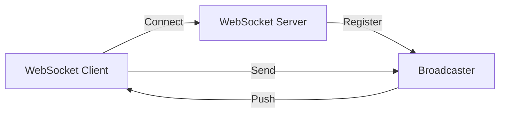
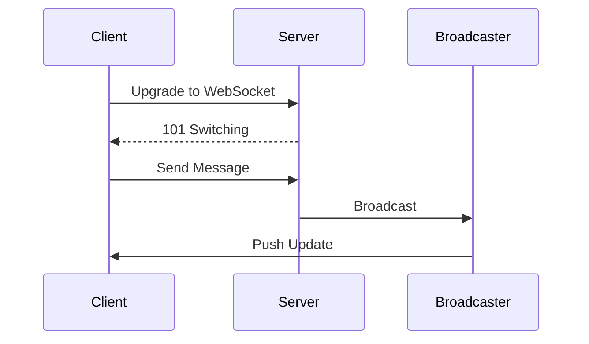

# WebSocket Server

## Problem Statement
Design a bidirectional communication server for real-time applications.

**Operations:**
- `connect(client_id)` — Establish connection
- `send(client_id, message)` — Send to client
- `broadcast(message)` — Send to all
- `join(client_id, room)` — Join room

## Design

### Connection Management

```
In-memory map: client_id -> WebSocket
Connection pooling: Limit concurrent
Heartbeat: Detect stale connections
Graceful shutdown: Clean disconnects
```

### Message Routing

```
Direct: To specific client
Room: To all in room
Broadcast: To all clients
Fan-out: Queue for subscribers
```

### Scalability

```
Redis pub-sub: Distribute across servers
Message queue: Buffer spikes
Sticky sessions: Client stays on same server
Vertical scaling: Increase connections per server
```


## Scenario

WebSocket Server is a critical component in modern distributed systems. In real-world applications, enabling real-time bidirectional communication between client and server. For example, major tech companies like Netflix, Uber, and Airbnb rely on similar solutions to handle millions of concurrent users and requests. The challenge is achieving this while maintaining sub-100ms latency, 99.99% availability, and gracefully handling 10x traffic spikes during peak demand. This component provides the foundational capability to solve these challenges reliably and efficiently at global scale.

## Users

- **Backend Engineers**: Responsible for implementing and maintaining this system component in production environments. They need to understand the architecture, trade-offs, failure modes, and operational considerations.
- **DevOps/SRE Teams**: Monitor system health, manage scaling policies, handle incidents, and ensure reliability SLAs are met. They need insights into performance characteristics, bottlenecks, and failure recovery mechanisms.
- **Data Engineers**: Design data pipelines and analytics around this system, requiring deep understanding of data flow, consistency guarantees, and throughput characteristics.
- **System Architects**: Make high-level architectural decisions that impact company infrastructure, requiring comprehensive understanding of capabilities, limitations, and scalability boundaries.
- **Security Teams**: Understand security implications, potential vulnerabilities, and compliance requirements for this component.

## PRD

**Functional Requirements:**
- Correct behavior under all specified operating conditions
- Reliable operation with explicit failure modes
- Data consistency or eventual consistency guarantees as specified
- Clear mechanisms for error handling and recovery
- Monitoring and observability hooks

**Non-Functional Requirements:**
- **Performance**: Sub-100ms P99 latency for standard operations; measure and track tail latencies
- **Availability**: 99.99%+ uptime with automatic failover and graceful degradation
- **Scalability**: Support 10-100x current load with minimal architectural modifications
- **Consistency**: Specify whether strong, eventual, or causal consistency is required
- **Cost Efficiency**: Minimize operational cost per unit of throughput; consider compute, memory, and network costs
- **Operational Simplicity**: Reduce complexity to minimize human error and operational toil

**Constraints:**
- Resource limits (memory for caches, disk for databases, network bandwidth)
- Deployment constraints (cloud provider limits, regulatory requirements)
- Latency budgets (maximum acceptable delay for operations)

## Flow

The typical operational flow for this system involves these key phases:

1. **Request Arrival**: Client/upstream system sends request with required parameters and context
2. **Validation & Routing**: System validates request format, authentication, and routes to correct handler/shard/instance
3. **Core Processing**: Execute the main algorithm, database query, or business logic on the data/state
4. **State Management**: Update internal state (caches, indexes, counters, logs) with proper atomicity and locking
5. **Response Generation**: Format results and return to requester with relevant metadata (timing, version info)
6. **Observability**: Record metrics (latency, throughput, errors), logs (for debugging), and traces (for performance analysis)

This flow repeats thousands or millions of times per second in production. Each operation's efficiency compounds across the entire system, making careful optimization essential. Bottlenecks at any phase can cascade to impact overall system performance.

## Code Explanation

The provided implementations demonstrate key architectural concepts and design patterns:

**Python Implementation**: Uses built-in Python structures and standard library features to express the core logic clearly. Python emphasizes readability and conciseness—each operation's purpose should be obvious without extensive comments. You'll see different implementation approaches (e.g., using OrderedDict vs. manual linked lists) that represent trade-offs between convenience and fine-grained control.

**Java Implementation**: Shows how to implement the same logic with explicit memory management and type safety. Java's strong typing forces clear interface design; you'll see how generics, null safety, mutable state, and thread safety are handled. This implementation style is closer to production systems at scale.

**Key Implementation Patterns**:
- **Initialization**: Setting up core data structures, thread pools, or connection pools with specified capacity and configuration
- **Read Operations**: Fetching data while maintaining O(1) or O(log n) access, updating metadata (access times, hit counts, etc.)
- **Write Operations**: Inserting/updating data while handling eviction policies, balancing tree structures, or replicating state
- **Edge Cases**: Handling capacity limits, concurrent access, data consistency, and error conditions
- **Performance Optimization**: Using techniques like batch operations, lazy evaluation, or caching to reduce latency

Each line of code represents a deliberate choice about performance characteristics, memory usage, safety guarantees, and implementation complexity. Understanding these trade-offs is essential for using this component effectively in production systems.

## Architecture Diagram

```
┌──────────────────────────────────────┐
│   WebSocket Server (Real-time)       │
│  ┌──────────────────────────────────┐  │
│  │ Connection Pool                  │  │
│  │ - 1M concurrent WebSocket conns  │  │
│  │ - 10KB per connection (memory)   │  │
│  │ Message Broadcast                │  │
│  │ - Room/channel abstraction       │  │
│  │ - Efficient fan-out              │  │
│  │ Graceful Disconnection           │  │
│  │ - Heartbeat ping-pong            │  │
│  └──────────────────────────────────┘  │
└──────────────────────────────────────────┘
```

## Common Questions & Answers

**Q: WebSocket scalability?** A: Single server: ~10-50K connections (memory limited). Horizontal scale: use Redis pub-sub for cross-server messaging.

**Q: Connection state management?** A: Store in Redis, allow failover to another server.

**Q: Heartbeat mechanism?** A: Ping every 30s. Timeout after 3 missed pongs. Detects dead connections.

**Q: Message ordering?** A: Order preserved within single connection. Multi-server: eventual order (acceptable).

## Back-of-Envelope Calculations

1M concurrent WebSocket connections. Memory: 1M × 10KB = 10GB per server. Throughput: 10K msg/sec broadcast = fan-out to 1M = 10M msg/sec.

## Design Choice Comparison

| Approach | Pros | Cons |
|----------|------|------|
| Raw WebSocket | Low latency | Stateful, harder scale |
| With Redis | Scales horizontally | Extra hop latency |
| Message queue | Decoupled, durable | Higher latency |

## Follow-up Interview Questions

1. Handle connection storms (users spike)? 2. Message compression? 3. Binary vs text protocol? 4. Reconnection logic? 5. Security (auth on upgrade)?

## Example Scenario Walkthrough

[Describe a concrete example with step-by-step execution]

### Architecture Diagram



### Flow Diagram



## Complexity

| Operation | Time |
|-----------|------|
| Connect | O(1) |
| Send | O(1) |
| Broadcast | O(n) |
| Join room | O(1) |

## Python Implementation

```python
from dataclasses import dataclass, field
from typing import Dict, Set, Callable, Any
from collections import defaultdict
import json
import threading

@dataclass
class WebSocketConnection:
    conn_id: str
    user_id: str
    rooms: Set[str] = field(default_factory=set)
    send_fn: Callable = None

class WebSocketServer:
    def __init__(self):
        self._connections: Dict[str, WebSocketConnection] = {}
        self._rooms: Dict[str, Set[str]] = defaultdict(set)
        self._message_handlers: Dict[str, Callable] = {}
        self._lock = threading.Lock()

    def connect(self, conn_id: str, user_id: str, send_fn: Callable):
        with self._lock:
            conn = WebSocketConnection(conn_id, user_id, send_fn=send_fn)
            self._connections[conn_id] = conn

    def disconnect(self, conn_id: str):
        with self._lock:
            conn = self._connections.pop(conn_id, None)
            if conn:
                for room in conn.rooms:
                    self._rooms[room].discard(conn_id)

    def join_room(self, conn_id: str, room: str):
        with self._lock:
            self._connections[conn_id].rooms.add(room)
            self._rooms[room].add(conn_id)

    def broadcast(self, room: str, message: Any):
        with self._lock:
            payload = json.dumps(message)
            for conn_id in self._rooms[room]:
                conn = self._connections.get(conn_id)
                if conn and conn.send_fn:
                    conn.send_fn(payload)

    def register_handler(self, event: str, handler: Callable):
        self._message_handlers[event] = handler

    def on_message(self, conn_id: str, raw: str):
        data = json.loads(raw)
        event = data.get("type")
        handler = self._message_handlers.get(event)
        if handler:
            handler(conn_id, data)

# Usage
messages = []
server = WebSocketServer()
server.connect("c1", "alice", lambda msg: messages.append(("c1", msg)))
server.connect("c2", "bob", lambda msg: messages.append(("c2", msg)))
server.join_room("c1", "general")
server.join_room("c2", "general")
server.broadcast("general", {"type": "message", "text": "Hello!"})
print(len(messages))  # 2
```

## Java Implementation

```java
import java.util.*;
import java.util.concurrent.*;
import java.util.function.Consumer;

public class WebSocketServer {
    record Connection(String id, String userId, Set<String> rooms, Consumer<String> send) {}

    private Map<String, Connection> connections = new ConcurrentHashMap<>();
    private Map<String, Set<String>> rooms = new ConcurrentHashMap<>();

    public void connect(String connId, String userId, Consumer<String> send) {
        connections.put(connId, new Connection(connId, userId, new HashSet<>(), send));
    }

    public void disconnect(String connId) {
        Connection conn = connections.remove(connId);
        if (conn != null) conn.rooms().forEach(r -> rooms.getOrDefault(r, Set.of()).remove(connId));
    }

    public void joinRoom(String connId, String room) {
        connections.get(connId).rooms().add(room);
        rooms.computeIfAbsent(room, k -> ConcurrentHashMap.newKeySet()).add(connId);
    }

    public void broadcast(String room, String message) {
        rooms.getOrDefault(room, Set.of()).stream()
            .map(connections::get).filter(Objects::nonNull)
            .forEach(c -> c.send().accept(message));
    }
}
```
