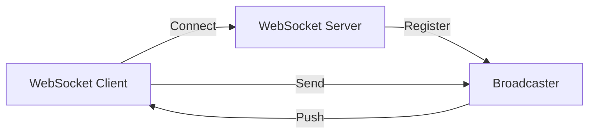
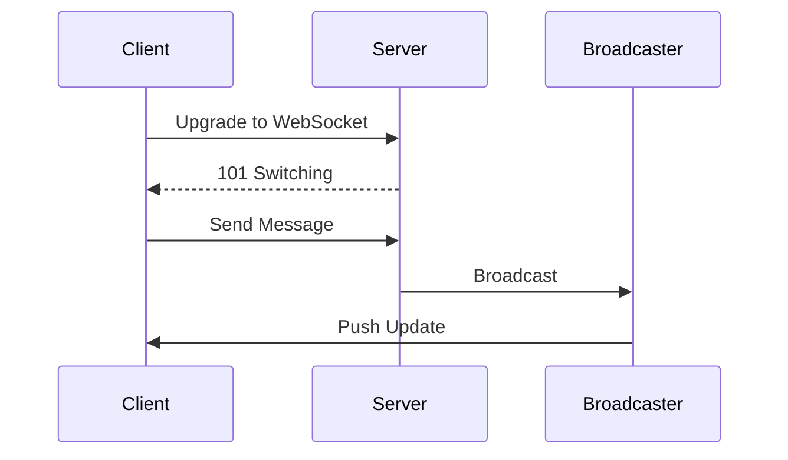

# WebSocket Server

## Problem Statement
Design a bidirectional communication server for real-time applications.

**Operations:**
- `connect(client_id)` — Establish connection
- `send(client_id, message)` — Send to client
- `broadcast(message)` — Send to all
- `join(client_id, room)` — Join room

## Design

### Connection Management

```
In-memory map: client_id -> WebSocket
Connection pooling: Limit concurrent
Heartbeat: Detect stale connections
Graceful shutdown: Clean disconnects
```

### Message Routing

```
Direct: To specific client
Room: To all in room
Broadcast: To all clients
Fan-out: Queue for subscribers
```

### Scalability

```
Redis pub-sub: Distribute across servers
Message queue: Buffer spikes
Sticky sessions: Client stays on same server
Vertical scaling: Increase connections per server
```


## Architecture Diagram

```
┌──────────────────────────────────────┐
│   WebSocket Server (Real-time)       │
│  ┌──────────────────────────────────┐  │
│  │ Connection Pool                  │  │
│  │ - 1M concurrent WebSocket conns  │  │
│  │ - 10KB per connection (memory)   │  │
│  │ Message Broadcast                │  │
│  │ - Room/channel abstraction       │  │
│  │ - Efficient fan-out              │  │
│  │ Graceful Disconnection           │  │
│  │ - Heartbeat ping-pong            │  │
│  └──────────────────────────────────┘  │
└──────────────────────────────────────────┘
```

## Common Questions & Answers

**Q: WebSocket scalability?** A: Single server: ~10-50K connections (memory limited). Horizontal scale: use Redis pub-sub for cross-server messaging.

**Q: Connection state management?** A: Store in Redis, allow failover to another server.

**Q: Heartbeat mechanism?** A: Ping every 30s. Timeout after 3 missed pongs. Detects dead connections.

**Q: Message ordering?** A: Order preserved within single connection. Multi-server: eventual order (acceptable).

## Back-of-Envelope Calculations

1M concurrent WebSocket connections. Memory: 1M × 10KB = 10GB per server. Throughput: 10K msg/sec broadcast = fan-out to 1M = 10M msg/sec.

## Design Choice Comparison

| Approach | Pros | Cons |
|----------|------|------|
| Raw WebSocket | Low latency | Stateful, harder scale |
| With Redis | Scales horizontally | Extra hop latency |
| Message queue | Decoupled, durable | Higher latency |

## Follow-up Interview Questions

1. Handle connection storms (users spike)? 2. Message compression? 3. Binary vs text protocol? 4. Reconnection logic? 5. Security (auth on upgrade)?

## Example Scenario Walkthrough

[Describe a concrete example with step-by-step execution]

### Architecture Diagram



### Flow Diagram



## Complexity

| Operation | Time |
|-----------|------|
| Connect | O(1) |
| Send | O(1) |
| Broadcast | O(n) |
| Join room | O(1) |

## Python Implementation

```python
from dataclasses import dataclass, field
from typing import Dict, Set, Callable, Any
from collections import defaultdict
import json
import threading

@dataclass
class WebSocketConnection:
    conn_id: str
    user_id: str
    rooms: Set[str] = field(default_factory=set)
    send_fn: Callable = None

class WebSocketServer:
    def __init__(self):
        self._connections: Dict[str, WebSocketConnection] = {}
        self._rooms: Dict[str, Set[str]] = defaultdict(set)
        self._message_handlers: Dict[str, Callable] = {}
        self._lock = threading.Lock()

    def connect(self, conn_id: str, user_id: str, send_fn: Callable):
        with self._lock:
            conn = WebSocketConnection(conn_id, user_id, send_fn=send_fn)
            self._connections[conn_id] = conn

    def disconnect(self, conn_id: str):
        with self._lock:
            conn = self._connections.pop(conn_id, None)
            if conn:
                for room in conn.rooms:
                    self._rooms[room].discard(conn_id)

    def join_room(self, conn_id: str, room: str):
        with self._lock:
            self._connections[conn_id].rooms.add(room)
            self._rooms[room].add(conn_id)

    def broadcast(self, room: str, message: Any):
        with self._lock:
            payload = json.dumps(message)
            for conn_id in self._rooms[room]:
                conn = self._connections.get(conn_id)
                if conn and conn.send_fn:
                    conn.send_fn(payload)

    def register_handler(self, event: str, handler: Callable):
        self._message_handlers[event] = handler

    def on_message(self, conn_id: str, raw: str):
        data = json.loads(raw)
        event = data.get("type")
        handler = self._message_handlers.get(event)
        if handler:
            handler(conn_id, data)

# Usage
messages = []
server = WebSocketServer()
server.connect("c1", "alice", lambda msg: messages.append(("c1", msg)))
server.connect("c2", "bob", lambda msg: messages.append(("c2", msg)))
server.join_room("c1", "general")
server.join_room("c2", "general")
server.broadcast("general", {"type": "message", "text": "Hello!"})
print(len(messages))  # 2
```

## Java Implementation

```java
import java.util.*;
import java.util.concurrent.*;
import java.util.function.Consumer;

public class WebSocketServer {
    record Connection(String id, String userId, Set<String> rooms, Consumer<String> send) {}

    private Map<String, Connection> connections = new ConcurrentHashMap<>();
    private Map<String, Set<String>> rooms = new ConcurrentHashMap<>();

    public void connect(String connId, String userId, Consumer<String> send) {
        connections.put(connId, new Connection(connId, userId, new HashSet<>(), send));
    }

    public void disconnect(String connId) {
        Connection conn = connections.remove(connId);
        if (conn != null) conn.rooms().forEach(r -> rooms.getOrDefault(r, Set.of()).remove(connId));
    }

    public void joinRoom(String connId, String room) {
        connections.get(connId).rooms().add(room);
        rooms.computeIfAbsent(room, k -> ConcurrentHashMap.newKeySet()).add(connId);
    }

    public void broadcast(String room, String message) {
        rooms.getOrDefault(room, Set.of()).stream()
            .map(connections::get).filter(Objects::nonNull)
            .forEach(c -> c.send().accept(message));
    }
}
```
