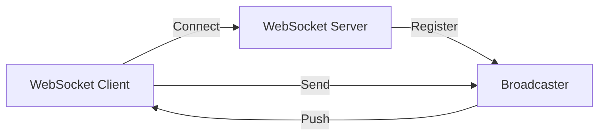
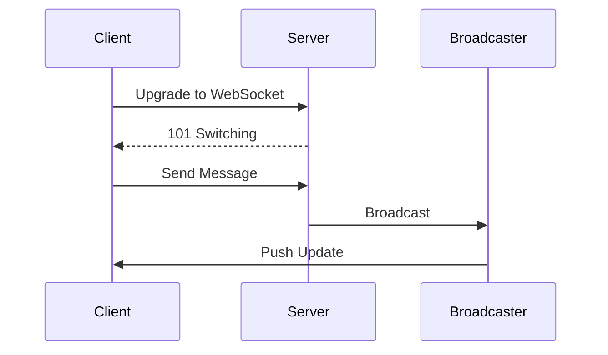

# WebSocket Server

## Problem Statement
Design a bidirectional communication server for real-time applications.

**Operations:**
- `connect(client_id)` — Establish connection
- `send(client_id, message)` — Send to client
- `broadcast(message)` — Send to all
- `join(client_id, room)` — Join room

## Design

### Connection Management

```
In-memory map: client_id -> WebSocket
Connection pooling: Limit concurrent
Heartbeat: Detect stale connections
Graceful shutdown: Clean disconnects
```

### Message Routing

```
Direct: To specific client
Room: To all in room
Broadcast: To all clients
Fan-out: Queue for subscribers
```

### Scalability

```
Redis pub-sub: Distribute across servers
Message queue: Buffer spikes
Sticky sessions: Client stays on same server
Vertical scaling: Increase connections per server
```


## Architecture Diagram

```
┌──────────────────────────────────────┐
│   WebSocket Server (Real-time)       │
│  ┌──────────────────────────────────┐  │
│  │ Connection Pool                  │  │
│  │ - 1M concurrent WebSocket conns  │  │
│  │ - 10KB per connection (memory)   │  │
│  │ Message Broadcast                │  │
│  │ - Room/channel abstraction       │  │
│  │ - Efficient fan-out              │  │
│  │ Graceful Disconnection           │  │
│  │ - Heartbeat ping-pong            │  │
│  └──────────────────────────────────┘  │
└──────────────────────────────────────────┘
```

## Common Questions & Answers

**Q: WebSocket scalability?** A: Single server: ~10-50K connections (memory limited). Horizontal scale: use Redis pub-sub for cross-server messaging.

**Q: Connection state management?** A: Store in Redis, allow failover to another server.

**Q: Heartbeat mechanism?** A: Ping every 30s. Timeout after 3 missed pongs. Detects dead connections.

**Q: Message ordering?** A: Order preserved within single connection. Multi-server: eventual order (acceptable).

## Back-of-Envelope Calculations

1M concurrent WebSocket connections. Memory: 1M × 10KB = 10GB per server. Throughput: 10K msg/sec broadcast = fan-out to 1M = 10M msg/sec.

## Design Choice Comparison

| Approach | Pros | Cons |
|----------|------|------|
| Raw WebSocket | Low latency | Stateful, harder scale |
| With Redis | Scales horizontally | Extra hop latency |
| Message queue | Decoupled, durable | Higher latency |

## Follow-up Interview Questions

1. Handle connection storms (users spike)? 2. Message compression? 3. Binary vs text protocol? 4. Reconnection logic? 5. Security (auth on upgrade)?

## Example Scenario Walkthrough

[Describe a concrete example with step-by-step execution]

### Architecture Diagram



### Flow Diagram



## Complexity

| Operation | Time |
|-----------|------|
| Connect | O(1) |
| Send | O(1) |
| Broadcast | O(n) |
| Join room | O(1) |
