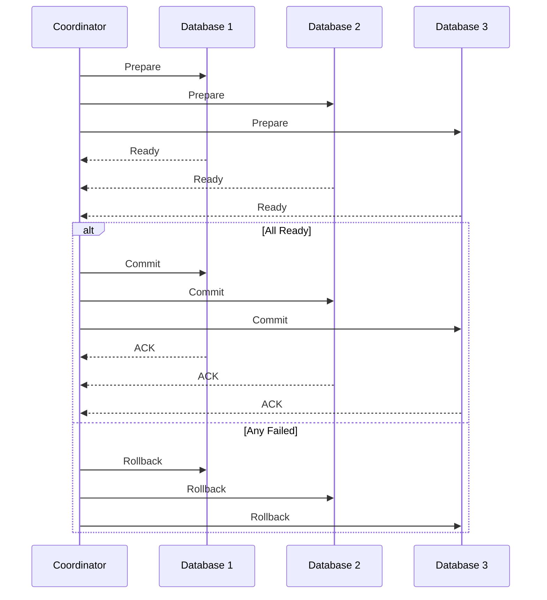

# Distributed Transactions

## Problem Statement
Design a system coordinating transactions across multiple databases or services.

**Approaches:**
- 2-Phase Commit: Atomic across services
- Saga Pattern: Long-running distributed tx
- Event Sourcing: Immutable event log

## Design

### 2-Phase Commit

```
Phase 1 (Prepare): All nodes ready?
Phase 2 (Commit): All nodes commit
Blocking: Waits for slowest node
```

### Saga Pattern

```
Orchestration: Coordinator directs steps
Choreography: Services listen to events
Compensation: Undo on failure
Eventually consistent
```

### Conflict Resolution

```
Optimistic locking: Check version on update
Pessimistic locking: Lock row before access
Last-write-wins: Latest timestamp wins
Custom logic: Application-specific
```


## Architecture Diagram

```
┌───────────────────────────────┐
│   2-Phase Commit (2PC)        │
│  Phase 1: Prepare             │
│  - Coordinator asks all nodes │
│  - Nodes lock & prepare       │
│  Phase 2: Commit/Abort        │
│  - All yes: commit            │
│  - Any no: rollback all       │
│  Timeout & Recovery           │
│  - Coordinator timeout        │
│  - Node replay from log       │
└───────────────────────────────┘
```

## Flow Diagram



## Common Questions & Answers

**Q: Blocking problem?** A: 2PC locks during prepare (reduces concurrency). Solutions: Saga, eventual consistency.

**Q: Timeout tuning?** A: Short: false failures. Long: latency. Typical: 10-30s.

**Q: Saga alternative?** A: Compensating txns, no blocking, eventual. Saga requires rollback logic.

**Q: Network partition?** A: Minority can't reach coordinator, waits forever (unsafe). Use Raft consensus.

## Back-of-Envelope Calculations

4 services, 100ms latency budget. Prepare: 80ms. Commit: 10ms. Throughput: 10 txn/sec (limited by latency).
## Design Choice Comparison

| Approach | Pros | Cons |
|----------|------|------|
| 2PC | Atomic, simple | Blocking |
| Saga | Eventual | Compensating logic |
| Event sourcing | Full history | Complex |

## Follow-up Interview Questions

1. Test with network failures? 2. Nested txn? 3. Scale beyond 10 services? 4. Prepare latency bottleneck? 5. Monitor failures?

## Example Scenario Walkthrough

[Describe a concrete example with step-by-step execution]

## Trade-offs

| Approach | Pros | Cons |
|----------|------|------|
| 2PC | Atomic | Blocking, slow |
| Saga | Flexible | Complex, eventual consistency |
| ES | Audit trail | Storage overhead |

## Python Implementation

```python
from enum import Enum
from typing import List, Callable, Optional

class TxnState(Enum):
    INITIAL = "initial"
    PREPARED = "prepared"
    COMMITTED = "committed"
    ABORTED = "aborted"

class Participant:
    def __init__(self, name: str):
        self.name = name
        self.state = TxnState.INITIAL

    def prepare(self) -> bool:
        # Simulate prepare phase - returns True if ready to commit
        self.state = TxnState.PREPARED
        print(f"[{self.name}] Prepared")
        return True

    def commit(self):
        self.state = TxnState.COMMITTED
        print(f"[{self.name}] Committed")

    def abort(self):
        self.state = TxnState.ABORTED
        print(f"[{self.name}] Aborted")

class TwoPhaseCommit:
    def __init__(self, participants: List[Participant]):
        self._participants = participants

    def execute(self) -> bool:
        # Phase 1: Prepare
        votes = [p.prepare() for p in self._participants]
        if all(votes):
            # Phase 2: Commit
            for p in self._participants:
                p.commit()
            return True
        else:
            # Phase 2: Abort
            for p in self._participants:
                p.abort()
            return False

# Saga Pattern
class SagaStep:
    def __init__(self, action: Callable, compensation: Callable):
        self.action = action
        self.compensation = compensation

class SagaOrchestrator:
    def __init__(self, steps: List[SagaStep]):
        self._steps = steps

    def execute(self):
        completed = []
        for step in self._steps:
            try:
                step.action()
                completed.append(step)
            except Exception as e:
                print(f"Step failed: {e}, compensating...")
                for s in reversed(completed):
                    s.compensation()
                return False
        return True

# Usage
p1, p2, p3 = Participant("DB1"), Participant("DB2"), Participant("DB3")
txn = TwoPhaseCommit([p1, p2, p3])
print("Success:", txn.execute())
```

## Java Implementation

```java
import java.util.*;

public class TwoPhaseCommit {
    interface Participant {
        boolean prepare();
        void commit();
        void abort();
    }

    private List<Participant> participants;

    public TwoPhaseCommit(List<Participant> participants) {
        this.participants = participants;
    }

    public boolean execute() {
        boolean allReady = participants.stream().allMatch(Participant::prepare);
        if (allReady) {
            participants.forEach(Participant::commit);
        } else {
            participants.forEach(Participant::abort);
        }
        return allReady;
    }

    public static void main(String[] args) {
        List<Participant> ps = List.of(
            new Participant() {
                public boolean prepare() { System.out.println("DB1 prepared"); return true; }
                public void commit() { System.out.println("DB1 committed"); }
                public void abort() { System.out.println("DB1 aborted"); }
            }
        );
        System.out.println("Success: " + new TwoPhaseCommit(ps).execute());
    }
}
```
