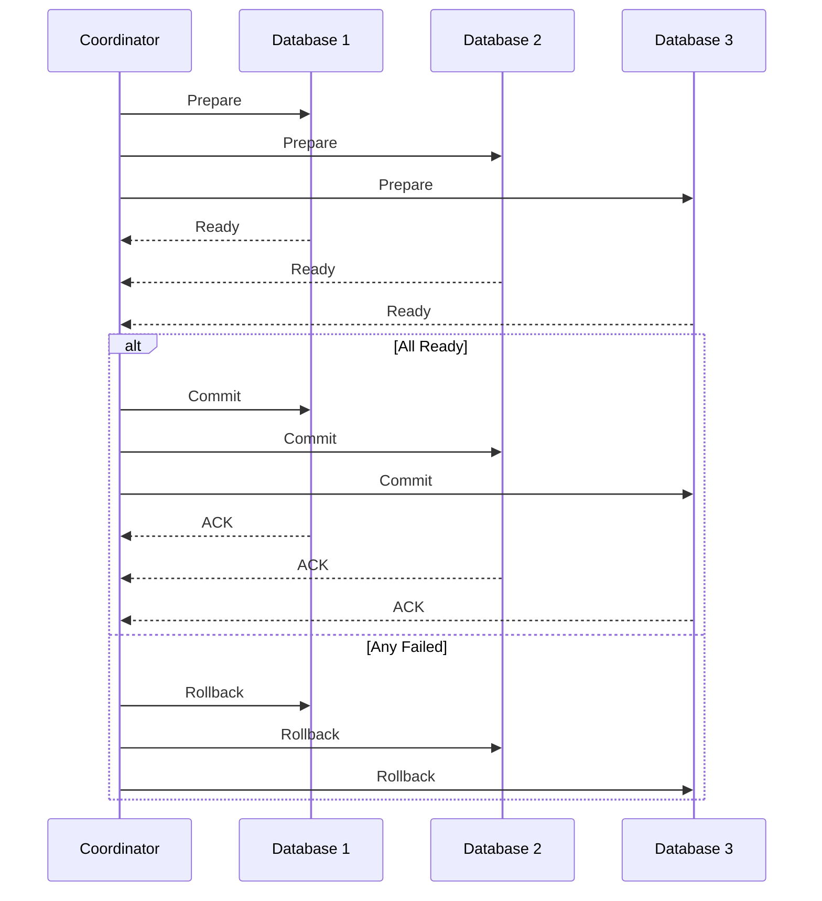

# Distributed Transactions

## Problem Statement
Design a system coordinating transactions across multiple databases or services.

**Approaches:**
- 2-Phase Commit: Atomic across services
- Saga Pattern: Long-running distributed tx
- Event Sourcing: Immutable event log

## Design

### 2-Phase Commit

```
Phase 1 (Prepare): All nodes ready?
Phase 2 (Commit): All nodes commit
Blocking: Waits for slowest node
```

### Saga Pattern

```
Orchestration: Coordinator directs steps
Choreography: Services listen to events
Compensation: Undo on failure
Eventually consistent
```

### Conflict Resolution

```
Optimistic locking: Check version on update
Pessimistic locking: Lock row before access
Last-write-wins: Latest timestamp wins
Custom logic: Application-specific
```


## Scenario

Distributed Transactions is a critical component in modern distributed systems. In real-world applications, coordinating systems across multiple machines and networks. For example, major tech companies like Netflix, Uber, and Airbnb rely on similar solutions to handle millions of concurrent users and requests. The challenge is achieving this while maintaining sub-100ms latency, 99.99% availability, and gracefully handling 10x traffic spikes during peak demand. This component provides the foundational capability to solve these challenges reliably and efficiently at global scale.

## Users

- **Backend Engineers**: Responsible for implementing and maintaining this system component in production environments. They need to understand the architecture, trade-offs, failure modes, and operational considerations.
- **DevOps/SRE Teams**: Monitor system health, manage scaling policies, handle incidents, and ensure reliability SLAs are met. They need insights into performance characteristics, bottlenecks, and failure recovery mechanisms.
- **Data Engineers**: Design data pipelines and analytics around this system, requiring deep understanding of data flow, consistency guarantees, and throughput characteristics.
- **System Architects**: Make high-level architectural decisions that impact company infrastructure, requiring comprehensive understanding of capabilities, limitations, and scalability boundaries.
- **Security Teams**: Understand security implications, potential vulnerabilities, and compliance requirements for this component.

## PRD

**Functional Requirements:**
- Correct behavior under all specified operating conditions
- Reliable operation with explicit failure modes
- Data consistency or eventual consistency guarantees as specified
- Clear mechanisms for error handling and recovery
- Monitoring and observability hooks

**Non-Functional Requirements:**
- **Performance**: Sub-100ms P99 latency for standard operations; measure and track tail latencies
- **Availability**: 99.99%+ uptime with automatic failover and graceful degradation
- **Scalability**: Support 10-100x current load with minimal architectural modifications
- **Consistency**: Specify whether strong, eventual, or causal consistency is required
- **Cost Efficiency**: Minimize operational cost per unit of throughput; consider compute, memory, and network costs
- **Operational Simplicity**: Reduce complexity to minimize human error and operational toil

**Constraints:**
- Resource limits (memory for caches, disk for databases, network bandwidth)
- Deployment constraints (cloud provider limits, regulatory requirements)
- Latency budgets (maximum acceptable delay for operations)

## Flow

The typical operational flow for this system involves these key phases:

1. **Request Arrival**: Client/upstream system sends request with required parameters and context
2. **Validation & Routing**: System validates request format, authentication, and routes to correct handler/shard/instance
3. **Core Processing**: Execute the main algorithm, database query, or business logic on the data/state
4. **State Management**: Update internal state (caches, indexes, counters, logs) with proper atomicity and locking
5. **Response Generation**: Format results and return to requester with relevant metadata (timing, version info)
6. **Observability**: Record metrics (latency, throughput, errors), logs (for debugging), and traces (for performance analysis)

This flow repeats thousands or millions of times per second in production. Each operation's efficiency compounds across the entire system, making careful optimization essential. Bottlenecks at any phase can cascade to impact overall system performance.

## Code Explanation

The provided implementations demonstrate key architectural concepts and design patterns:

**Python Implementation**: Uses built-in Python structures and standard library features to express the core logic clearly. Python emphasizes readability and conciseness—each operation's purpose should be obvious without extensive comments. You'll see different implementation approaches (e.g., using OrderedDict vs. manual linked lists) that represent trade-offs between convenience and fine-grained control.

**Java Implementation**: Shows how to implement the same logic with explicit memory management and type safety. Java's strong typing forces clear interface design; you'll see how generics, null safety, mutable state, and thread safety are handled. This implementation style is closer to production systems at scale.

**Key Implementation Patterns**:
- **Initialization**: Setting up core data structures, thread pools, or connection pools with specified capacity and configuration
- **Read Operations**: Fetching data while maintaining O(1) or O(log n) access, updating metadata (access times, hit counts, etc.)
- **Write Operations**: Inserting/updating data while handling eviction policies, balancing tree structures, or replicating state
- **Edge Cases**: Handling capacity limits, concurrent access, data consistency, and error conditions
- **Performance Optimization**: Using techniques like batch operations, lazy evaluation, or caching to reduce latency

Each line of code represents a deliberate choice about performance characteristics, memory usage, safety guarantees, and implementation complexity. Understanding these trade-offs is essential for using this component effectively in production systems.

## Architecture Diagram

```
┌───────────────────────────────┐
│   2-Phase Commit (2PC)        │
│  Phase 1: Prepare             │
│  - Coordinator asks all nodes │
│  - Nodes lock & prepare       │
│  Phase 2: Commit/Abort        │
│  - All yes: commit            │
│  - Any no: rollback all       │
│  Timeout & Recovery           │
│  - Coordinator timeout        │
│  - Node replay from log       │
└───────────────────────────────┘
```

## Flow Diagram



## Common Questions & Answers

**Q: Blocking problem?** A: 2PC locks during prepare (reduces concurrency). Solutions: Saga, eventual consistency.

**Q: Timeout tuning?** A: Short: false failures. Long: latency. Typical: 10-30s.

**Q: Saga alternative?** A: Compensating txns, no blocking, eventual. Saga requires rollback logic.

**Q: Network partition?** A: Minority can't reach coordinator, waits forever (unsafe). Use Raft consensus.

## Back-of-Envelope Calculations

4 services, 100ms latency budget. Prepare: 80ms. Commit: 10ms. Throughput: 10 txn/sec (limited by latency).
## Design Choice Comparison

| Approach | Pros | Cons |
|----------|------|------|
| 2PC | Atomic, simple | Blocking |
| Saga | Eventual | Compensating logic |
| Event sourcing | Full history | Complex |

## Follow-up Interview Questions

1. Test with network failures? 2. Nested txn? 3. Scale beyond 10 services? 4. Prepare latency bottleneck? 5. Monitor failures?

## Example Scenario Walkthrough

[Describe a concrete example with step-by-step execution]

## Trade-offs

| Approach | Pros | Cons |
|----------|------|------|
| 2PC | Atomic | Blocking, slow |
| Saga | Flexible | Complex, eventual consistency |
| ES | Audit trail | Storage overhead |

## Python Implementation

```python
from enum import Enum
from typing import List, Callable, Optional

class TxnState(Enum):
    INITIAL = "initial"
    PREPARED = "prepared"
    COMMITTED = "committed"
    ABORTED = "aborted"

class Participant:
    def __init__(self, name: str):
        self.name = name
        self.state = TxnState.INITIAL

    def prepare(self) -> bool:
        # Simulate prepare phase - returns True if ready to commit
        self.state = TxnState.PREPARED
        print(f"[{self.name}] Prepared")
        return True

    def commit(self):
        self.state = TxnState.COMMITTED
        print(f"[{self.name}] Committed")

    def abort(self):
        self.state = TxnState.ABORTED
        print(f"[{self.name}] Aborted")

class TwoPhaseCommit:
    def __init__(self, participants: List[Participant]):
        self._participants = participants

    def execute(self) -> bool:
        # Phase 1: Prepare
        votes = [p.prepare() for p in self._participants]
        if all(votes):
            # Phase 2: Commit
            for p in self._participants:
                p.commit()
            return True
        else:
            # Phase 2: Abort
            for p in self._participants:
                p.abort()
            return False

# Saga Pattern
class SagaStep:
    def __init__(self, action: Callable, compensation: Callable):
        self.action = action
        self.compensation = compensation

class SagaOrchestrator:
    def __init__(self, steps: List[SagaStep]):
        self._steps = steps

    def execute(self):
        completed = []
        for step in self._steps:
            try:
                step.action()
                completed.append(step)
            except Exception as e:
                print(f"Step failed: {e}, compensating...")
                for s in reversed(completed):
                    s.compensation()
                return False
        return True

# Usage
p1, p2, p3 = Participant("DB1"), Participant("DB2"), Participant("DB3")
txn = TwoPhaseCommit([p1, p2, p3])
print("Success:", txn.execute())
```

## Java Implementation

```java
import java.util.*;

public class TwoPhaseCommit {
    interface Participant {
        boolean prepare();
        void commit();
        void abort();
    }

    private List<Participant> participants;

    public TwoPhaseCommit(List<Participant> participants) {
        this.participants = participants;
    }

    public boolean execute() {
        boolean allReady = participants.stream().allMatch(Participant::prepare);
        if (allReady) {
            participants.forEach(Participant::commit);
        } else {
            participants.forEach(Participant::abort);
        }
        return allReady;
    }

    public static void main(String[] args) {
        List<Participant> ps = List.of(
            new Participant() {
                public boolean prepare() { System.out.println("DB1 prepared"); return true; }
                public void commit() { System.out.println("DB1 committed"); }
                public void abort() { System.out.println("DB1 aborted"); }
            }
        );
        System.out.println("Success: " + new TwoPhaseCommit(ps).execute());
    }
}
```
