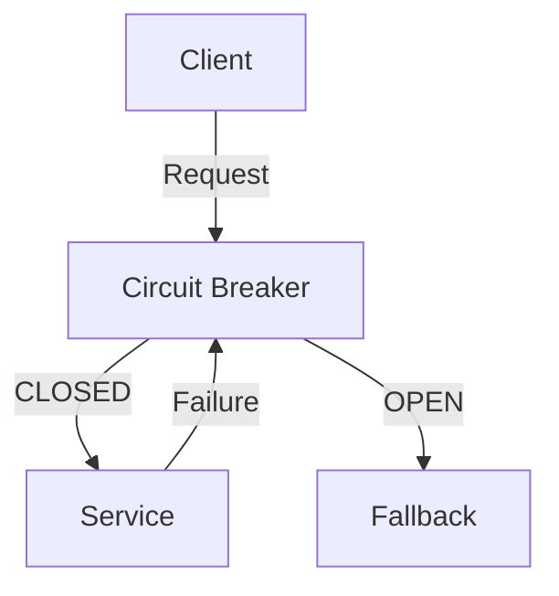
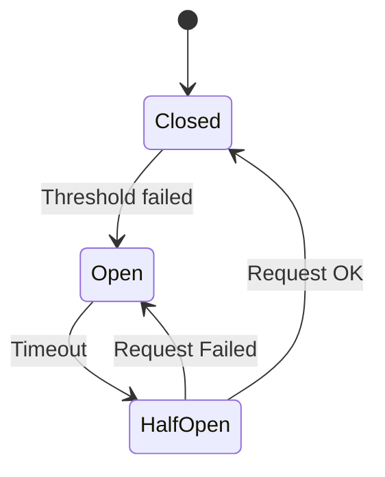

# Circuit Breaker Pattern

## Problem Statement
Design a circuit breaker preventing cascading failures when calling failing services.

**States:**
- Closed: Normal operation
- Open: Reject requests
- Half-open: Test if service recovered

## Design

### State Transitions

```
Closed → Open: Failure threshold exceeded
Open → Half-open: After timeout
Half-open → Closed: Test succeeds
Half-open → Open: Test fails
```

### Configuration

```
Failure threshold: N failures trigger open
Timeout: How long to wait before testing
Test request rate: How many to test when half-open
Success threshold: Successes to close
```

### Monitoring

```
Track failure rate
Alert on state changes
Metrics: Success, failure, timeout
Dashboard: Service health
```


## Architecture Diagram

```
┌───────────────────────────────┐
│   Circuit Breaker Pattern     │
│  States                       │
│  - CLOSED: normal             │
│  - OPEN: reject fast          │
│  - HALF_OPEN: test recovery   │
│  Thresholds                   │
│  - Failures: 5                │
│  - Timeout: 30s (before retry)│
│  - Reset: 60s (half-open)     │
│  Fallback & Recovery          │
│  - Cached response            │
└───────────────────────────────┘
```

## Common Questions & Answers

**Q: Threshold tuning?** A: Too low: false open. Too high: long degradation. Typical: 5 failures or 50% error in 10s.

**Q: Half-open state?** A: Allow 1-3 test requests. If succeed, close. If fail, reopen.

**Q: Cascade prevention?** A: CB on each dependency. Fallback to cache/default. Timeout. Bulkhead isolation.

**Q: Monitoring?** A: Alert on OPEN. Track state changes (oscillation = tuning issue).

## Back-of-Envelope Calculations

Service A → B fails: 5 failures open. A rejects 30s. B recovers: half-open 60s. Impact: 5-95s downtime (graceful).
## Design Choice Comparison

| Approach | Pros | Cons |
|----------|------|------|
| Circuit Breaker | Prevents cascade | Needs fallback |
| Retry+timeout | Simple | Amplify failures |
| Bulkhead | Isolates | Overhead |

## Follow-up Interview Questions

1. Coordinate across services? 2. Auto-tune thresholds? 3. Test behavior? 4. Dependency monitoring bottleneck? 5. Recover from cascade?

## Example Scenario Walkthrough

[Describe a concrete example with step-by-step execution]

### Architecture Diagram



### Flow Diagram



## Complexity

| Operation | Time |
|-----------|------|
| Check state | O(1) |
| Record success/failure | O(1) |
| State transition | O(1) |

## Python Implementation

```python
from enum import Enum
from typing import Callable, TypeVar, Any
import time
import functools

T = TypeVar("T")

class CircuitState(Enum):
    CLOSED = "closed"
    OPEN = "open"
    HALF_OPEN = "half_open"

class CircuitBreaker:
    def __init__(self, failure_threshold: int = 5, recovery_timeout: float = 60.0,
                 half_open_max_calls: int = 3):
        self.state = CircuitState.CLOSED
        self._failure_count = 0
        self._success_count = 0
        self._failure_threshold = failure_threshold
        self._recovery_timeout = recovery_timeout
        self._half_open_max_calls = half_open_max_calls
        self._opened_at: float = 0

    def call(self, fn: Callable[..., T], *args, **kwargs) -> T:
        if self.state == CircuitState.OPEN:
            if time.time() - self._opened_at >= self._recovery_timeout:
                self.state = CircuitState.HALF_OPEN
                self._success_count = 0
            else:
                raise Exception("Circuit is OPEN - request rejected")

        try:
            result = fn(*args, **kwargs)
            self._on_success()
            return result
        except Exception:
            self._on_failure()
            raise

    def _on_success(self):
        if self.state == CircuitState.HALF_OPEN:
            self._success_count += 1
            if self._success_count >= self._half_open_max_calls:
                self.state = CircuitState.CLOSED
                self._failure_count = 0
        else:
            self._failure_count = 0

    def _on_failure(self):
        self._failure_count += 1
        if self._failure_count >= self._failure_threshold:
            self.state = CircuitState.OPEN
            self._opened_at = time.time()

# Usage
cb = CircuitBreaker(failure_threshold=3)

def unstable_api():
    raise ConnectionError("Service down")

for i in range(5):
    try:
        cb.call(unstable_api)
    except Exception as e:
        print(f"[{cb.state.value}] {e}")
```

## Java Implementation

```java
import java.util.concurrent.atomic.AtomicInteger;
import java.util.function.Supplier;

public class CircuitBreaker {
    enum State { CLOSED, OPEN, HALF_OPEN }

    private volatile State state = State.CLOSED;
    private AtomicInteger failures = new AtomicInteger(0);
    private final int threshold;
    private final long recoveryMs;
    private volatile long openedAt;

    public CircuitBreaker(int threshold, long recoveryMs) {
        this.threshold = threshold;
        this.recoveryMs = recoveryMs;
    }

    public <T> T call(Supplier<T> fn) {
        if (state == State.OPEN) {
            if (System.currentTimeMillis() - openedAt >= recoveryMs) {
                state = State.HALF_OPEN;
            } else {
                throw new RuntimeException("Circuit is OPEN");
            }
        }
        try {
            T result = fn.get();
            onSuccess();
            return result;
        } catch (Exception e) {
            onFailure();
            throw e;
        }
    }

    private void onSuccess() {
        failures.set(0);
        state = State.CLOSED;
    }

    private void onFailure() {
        if (failures.incrementAndGet() >= threshold) {
            state = State.OPEN;
            openedAt = System.currentTimeMillis();
        }
    }
}
```
