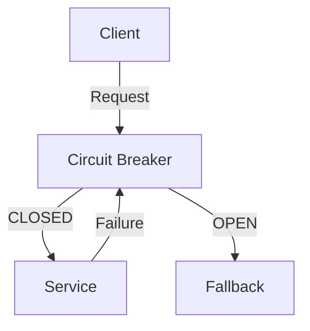
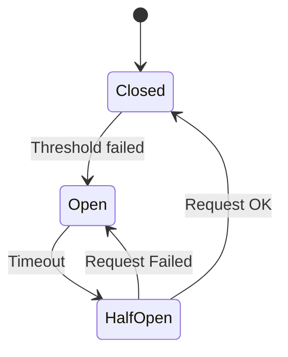

# Circuit Breaker Pattern

## Problem Statement
Design a circuit breaker preventing cascading failures when calling failing services.

**States:**
- Closed: Normal operation
- Open: Reject requests
- Half-open: Test if service recovered

## Design

### State Transitions

```
Closed → Open: Failure threshold exceeded
Open → Half-open: After timeout
Half-open → Closed: Test succeeds
Half-open → Open: Test fails
```

### Configuration

```
Failure threshold: N failures trigger open
Timeout: How long to wait before testing
Test request rate: How many to test when half-open
Success threshold: Successes to close
```

### Monitoring

```
Track failure rate
Alert on state changes
Metrics: Success, failure, timeout
Dashboard: Service health
```


## Architecture Diagram

```
┌───────────────────────────────┐
│   Circuit Breaker Pattern     │
│  States                       │
│  - CLOSED: normal             │
│  - OPEN: reject fast          │
│  - HALF_OPEN: test recovery   │
│  Thresholds                   │
│  - Failures: 5                │
│  - Timeout: 30s (before retry)│
│  - Reset: 60s (half-open)     │
│  Fallback & Recovery          │
│  - Cached response            │
└───────────────────────────────┘
```

## Common Questions & Answers

**Q: Threshold tuning?** A: Too low: false open. Too high: long degradation. Typical: 5 failures or 50% error in 10s.

**Q: Half-open state?** A: Allow 1-3 test requests. If succeed, close. If fail, reopen.

**Q: Cascade prevention?** A: CB on each dependency. Fallback to cache/default. Timeout. Bulkhead isolation.

**Q: Monitoring?** A: Alert on OPEN. Track state changes (oscillation = tuning issue).

## Back-of-Envelope Calculations

Service A → B fails: 5 failures open. A rejects 30s. B recovers: half-open 60s. Impact: 5-95s downtime (graceful).
## Design Choice Comparison

| Approach | Pros | Cons |
|----------|------|------|
| Circuit Breaker | Prevents cascade | Needs fallback |
| Retry+timeout | Simple | Amplify failures |
| Bulkhead | Isolates | Overhead |

## Follow-up Interview Questions

1. Coordinate across services? 2. Auto-tune thresholds? 3. Test behavior? 4. Dependency monitoring bottleneck? 5. Recover from cascade?

## Example Scenario Walkthrough

[Describe a concrete example with step-by-step execution]

### Architecture Diagram



### Flow Diagram



## Complexity

| Operation | Time |
|-----------|------|
| Check state | O(1) |
| Record success/failure | O(1) |
| State transition | O(1) |
