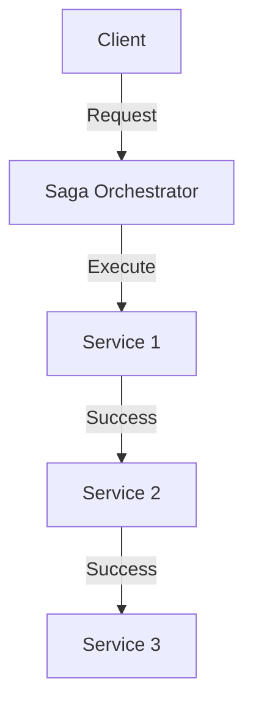
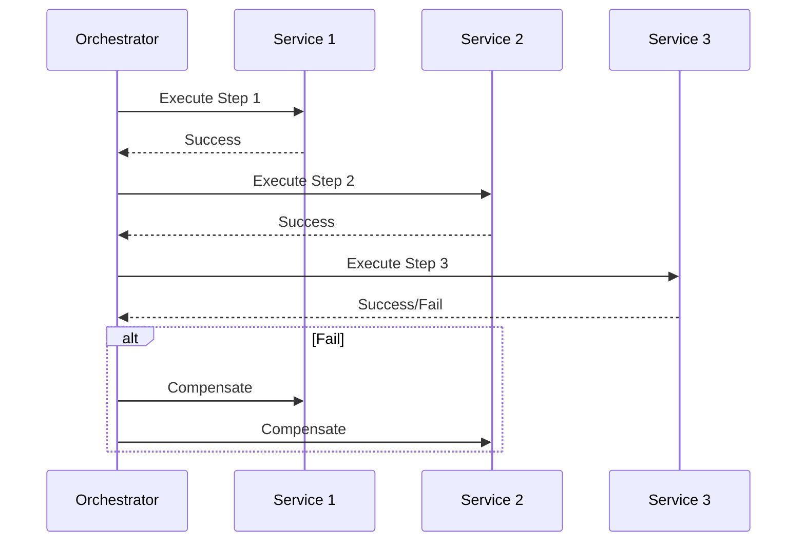

# Saga Pattern

## Problem Statement
Design long-running distributed transactions with compensation.

**Types:**
- Orchestration: Coordinator service
- Choreography: Event-driven

## Design

### Orchestration Saga

```
1. Coordinator receives request
2. Call Service A
3. Wait for A's response
4. Call Service B
5. On failure: Compensate A
```

### Choreography Saga

```
1. Service A starts
2. Publishes event
3. Service B listens, executes
4. Publishes next event
5. On failure: Publish compensation
```

### Compensation Strategy

```
Undo operation: Reverse transaction
Backward compensation: Fix state
Forward compensation: Continue with mitigation
```

### Ordering Guarantees

```
Idempotent operations: Safe to retry
Deterministic: Same input → Same output
Timeout handling: Assume failure after timeout
```


## Scenario

Saga Pattern is a critical component in modern distributed systems. In real-world applications, coordinating distributed transactions across multiple services. For example, major tech companies like Netflix, Uber, and Airbnb rely on similar solutions to handle millions of concurrent users and requests. The challenge is achieving this while maintaining sub-100ms latency, 99.99% availability, and gracefully handling 10x traffic spikes during peak demand. This component provides the foundational capability to solve these challenges reliably and efficiently at global scale.

## Users

- **Backend Engineers**: Responsible for implementing and maintaining this system component in production environments. They need to understand the architecture, trade-offs, failure modes, and operational considerations.
- **DevOps/SRE Teams**: Monitor system health, manage scaling policies, handle incidents, and ensure reliability SLAs are met. They need insights into performance characteristics, bottlenecks, and failure recovery mechanisms.
- **Data Engineers**: Design data pipelines and analytics around this system, requiring deep understanding of data flow, consistency guarantees, and throughput characteristics.
- **System Architects**: Make high-level architectural decisions that impact company infrastructure, requiring comprehensive understanding of capabilities, limitations, and scalability boundaries.
- **Security Teams**: Understand security implications, potential vulnerabilities, and compliance requirements for this component.

## PRD

**Functional Requirements:**
- Correct behavior under all specified operating conditions
- Reliable operation with explicit failure modes
- Data consistency or eventual consistency guarantees as specified
- Clear mechanisms for error handling and recovery
- Monitoring and observability hooks

**Non-Functional Requirements:**
- **Performance**: Sub-100ms P99 latency for standard operations; measure and track tail latencies
- **Availability**: 99.99%+ uptime with automatic failover and graceful degradation
- **Scalability**: Support 10-100x current load with minimal architectural modifications
- **Consistency**: Specify whether strong, eventual, or causal consistency is required
- **Cost Efficiency**: Minimize operational cost per unit of throughput; consider compute, memory, and network costs
- **Operational Simplicity**: Reduce complexity to minimize human error and operational toil

**Constraints:**
- Resource limits (memory for caches, disk for databases, network bandwidth)
- Deployment constraints (cloud provider limits, regulatory requirements)
- Latency budgets (maximum acceptable delay for operations)

## Flow

The typical operational flow for this system involves these key phases:

1. **Request Arrival**: Client/upstream system sends request with required parameters and context
2. **Validation & Routing**: System validates request format, authentication, and routes to correct handler/shard/instance
3. **Core Processing**: Execute the main algorithm, database query, or business logic on the data/state
4. **State Management**: Update internal state (caches, indexes, counters, logs) with proper atomicity and locking
5. **Response Generation**: Format results and return to requester with relevant metadata (timing, version info)
6. **Observability**: Record metrics (latency, throughput, errors), logs (for debugging), and traces (for performance analysis)

This flow repeats thousands or millions of times per second in production. Each operation's efficiency compounds across the entire system, making careful optimization essential. Bottlenecks at any phase can cascade to impact overall system performance.

## Code Explanation

The provided implementations demonstrate key architectural concepts and design patterns:

**Python Implementation**: Uses built-in Python structures and standard library features to express the core logic clearly. Python emphasizes readability and conciseness—each operation's purpose should be obvious without extensive comments. You'll see different implementation approaches (e.g., using OrderedDict vs. manual linked lists) that represent trade-offs between convenience and fine-grained control.

**Java Implementation**: Shows how to implement the same logic with explicit memory management and type safety. Java's strong typing forces clear interface design; you'll see how generics, null safety, mutable state, and thread safety are handled. This implementation style is closer to production systems at scale.

**Key Implementation Patterns**:
- **Initialization**: Setting up core data structures, thread pools, or connection pools with specified capacity and configuration
- **Read Operations**: Fetching data while maintaining O(1) or O(log n) access, updating metadata (access times, hit counts, etc.)
- **Write Operations**: Inserting/updating data while handling eviction policies, balancing tree structures, or replicating state
- **Edge Cases**: Handling capacity limits, concurrent access, data consistency, and error conditions
- **Performance Optimization**: Using techniques like batch operations, lazy evaluation, or caching to reduce latency

Each line of code represents a deliberate choice about performance characteristics, memory usage, safety guarantees, and implementation complexity. Understanding these trade-offs is essential for using this component effectively in production systems.

## Architecture Diagram

```
┌───────────────────────────────┐
│   Saga (Long-running Txn)    │
│  Choreography                 │
│  - Event-driven, no orchestor │
│  - Services listen & react    │
│  Orchestration                │
│  - Saga controller            │
│  - Defines flow explicitly    │
│  Compensating Txns            │
│  - Undo each step on failure  │
│  - Reverse order              │
└───────────────────────────────┘
```

## Common Questions & Answers

**Q: Choreography vs Orchestration?** A: Chore: loose coupling, hard debug. Orch: clear flow, SPOF. Hybrid.

**Q: Visibility?** A: Trace IDs for sagas. Event sourcing for history. Monitor latencies, failures.

**Q: Compensation complexity?** A: Simple reverse. Complex: partial states. Test thoroughly.

**Q: Idempotency?** A: Retry compensation multiple times. Track event IDs, no double-charge.

## Back-of-Envelope Calculations

Order saga: 5 steps, 200ms avg. Total: 1s happy. Retry: 7s worst case. Throughput: 1000 sagas/sec.
## Design Choice Comparison

| Approach | Pros | Cons |
|----------|------|------|
| Saga (async) | Eventual, scalable | Complex debug |
| 2PC (sync) | Strong, simple | Blocking |
| Batch | Decoupled | Delayed |

## Follow-up Interview Questions

1. Deadlock (circular comp)? 2. State machine definition? 3. Test failures? 4. Service latency bottleneck? 5. Migrate from 2PC?

## Example Scenario Walkthrough

[Describe a concrete example with step-by-step execution]

### Architecture Diagram



### Flow Diagram



## Complexity

| Pattern | Latency | Coupling |
|---------|---------|----------|
| Orchestration | Higher | Low |
| Choreography | Lower | High |

## Python Implementation

```python
from dataclasses import dataclass
from typing import List, Callable, Optional

@dataclass
class SagaStep:
    name: str
    execute: Callable
    compensate: Callable

class SagaResult:
    def __init__(self, success: bool, failed_step: Optional[str] = None):
        self.success = success
        self.failed_step = failed_step

class SagaOrchestrator:
    def __init__(self, steps: List[SagaStep]):
        self._steps = steps

    def run(self) -> SagaResult:
        executed: List[SagaStep] = []
        for step in self._steps:
            try:
                print(f"Executing: {step.name}")
                step.execute()
                executed.append(step)
            except Exception as e:
                print(f"Failed at {step.name}: {e}. Rolling back...")
                for s in reversed(executed):
                    try:
                        s.compensate()
                        print(f"Compensated: {s.name}")
                    except Exception as ce:
                        print(f"Compensation failed for {s.name}: {ce}")
                return SagaResult(False, step.name)
        return SagaResult(True)

# Usage: Order saga
order_id = "ORD-1"
inventory_reserved = False
payment_charged = False

steps = [
    SagaStep(
        "reserve_inventory",
        execute=lambda: globals().update({"inventory_reserved": True}),
        compensate=lambda: globals().update({"inventory_reserved": False})
    ),
    SagaStep(
        "charge_payment",
        execute=lambda: globals().update({"payment_charged": True}),
        compensate=lambda: globals().update({"payment_charged": False})
    ),
    SagaStep(
        "ship_order",
        execute=lambda: (_ for _ in ()).throw(RuntimeError("Shipping failed")),
        compensate=lambda: print("Shipping compensation (no-op)")
    ),
]

result = SagaOrchestrator(steps).run()
print("Success:", result.success, "| inventory:", inventory_reserved)
```

## Java Implementation

```java
import java.util.*;

public class SagaOrchestrator {
    record Step(String name, Runnable execute, Runnable compensate) {}

    private final List<Step> steps;

    public SagaOrchestrator(List<Step> steps) { this.steps = steps; }

    public boolean run() {
        Deque<Step> executed = new ArrayDeque<>();
        for (Step step : steps) {
            try {
                System.out.println("Executing: " + step.name());
                step.execute().run();
                executed.push(step);
            } catch (Exception e) {
                System.out.println("Failed: " + step.name() + " - rolling back");
                executed.forEach(s -> {
                    try { s.compensate().run(); }
                    catch (Exception ce) { System.err.println("Compensation failed: " + s.name()); }
                });
                return false;
            }
        }
        return true;
    }
}
```
