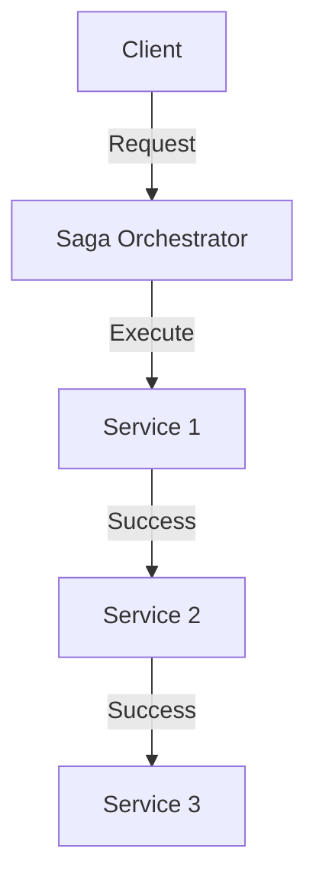
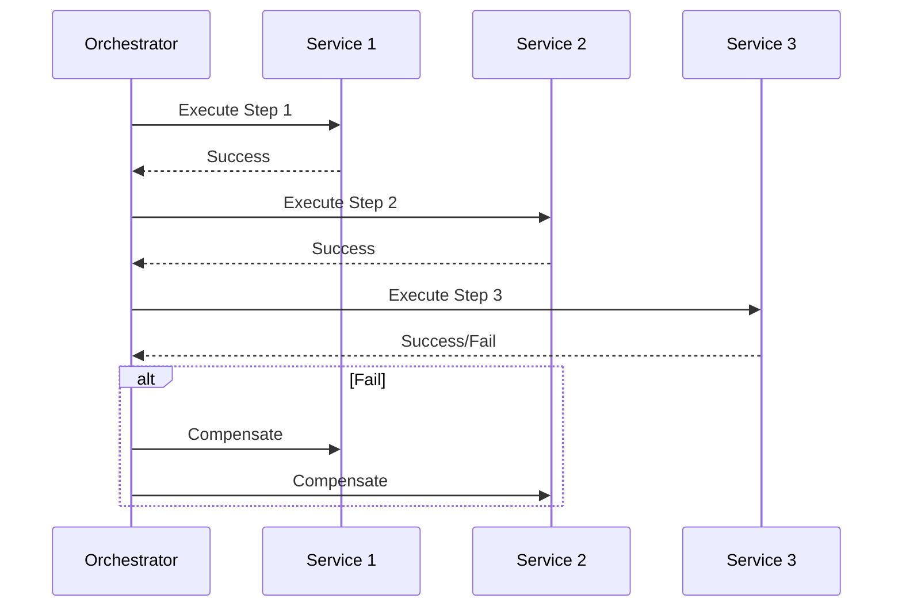

# Saga Pattern

## Problem Statement
Design long-running distributed transactions with compensation.

**Types:**
- Orchestration: Coordinator service
- Choreography: Event-driven

## Design

### Orchestration Saga

```
1. Coordinator receives request
2. Call Service A
3. Wait for A's response
4. Call Service B
5. On failure: Compensate A
```

### Choreography Saga

```
1. Service A starts
2. Publishes event
3. Service B listens, executes
4. Publishes next event
5. On failure: Publish compensation
```

### Compensation Strategy

```
Undo operation: Reverse transaction
Backward compensation: Fix state
Forward compensation: Continue with mitigation
```

### Ordering Guarantees

```
Idempotent operations: Safe to retry
Deterministic: Same input → Same output
Timeout handling: Assume failure after timeout
```


## Architecture Diagram

```
┌───────────────────────────────┐
│   Saga (Long-running Txn)    │
│  Choreography                 │
│  - Event-driven, no orchestor │
│  - Services listen & react    │
│  Orchestration                │
│  - Saga controller            │
│  - Defines flow explicitly    │
│  Compensating Txns            │
│  - Undo each step on failure  │
│  - Reverse order              │
└───────────────────────────────┘
```

## Common Questions & Answers

**Q: Choreography vs Orchestration?** A: Chore: loose coupling, hard debug. Orch: clear flow, SPOF. Hybrid.

**Q: Visibility?** A: Trace IDs for sagas. Event sourcing for history. Monitor latencies, failures.

**Q: Compensation complexity?** A: Simple reverse. Complex: partial states. Test thoroughly.

**Q: Idempotency?** A: Retry compensation multiple times. Track event IDs, no double-charge.

## Back-of-Envelope Calculations

Order saga: 5 steps, 200ms avg. Total: 1s happy. Retry: 7s worst case. Throughput: 1000 sagas/sec.
## Design Choice Comparison

| Approach | Pros | Cons |
|----------|------|------|
| Saga (async) | Eventual, scalable | Complex debug |
| 2PC (sync) | Strong, simple | Blocking |
| Batch | Decoupled | Delayed |

## Follow-up Interview Questions

1. Deadlock (circular comp)? 2. State machine definition? 3. Test failures? 4. Service latency bottleneck? 5. Migrate from 2PC?

## Example Scenario Walkthrough

[Describe a concrete example with step-by-step execution]

### Architecture Diagram



### Flow Diagram



## Complexity

| Pattern | Latency | Coupling |
|---------|---------|----------|
| Orchestration | Higher | Low |
| Choreography | Lower | High |

## Python Implementation

```python
from dataclasses import dataclass
from typing import List, Callable, Optional

@dataclass
class SagaStep:
    name: str
    execute: Callable
    compensate: Callable

class SagaResult:
    def __init__(self, success: bool, failed_step: Optional[str] = None):
        self.success = success
        self.failed_step = failed_step

class SagaOrchestrator:
    def __init__(self, steps: List[SagaStep]):
        self._steps = steps

    def run(self) -> SagaResult:
        executed: List[SagaStep] = []
        for step in self._steps:
            try:
                print(f"Executing: {step.name}")
                step.execute()
                executed.append(step)
            except Exception as e:
                print(f"Failed at {step.name}: {e}. Rolling back...")
                for s in reversed(executed):
                    try:
                        s.compensate()
                        print(f"Compensated: {s.name}")
                    except Exception as ce:
                        print(f"Compensation failed for {s.name}: {ce}")
                return SagaResult(False, step.name)
        return SagaResult(True)

# Usage: Order saga
order_id = "ORD-1"
inventory_reserved = False
payment_charged = False

steps = [
    SagaStep(
        "reserve_inventory",
        execute=lambda: globals().update({"inventory_reserved": True}),
        compensate=lambda: globals().update({"inventory_reserved": False})
    ),
    SagaStep(
        "charge_payment",
        execute=lambda: globals().update({"payment_charged": True}),
        compensate=lambda: globals().update({"payment_charged": False})
    ),
    SagaStep(
        "ship_order",
        execute=lambda: (_ for _ in ()).throw(RuntimeError("Shipping failed")),
        compensate=lambda: print("Shipping compensation (no-op)")
    ),
]

result = SagaOrchestrator(steps).run()
print("Success:", result.success, "| inventory:", inventory_reserved)
```

## Java Implementation

```java
import java.util.*;

public class SagaOrchestrator {
    record Step(String name, Runnable execute, Runnable compensate) {}

    private final List<Step> steps;

    public SagaOrchestrator(List<Step> steps) { this.steps = steps; }

    public boolean run() {
        Deque<Step> executed = new ArrayDeque<>();
        for (Step step : steps) {
            try {
                System.out.println("Executing: " + step.name());
                step.execute().run();
                executed.push(step);
            } catch (Exception e) {
                System.out.println("Failed: " + step.name() + " - rolling back");
                executed.forEach(s -> {
                    try { s.compensate().run(); }
                    catch (Exception ce) { System.err.println("Compensation failed: " + s.name()); }
                });
                return false;
            }
        }
        return true;
    }
}
```
